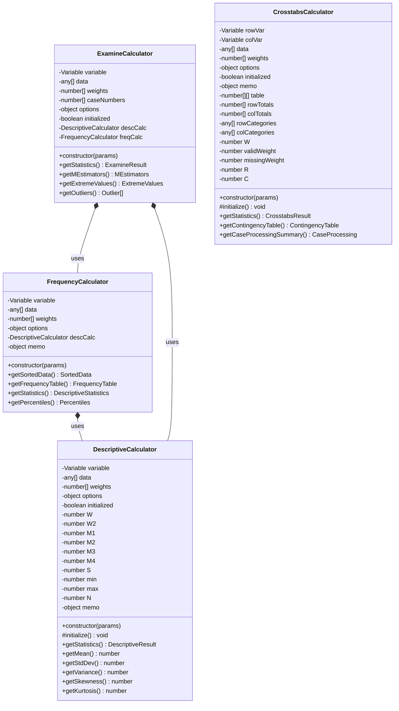

```mermaid
classDiagram
    title DescriptiveStatistics Calculator Classes
    
    class DescriptiveCalculator {
        -Variable variable
        -any[] data
        -number[] weights
        -object options
        -boolean initialized
        -number W
        -number W2
        -number M1
        -number M2
        -number M3
        -number M4
        -number S
        -number min
        -number max
        -number N
        -object memo
        +constructor(params)
        #initialize() void
        +getStatistics() DescriptiveResult
        +getMean() number
        +getStdDev() number
        +getVariance() number
        +getSkewness() number
        +getKurtosis() number
    }
    
    class FrequencyCalculator {
        -Variable variable
        -any[] data
        -number[] weights
        -object options
        -DescriptiveCalculator descCalc
        -object memo
        +constructor(params)
        +getSortedData() SortedData
        +getFrequencyTable() FrequencyTable
        +getStatistics() DescriptiveStatistics
        +getPercentiles() Percentiles
    }
    
    class ExamineCalculator {
        -Variable variable
        -any[] data
        -number[] weights
        -number[] caseNumbers
        -object options
        -boolean initialized
        -DescriptiveCalculator descCalc
        -FrequencyCalculator freqCalc
        +constructor(params)
        +getStatistics() ExamineResult
        +getMEstimators() MEstimators
        +getExtremeValues() ExtremeValues
        +getOutliers() Outlier[]
    }
    
    class CrosstabsCalculator {
        -Variable rowVar
        -Variable colVar
        -any[] data
        -number[] weights
        -object options
        -boolean initialized
        -object memo
        -number[][] table
        -number[] rowTotals
        -number[] colTotals
        -any[] rowCategories
        -any[] colCategories
        -number W
        -number validWeight
        -number missingWeight
        -number R
        -number C
        +constructor(params)
        #initialize() void
        +getStatistics() CrosstabsResult
        +getContingencyTable() ContingencyTable
        +getCaseProcessingSummary() CaseProcessing
    }
    
    FrequencyCalculator *-- DescriptiveCalculator : uses
    ExamineCalculator *-- DescriptiveCalculator : uses
    ExamineCalculator *-- FrequencyCalculator : uses
```