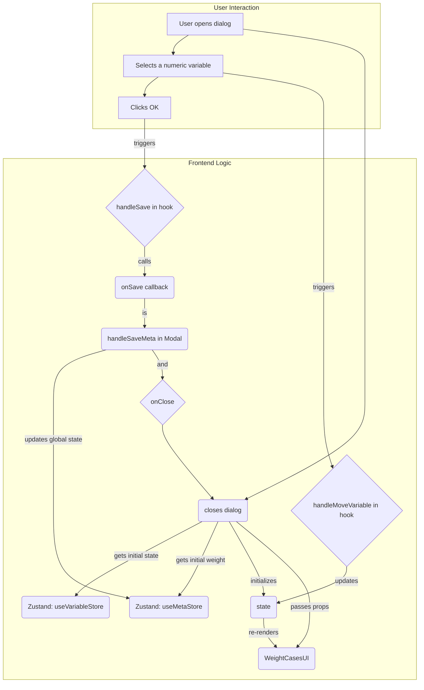

# Weight Cases Feature

This document describes the functionality and architecture of the "Weight Cases" feature, which allows users to apply a case weight to the dataset based on the values of a numeric variable.

## 1. Overview

The "Weight Cases" feature enables users to assign a weight to each case (row) in the dataset. This is a common requirement in survey data analysis, where a sample might be weighted to reflect the entire population. When a weighting variable is active, its values are used to adjust the influence of each case in subsequent statistical analyses.

The feature is implemented as a simple dialog where a user can select a single numeric variable as the frequency weight. This setting is stored globally in the `useMetaStore`, ensuring that any analysis that supports case weighting will automatically use it.

## 2. Functionality Explained

-   **Weighting by Variable**: The user can select one numeric variable from a list of available variables. The values of this variable will be used to weight each case.
-   **Type Validation**: The dialog automatically filters the list to show only numeric variables as valid candidates for weighting. An error is shown if an invalid type is somehow selected.
-   **Exclusion of Cases**: Any case that has a value of zero, a negative value, or a missing value for the selected weighting variable will be automatically excluded from analyses that use this weight.
-   **Global Status**: The weighting configuration is a global setting. The dialog displays the currently active weighting variable, or "Do not weight cases" if none is selected.
-   **Disabling Weighting**: To turn off weighting, the user simply removes the variable from the "Weight cases by" list and confirms by clicking "OK".

## 3. Architecture and Data Flow

The feature is designed with a clear separation between the UI, state management, and the main orchestrator component.

### 3.1. Core Components

-   **`WeightCasesModal` (`index.tsx`)**: The main orchestrator component. It fetches the complete variable list from `useVariableStore` and the current weight status from `useMetaStore`. It initializes the `useWeightCases` hook and passes all necessary state and handlers as props to the `WeightCasesUI`. It also defines the `onSave` logic that updates the global `useMetaStore`.
-   **`WeightCasesUI` (`WeightCasesUI.tsx`)**: The presentational component that renders the user interface. It is a controlled component that receives all its data and handlers via props. It uses the shared `VariableListManager` component for the drag-and-drop lists.
-   **`hooks/useWeightCases.ts`**: The core logic hook. It manages all UI-related state, such as the list of available variables and the selected frequency variable. It handles user interactions like moving variables and contains the logic for validation and resetting the state. It does not interact with global stores directly, receiving initial state and an `onSave` callback from `WeightCasesModal`.

### 3.2. Data Flow



1.  **Initialization**: `WeightCasesModal` mounts and initializes the `useWeightCases` hook, passing the full variable list from `useVariableStore` and the current weight from `useMetaStore`.
2.  **Rendering**: The `WeightCasesUI` component renders the dialog with the available variables and the currently selected weight variable (if any).
3.  **Selection**: The user moves a numeric variable into the "Weight cases by" target list. This action calls `handleMoveVariable` in the hook, which updates the local state, triggering a re-render.
4.  **Confirmation**: The user clicks "OK". This calls the `handleSave` function from the hook, which in turn calls the `onSave` callback (`handleSaveMeta`) that was passed down from `WeightCasesModal`.
5.  **Global State Update**: `handleSaveMeta` updates the global state in `useMetaStore` with the name of the new weighting variable (or an empty string if none is selected).
6.  **Cleanup**: The `onClose` function is called, and the dialog is unmounted.

## 4. Testing Strategy

The feature is tested at both the UI and hook level to ensure reliability.

### 4.1. Hook Logic Testing (`__tests__/useWeightCases.test.ts`)

This is the most critical test suite, as it covers the core business logic.

-   **Initialization**: Verifies that the hook correctly initializes its state, filtering for only numeric variables and correctly setting a pre-selected weight if one exists in the initial state.
-   **State Manipulation**:
    -   Tests moving a variable from the "available" list to the "frequency" list.
    -   Tests the "swap" logic, where moving a new variable to the frequency list correctly moves the old one back to the available list.
-   **Saving & Resetting**: Ensures `handleSave` provides the correct variable name (or an empty string) and that `handleReset` properly reverts the state.
-   **Error Handling**: Confirms that trying to weight by a non-numeric variable correctly triggers an error state.

### 4.2. UI Component Testing (`__tests__/WeightCasesUI.test.tsx`)

This suite tests the `WeightCasesUI` component in isolation.

-   **Rendering**: Verifies that the component renders the initial state correctly, including the "Current Status" text.
-   **User Interactions**: Simulates user clicks on the `OK`, `Reset`, and `Cancel` buttons and asserts that the corresponding handler functions are called.
-   **State Display**: Checks that the UI correctly displays the weighting status when a variable is selected.
-   **Error Handling**: Confirms that the error dialog is rendered when `errorDialogOpen` is true.

```
/WeightCases
├── 📂 hooks/
│   └── 📄 useWeightCases.ts  // Mengelola state & logika UI.
├── 📄 index.tsx              // Titik masuk & perakit (Orchestrator).
├── 📄 README.md              // Dokumen ini.
└── 📄 types.ts              // Definisi tipe TypeScript.
```

-   **`index.tsx` (Orchestrator & UI)**: Karena UI untuk fitur ini cukup sederhana, komponen UI (`WeightCasesContent`) dan perakit (`WeightCasesModal`) digabungkan dalam satu file, namun tetap dengan pemisahan logis. Perakit memanggil *hook* dan menyalurkan *props* ke komponen UI.
-   **`hooks/useWeightCases.ts` (Hook Logika)**: Jantung dari fitur ini. Ia mengelola semua state (variabel yang tersedia, variabel pembobot), menangani interaksi pengguna (memindahkan variabel), dan berkomunikasi dengan `useMetaStore` untuk menyimpan atau menghapus konfigurasi pembobotan.
-   **`types.ts` (Definisi Tipe)**: Mendefinisikan `WeightCasesModalProps` dan `WeightCasesUIProps` (yang diturunkan dari *return type* `useWeightCases`) untuk memastikan keamanan tipe.

## Alur Kerja

1.  **Inisialisasi**: `useWeightCases` diinisialisasi, mengambil daftar variabel dari `useVariableStore` dan status pembobotan saat ini dari `useMetaStore`.
2.  **Seleksi Variabel**: Pengguna menyeret variabel numerik yang valid ke dalam kotak "Weight cases by".
3.  **Konfirmasi**:
    -   Pengguna mengklik "OK".
    -   Fungsi `handleSave` dari *hook* dipanggil.
    -   Nama variabel pembobot disimpan ke dalam `useMetaStore` melalui `setMeta({ weight: 'nama_variabel' })`.
    -   Dialog ditutup.
4.  **Reset/Hapus Pembobotan**:
    -   Pengguna menghapus variabel dari kotak atau mengklik "Reset".
    -   `handleSave` dipanggil (jika OK diklik setelah menghapus) atau `handleReset` dipanggil.
    -   `setMeta({ weight: '' })` dipanggil, menghapus konfigurasi pembobotan dari state global. 