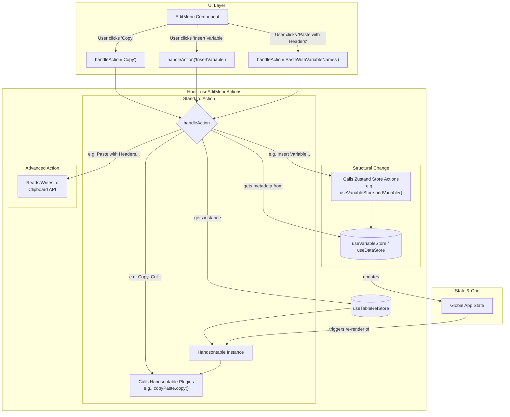

# `useEditMenuActions` Hook

## 1. Overview

The `useEditMenuActions` hook is a centralized handler for all edit-related actions performed on the main data grid (a Handsontable instance). It provides a single function, `handleAction`, which takes an `EditMenuActionType` and executes the corresponding logic.

This hook is designed to abstract the complexities of interacting with the Handsontable instance and our application's state management (Zustand stores), ensuring that all edits are handled consistently and reliably. It consolidates all edit actions (e.g., cut, copy, paste, insert row/column) into a single, manageable location and ensures that actions modifying the grid's structure are correctly propagated through our state management stores.

## 2. Architecture and Data Flow

The hook serves as a crucial intermediary between UI components (like the main "Edit" menu) and the underlying data layer, which consists of the Handsontable grid and Zustand state stores.

### Dependencies

This hook is tightly coupled with the following Zustand stores:

-   `useTableRefStore`: To get a reference to the active Handsontable instance.
-   `useVariableStore`: To manage variable (column) metadata, including adding new variables.
-   `useDataStore`: To manage the grid's data, including adding new cases (rows).

### Data Flow Diagram

The diagram below illustrates how the hook processes different categories of actions.



## 3. Usage Example

The hook is intended to be used within components that trigger edit actions, such as a dropdown menu in the application's navbar.

```tsx
import React from 'react';
import { DropdownMenu, DropdownMenuItem, DropdownMenuSeparator } from '@/components/ui/dropdown-menu';
import { useEditMenuActions, EditMenuActionType } from './hooks/useEditMenuActions';

const EditMenu = () => {
    const { handleAction } = useEditMenuActions();

    const onSelect = (action: EditMenuActionType) => {
        handleAction(action);
    };

    return (
        <DropdownMenu>
            <DropdownMenuItem onSelect={() => onSelect("Undo")}>Undo</DropdownMenuItem>
            <DropdownMenuItem onSelect={() => onSelect("Redo")}>Redo</DropdownMenuItem>
            <DropdownMenuSeparator />
            <DropdownMenuItem onSelect={() => onSelect("Cut")}>Cut</DropdownMenuItem>
            <DropdownMenuItem onSelect={() => onSelect("Copy")}>Copy</DropdownMenuItem>
            <DropdownMenuItem onSelect={() => onSelect("Paste")}>Paste</DropdownMenuItem>
            <DropdownMenuSeparator />
            <DropdownMenuItem onSelect={() => onSelect("InsertVariable")}>Insert Variable</DropdownMenuItem>
            <DropdownMenuItem onSelect={() => onSelect("InsertCases")}>Insert Case</DropdownMenuItem>
        </DropdownMenu>
    );
};

export default EditMenu;
```

## 4. Actions Handled

The `handleAction` function accepts the following `EditMenuActionType` values:

-   `Undo`
-   `Redo`
-   `Cut`
-   `Copy`
-   `CopyWithVariableNames`
-   `CopyWithVariableLabels`
-   `Paste`
-   `PasteVariables`
-   `PasteWithVariableNames`
-   `Clear`
-   `InsertVariable`
-   `InsertCases`

## 5. Detailed Action Explanations

### Standard Actions

-   **`Undo`/`Redo`**: Triggers Handsontable's built-in undo/redo functionality.
-   **`Cut`/`Copy`/`Paste`**: Uses the Handsontable `copyPaste` plugin to perform standard clipboard operations on the selected cells.
-   **`Clear`**: Empties the content of the selected cells.

### Advanced Copy/Paste Actions

-   **`CopyWithVariableNames` / `CopyWithVariableLabels`**:
    -   **Case:** A user wants to copy data to an external application (like Excel or Google Sheets) and include headers.
    -   **Action:** Copies the selected data and prepends a header row. The header is generated from the variable's `name` or `label` from `useVariableStore`. The final output is a TSV (Tab-Separated Values) string written to the clipboard.

-   **`PasteVariables`**:
    -   **Case:** A user has a list of variable names (e.g., in a text file or spreadsheet column) and wants to quickly create them in the application.
    -   **Action:** Reads a list of names from the clipboard (expects them to be separated by newlines or tabs). It then creates new variables (columns) starting from the selected column index, using the names from the clipboard. This action only creates the variables; it does not paste any data rows.

-   **`PasteWithVariableNames`**:
    -   **Case:** A user has a complete dataset (headers and data rows) in an external application and wants to paste it into the grid.
    -   **Action:** This is a powerful atomic operation that reads a multi-row TSV string from the clipboard.
        1.  It treats the **first row** as variable names and creates the corresponding columns via `useVariableStore`.
        2.  It treats the **subsequent rows** as data and passes them to the store along with the new variable definitions.
        3.  The `useVariableStore` and `useDataStore` handle the creation of variables and the insertion of data in a single, synchronized update.

### Structural Actions

-   **`InsertVariable`**:
    -   **Case:** The user needs to add a new, empty column to the grid.
    -   **Action:** Inserts a new variable (column) to the right of the currently selected column. If no column is selected, it adds it at the end. This is handled by calling `useVariableStore.getState().addVariable()`, ensuring the state is updated correctly.

-   **`InsertCases`**:
    -   **Case:** The user needs to add a new, empty row to the grid.
    -   **Action:** Inserts a new case (row) below the currently selected row. If no row is selected, it adds it at the end. This is handled by calling `useDataStore.getState().addRow()`. 