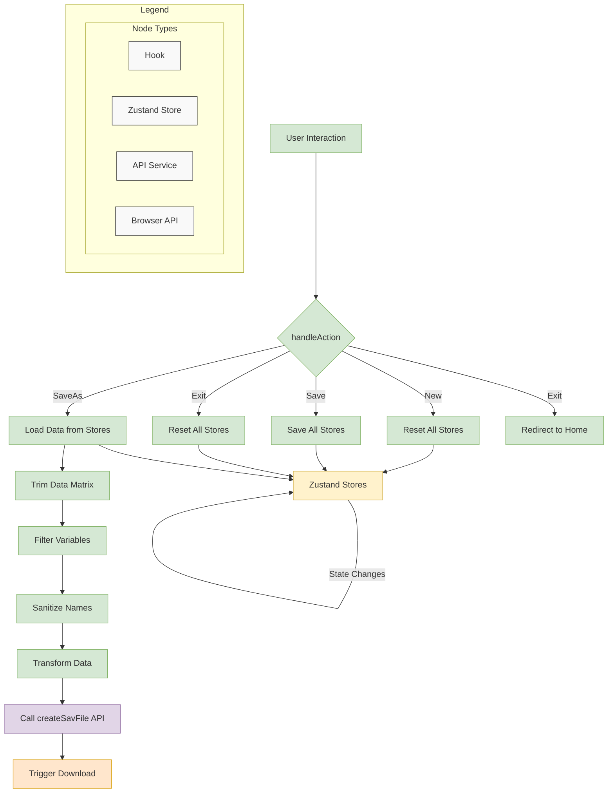

# `useFileMenuActions` Hook

This document provides a comprehensive technical overview of the `useFileMenuActions` hook for developers, detailing its implementation, architecture, and usage.

## 1. Overview

The `useFileMenuActions` hook is a centralized controller for managing the application's core session and file operations. It provides a single `handleAction` function that orchestrates all actions typically found in a "File" menu, such as creating a new session, saving data, and exiting the application.

The implementation follows a feature-sliced design pattern, separating concerns between UI components and business logic, and abstracting complex interactions with Zustand stores and API services.

## 2. Key Features

- **Centralized File Operations**:
  - New session creation
  - Data persistence
  - File export (Save As)
  - Application exit

- **Robust State Management**:
  - Integration with multiple Zustand stores
  - Proper error handling
  - Consistent state transitions

- **File Export Capabilities**:
  - SPSS (.sav) file generation
  - Data sanitization and transformation
  - Browser download triggering

## 3. Architecture and Implementation

### 3.1. Core Responsibilities

#### `useFileMenuActions` hook
- **Role**: Business logic orchestrator
- **Responsibilities**:
  - Handling file menu actions (New, Save, SaveAs, Exit)
  - Managing interactions with Zustand stores
  - Coordinating API calls for file generation
  - Handling navigation between application views
- **Key Implementation Details**:
  - Uses React hooks and TypeScript
  - Implements async/await for asynchronous operations
  - Integrates with Zustand stores (`useDataStore`, `useVariableStore`, `useMetaStore`, `useResultStore`)
  - Uses Next.js router for navigation
  - Implements data sanitization for file export
  - Handles error boundaries with try/catch blocks

### 3.2. Data Flow and Workflow



### 3.3. Detailed Workflow Steps

#### New Action
1. User triggers "New" action from UI
2. `handleAction` is called with `actionType: "New"`
3. All Zustand stores are reset:
   - `useDataStore.resetData()`
   - `useVariableStore.resetVariables()`
   - `useMetaStore.resetMeta()`
   - `useResultStore.clearAll()`
4. Console log confirms session reset

#### Save Action
1. User triggers "Save" action from UI
2. `handleAction` is called with `actionType: "Save"`
3. Try/catch block wraps save operations
4. All relevant stores are saved:
   - `useMetaStore.saveMeta()`
   - `useVariableStore.saveVariables()`
   - `useDataStore.saveData()`
5. Success or error feedback is provided

#### SaveAs Action
1. User triggers "SaveAs" action from UI
2. `handleAction` is called with `actionType: "SaveAs"`
3. Try/catch block wraps export operations
4. Data is synced from stores:
   - `useVariableStore.loadVariables()`
   - `useDataStore.loadData()`
5. Data matrix is trimmed to actual used range
6. Variables are filtered for valid entries
7. Variable names are sanitized for SPSS compliance
8. Data is transformed to required JSON structure
9. `createSavFile` API is called with transformed data
10. `downloadBlobAsFile` triggers browser download
11. Success or error feedback is provided

#### Exit Action
1. User triggers "Exit" action from UI
2. `handleAction` is called with `actionType: "Exit"`
3. Try/catch block wraps exit operations
4. All Zustand stores are reset (same as New action)
5. Next.js router redirects to home page (`/`)
6. Success or error feedback is provided

## 4. Hook Properties and Return Values

### Input Parameters
The `handleAction` function accepts a payload of type `FileActionPayload`:

```typescript
interface FileActionPayload {
    actionType: FileMenuActionType;
    data?: any;
}

type FileMenuActionType = "New" | "Save" | "SaveAs" | "Exit";
```

### Return Values
The hook returns an object with the following properties:

- `handleAction: (payload: FileActionPayload) => Promise<void>`: Function to handle file menu actions

## 5. Error Handling

The hook implements comprehensive error handling:

- **Store Operations**:
  - Try/catch blocks for save and reset operations
  - Error logging to console
  - User alerts for critical failures

- **File Export**:
  - Try/catch blocks for data processing
  - Error logging to console
  - User alerts with specific error messages

- **Navigation**:
  - Try/catch blocks for router operations
  - Error logging to console
  - User alerts for navigation failures

## 6. Testing Strategy

### 6.1. Hook Testing (`__tests__/useFileMenuActions.test.ts`)
- **Focus**: Business logic in `useFileMenuActions` hook
- **Approach**: Mock Zustand stores, router, and API services
- **Coverage**:
  - Action handling for all action types
  - Store method calls
  - API service calls
  - Router navigation
  - Error scenarios
  - Unknown action handling

## 7. Performance Considerations

- Efficient state management with Zustand
- Proper resource cleanup
- Non-blocking async operations
- Optimized data processing for file export
- Memoization techniques where applicable

## 8. Dependencies

- Zustand stores (`useDataStore`, `useVariableStore`, `useMetaStore`, `useResultStore`)
- Next.js router (`next/navigation`)
- API services (`@/services/api`)
- `useModal` hook (`@/hooks/useModal`)

## 9. Usage Example

The hook is designed to be called from UI components like a main navigation menu.

```tsx
import React from 'react';
import { DropdownMenu, DropdownMenuItem } from '@/components/ui/dropdown-menu';
import { useFileMenuActions, FileMenuActionType } from './hooks/useFileMenuActions';

const FileMenu = () => {
    const { handleAction } = useFileMenuActions();

    const onSelect = (action: FileMenuActionType) => {
        handleAction({ actionType: action });
    };

    return (
        <DropdownMenu>
            <DropdownMenuItem onSelect={() => onSelect("New")}>New</DropdownMenuItem>
            <DropdownMenuItem onSelect={() => onSelect("Save")}>Save</DropdownMenuItem>
            <DropdownMenuItem onSelect={() => onSelect("SaveAs")}>Save As...</DropdownMenuItem>
            <DropdownMenuSeparator />
            <DropdownMenuItem onSelect={() => onSelect("Exit")}>Exit</DropdownMenuItem>
        </DropdownMenu>
    );
};

export default FileMenu;
```