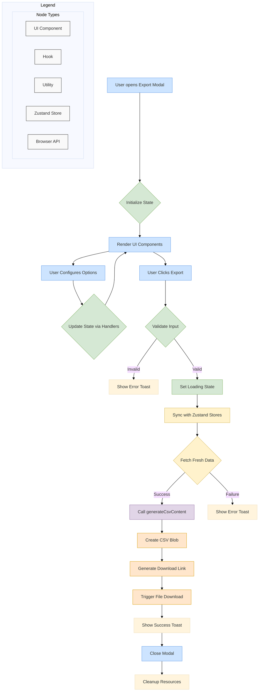

# Export CSV Modal - Advanced CSV Export System with Comprehensive Formatting

Advanced CSV export system dalam Statify untuk providing flexible data export capabilities, comprehensive formatting options, dan intelligent export optimization. System ini menyediakan powerful CSV generation dengan extensive customization dan quality assurance features.

## 📁 Component Architecture

```
ExportCsv/
├── index.tsx                  # Main modal component
├── types.ts                   # TypeScript type definitions
├── tours.ts                   # Interactive tour configurations
├── README.md                  # Documentation
│
├── __test__/                  # Test suite
│   ├── exportCsvUtils.test.ts         # Utility function tests
│   ├── index.test.tsx                 # Main component tests
│   └── useExportCsv.test.ts           # Hook logic tests
│
├── hooks/                     # Business logic hooks
│   ├── useExportCsv.ts               # Core export logic
│   └── useTourGuide.ts               # Tour guide functionality
│
└── utils/                     # Utility functions
    └── exportCsvUtils.ts             # CSV generation and formatting utilities
```

## 🎯 Core Functionality

### CSV Export System
```typescript
interface CsvExportSystem {
  // Export configuration
  exportConfiguration: {
    basicSettings: {
      filename: string;
      delimiter: CsvDelimiter;
      encoding: TextEncoding;
      lineEnding: LineEndingType;
      includeHeaders: boolean;
      includeVariableProperties: boolean;
    };
    
    advancedSettings: {
      quotingStrategy: QuotingStrategy;
      escapeStrategy: EscapeStrategy;
      nullValueRepresentation: string;
      dateTimeFormat: DateTimeFormat;
      numberFormat: NumberFormat;
      booleanFormat: BooleanFormat;
    };
    
    qualitySettings: {
      dataValidation: DataValidationConfig;
      characterSanitization: CharacterSanitizationConfig;
      compressionOptions: CompressionConfig;
      integrityChecking: IntegrityCheckConfig;
    };
    
    compatibilitySettings: {
      targetApplication: TargetApplication;
      csvDialect: CsvDialect;
      localeSettings: LocaleSettings;
      platformOptimization: PlatformOptimization;
    };
  };
  
  // Data processing pipeline
  dataProcessingPipeline: {
    dataExtraction: {
      extractFromStores: () => ExtractedData;
      filterColumns: (columns: string[]) => FilteredData;
      filterRows: (criteria: FilterCriteria) => FilteredData;
      aggregateData: (aggregations: Aggregation[]) => AggregatedData;
    };
    
    dataTransformation: {
      convertDataTypes: (data: RawData) => ConvertedData;
      formatValues: (data: ConvertedData) => FormattedData;
      handleMissingValues: (data: FormattedData) => ProcessedData;
      validateDataIntegrity: (data: ProcessedData) => ValidationResult;
    };
    
    csvGeneration: {
      generateHeaders: (variables: Variable[]) => CsvHeaders;
      generateRows: (data: ProcessedData) => CsvRows;
      assembbleCsv: (headers: CsvHeaders, rows: CsvRows) => CsvContent;
      optimizeCsvSize: (csv: CsvContent) => OptimizedCsv;
    };
    
    qualityAssurance: {
      validateCsvFormat: (csv: CsvContent) => FormatValidationResult;
      checkDataConsistency: (original: RawData, csv: CsvContent) => ConsistencyReport;
      performIntegrityCheck: (csv: CsvContent) => IntegrityReport;
      generateQualityReport: (validationResults: ValidationResult[]) => QualityReport;
    };
  };
  
  // Advanced export features
  advancedExportFeatures: {
    intelligentFormatting: {
      autoDetectBestFormat: (data: RawData) => FormatRecommendation;
      optimizeForTarget: (data: RawData, target: TargetApplication) => OptimizationResult;
      preserveDataTypes: (data: RawData) => TypePreservationStrategy;
      minimizeFileSize: (data: RawData) => SizeOptimizationStrategy;
    };
    
    batchExport: {
      exportMultipleDatasets: (datasets: Dataset[]) => Promise<BatchExportResult>;
      splitLargeDatasets: (data: LargeData) => DatasetChunk[];
      mergeExportResults: (results: ExportResult[]) => MergedResult;
      scheduledExport: (schedule: ExportSchedule) => ScheduledExportResult;
    };
    
    customExportFormats: {
      defineCustomDialects: (definition: CsvDialectDefinition) => CustomDialect;
      createExportTemplates: (template: ExportTemplate) => TemplateResult;
      supportLegacyFormats: (format: LegacyFormat) => LegacyFormatSupport;
      enablePluginSupport: (plugin: ExportPlugin) => PluginIntegration;
    };
    
    cloudIntegration: {
      exportToCloudStorage: (data: ProcessedData, provider: CloudProvider) => Promise<CloudExportResult>;
      syncWithDatabases: (data: ProcessedData, connection: DatabaseConnection) => Promise<SyncResult>;
      apiExport: (data: ProcessedData, apiEndpoint: ApiEndpoint) => Promise<ApiExportResult>;
      collaborativeExport: (data: ProcessedData, workspace: SharedWorkspace) => Promise<CollaborativeResult>;
    };
  };
}
```

### CSV Formatting and Dialects
```typescript
interface CsvFormattingDialects {
  // Standard CSV dialects
  standardDialects: {
    rfc4180: {
      description: 'Standard RFC 4180 compliant CSV';
      delimiter: ',';
      quoteChar: '"';
      escapeChar: '"';
      lineTerminator: '\r\n';
      quoting: 'QUOTE_MINIMAL';
    };
    
    excel: {
      description: 'Microsoft Excel compatible CSV';
      delimiter: ',';
      quoteChar: '"';
      escapeChar: '"';
      lineTerminator: '\r\n';
      quoting: 'QUOTE_NONNUMERIC';
    };
    
    unix: {
      description: 'Unix/Linux optimized CSV';
      delimiter: ',';
      quoteChar: '"';
      escapeChar: '\\';
      lineTerminator: '\n';
      quoting: 'QUOTE_MINIMAL';
    };
    
    tabSeparated: {
      description: 'Tab-separated values (TSV)';
      delimiter: '\t';
      quoteChar: '"';
      escapeChar: '\\';
      lineTerminator: '\n';
      quoting: 'QUOTE_MINIMAL';
    };
  };
  
  // Regional dialects
  regionalDialects: {
    european: {
      description: 'European locale CSV (semicolon separated)';
      delimiter: ';';
      quoteChar: '"';
      escapeChar: '"';
      lineTerminator: '\r\n';
      decimalSeparator: ',';
      quoting: 'QUOTE_NONNUMERIC';
    };
    
    german: {
      description: 'German locale CSV';
      delimiter: ';';
      quoteChar: '"';
      escapeChar: '"';
      lineTerminator: '\r\n';
      decimalSeparator: ',';
      dateFormat: 'DD.MM.YYYY';
    };
    
    french: {
      description: 'French locale CSV';
      delimiter: ';';
      quoteChar: '"';
      escapeChar: '"';
      lineTerminator: '\r\n';
      decimalSeparator: ',';
      dateFormat: 'DD/MM/YYYY';
    };
  };
  
  // Application-specific dialects
  applicationDialects: {
    spss: {
      description: 'SPSS-compatible CSV format';
      delimiter: ',';
      quoteChar: '"';
      escapeChar: '"';
      lineTerminator: '\r\n';
      includeVariableNames: true;
      includeVariableLabels: true;
      missingValueCode: '.';
    };
    
    r: {
      description: 'R-compatible CSV format';
      delimiter: ',';
      quoteChar: '"';
      escapeChar: '\\';
      lineTerminator: '\n';
      naString: 'NA';
      booleanFormat: ['TRUE', 'FALSE'];
    };
    
    python: {
      description: 'Python pandas-compatible CSV';
      delimiter: ',';
      quoteChar: '"';
      escapeChar: '\\';
      lineTerminator: '\n';
      naString: 'NaN';
      indexColumn: false;
    };
    
    tableau: {
      description: 'Tableau-optimized CSV format';
      delimiter: ',';
      quoteChar: '"';
      escapeChar: '"';
      lineTerminator: '\r\n';
      includeMetadata: true;
      dataTypeHints: true;
    };
  };
  
  // Custom dialect builder
  customDialectBuilder: {
    createDialect: (
      name: string,
      configuration: DialectConfiguration
    ) => CustomDialect;
    
    validateDialect: (
      dialect: CustomDialect
    ) => DialectValidationResult;
    
    testDialect: (
      dialect: CustomDialect,
      sampleData: SampleData
    ) => DialectTestResult;
    
    optimizeDialect: (
      dialect: CustomDialect,
      data: RawData
    ) => OptimizedDialect;
  };
}
```

## 🔧 Hook Implementation

### useExportCsv Hook
```typescript
interface UseExportCsvHook {
  // Export configuration state
  exportConfigurationState: {
    filename: string;
    delimiter: CsvDelimiter;
    encoding: TextEncoding;
    includeHeaders: boolean;
    includeVariableProperties: boolean;
    quotingStrategy: QuotingStrategy;
    customSettings: CustomExportSettings;
  };
  
  // Export configuration management
  exportConfigurationManagement: {
    setFilename: (filename: string) => void;
    setDelimiter: (delimiter: CsvDelimiter) => void;
    setEncoding: (encoding: TextEncoding) => void;
    setIncludeHeaders: (include: boolean) => void;
    setIncludeVariableProperties: (include: boolean) => void;
    setQuotingStrategy: (strategy: QuotingStrategy) => void;
    updateCustomSettings: (settings: Partial<CustomExportSettings>) => void;
  };
  
  // Export validation
  exportValidation: {
    validateConfiguration: () => ConfigurationValidationResult;
    validateData: () => DataValidationResult;
    validateFilename: (filename: string) => FilenameValidationResult;
    validateExportSize: () => SizeValidationResult;
  };
  
  // Export execution
  exportExecution: {
    exportToCsv: () => Promise<ExportResult>;
    previewExport: () => ExportPreview;
    cancelExport: () => void;
    retryExport: () => Promise<ExportResult>;
    exportWithProgress: (onProgress: ProgressCallback) => Promise<ExportResult>;
  };
  
  // Export state management
  exportStateManagement: {
    isExporting: boolean;
    exportProgress: ExportProgress;
    exportError: ExportError | null;
    exportSuccess: boolean;
    canExport: boolean;
    estimatedTime: number;
  };
  
  // Advanced export features
  advancedExportFeatures: {
    templateManagement: {
      saveExportTemplate: (name: string) => void;
      loadExportTemplate: (templateId: string) => void;
      deleteExportTemplate: (templateId: string) => void;
      listExportTemplates: () => ExportTemplate[];
    };
    
    batchExport: {
      addToExportQueue: (config: ExportConfiguration) => void;
      removeFromExportQueue: (configId: string) => void;
      processExportQueue: () => Promise<BatchExportResult>;
      clearExportQueue: () => void;
    };
    
    qualityControl: {
      performQualityCheck: () => QualityCheckResult;
      generateQualityReport: () => QualityReport;
      validateExportIntegrity: () => IntegrityValidationResult;
      compareWithOriginal: () => ComparisonResult;
    };
    
    optimization: {
      optimizeExportSettings: () => OptimizationRecommendation[];
      estimateExportTime: () => TimeEstimation;
      calculateFileSize: () => SizeEstimation;
      suggestPerformanceImprovements: () => PerformanceRecommendation[];
    };
  };
  
  // Integration features
  integrationFeatures: {
    storeIntegration: {
      accessDataStore: () => DataStore;
      accessVariableStore: () => VariableStore;
      accessMetaStore: () => MetaStore;
      syncWithStores: () => void;
    };
    
    tourIntegration: {
      startTour: () => void;
      stopTour: () => void;
      nextTourStep: () => void;
      previousTourStep: () => void;
      skipTour: () => void;
    };
    
    modalIntegration: {
      closeModal: () => void;
      minimizeModal: () => void;
      maximizeModal: () => void;
      resetModal: () => void;
    };
  };
}
```

### Export CSV Utils
```typescript
interface ExportCsvUtils {
  // Core CSV generation
  csvGeneration: {
    generateCsvFromData: (
      data: DataMatrix,
      variables: Variable[],
      options: CsvExportOptions
    ) => string;
    
    generateHeaders: (
      variables: Variable[],
      includeProperties: boolean
    ) => string[];
    
    generateDataRow: (
      row: DataRow,
      variables: Variable[],
      options: FormattingOptions
    ) => string;
    
    assembleCsvContent: (
      headers: string[],
      rows: string[],
      options: AssemblyOptions
    ) => string;
  };
  
  // Value formatting
  valueFormatting: {
    formatValue: (
      value: any,
      variable: Variable,
      options: ValueFormattingOptions
    ) => string;
    
    formatNumericValue: (
      value: number,
      format: NumberFormat
    ) => string;
    
    formatDateValue: (
      value: Date,
      format: DateFormat
    ) => string;
    
    formatStringValue: (
      value: string,
      options: StringFormattingOptions
    ) => string;
    
    formatBooleanValue: (
      value: boolean,
      format: BooleanFormat
    ) => string;
  };
  
  // Character handling
  characterHandling: {
    escapeSpecialCharacters: (
      value: string,
      delimiter: string,
      quoteChar: string
    ) => string;
    
    sanitizeText: (
      text: string,
      sanitizationRules: SanitizationRule[]
    ) => string;
    
    handleLineBreaks: (
      text: string,
      strategy: LineBreakStrategy
    ) => string;
    
    convertEncoding: (
      text: string,
      fromEncoding: TextEncoding,
      toEncoding: TextEncoding
    ) => string;
  };
  
  // Validation utilities
  validationUtilities: {
    validateCsvFormat: (
      csvContent: string,
      dialect: CsvDialect
    ) => ValidationResult;
    
    validateDataConsistency: (
      originalData: DataMatrix,
      csvContent: string
    ) => ConsistencyValidationResult;
    
    validateCharacterEncoding: (
      text: string,
      encoding: TextEncoding
    ) => EncodingValidationResult;
    
    validateFileSize: (
      csvContent: string,
      maxSize: number
    ) => SizeValidationResult;
  };
  
  // Performance optimization
  performanceOptimization: {
    optimizeCsvGeneration: (
      data: LargeDataMatrix,
      options: OptimizationOptions
    ) => OptimizedGenerationStrategy;
    
    chunkLargeData: (
      data: LargeDataMatrix,
      chunkSize: number
    ) => DataChunk[];
    
    streamCsvGeneration: (
      data: DataStream,
      options: StreamingOptions
    ) => AsyncGenerator<string>;
    
    compressCsvContent: (
      csvContent: string,
      compressionOptions: CompressionOptions
    ) => CompressedContent;
  };
}
```

## 🎨 UI Components

### ExportCsv Component
```typescript
interface ExportCsvProps {
  // Basic configuration
  basicConfiguration: {
    filename: string;
    onFilenameChange: (filename: string) => void;
    delimiter: CsvDelimiter;
    onDelimiterChange: (delimiter: CsvDelimiter) => void;
    encoding: TextEncoding;
    onEncodingChange: (encoding: TextEncoding) => void;
  };
  
  // Export options
  exportOptions: {
    includeHeaders: boolean;
    onIncludeHeadersChange: (include: boolean) => void;
    includeVariableProperties: boolean;
    onIncludeVariablePropertiesChange: (include: boolean) => void;
    quotingStrategy: QuotingStrategy;
    onQuotingStrategyChange: (strategy: QuotingStrategy) => void;
  };
  
  // Advanced settings
  advancedSettings: {
    showAdvancedSettings: boolean;
    onToggleAdvancedSettings: () => void;
    customDialect: CustomDialect;
    onCustomDialectChange: (dialect: CustomDialect) => void;
    qualitySettings: QualitySettings;
    onQualitySettingsChange: (settings: QualitySettings) => void;
  };
  
  // Export execution
  exportExecution: {
    onExport: () => void;
    onPreview: () => void;
    onCancel: () => void;
    canExport: boolean;
    isExporting: boolean;
    exportProgress: ExportProgress;
  };
  
  // Preview and validation
  previewValidation: {
    exportPreview: ExportPreview;
    validationResults: ValidationResult[];
    showPreview: boolean;
    onTogglePreview: () => void;
    onRefreshPreview: () => void;
  };
  
  // Tour integration
  tourIntegration: {
    tourStep: TourStep;
    isTourActive: boolean;
    onStartTour: () => void;
    onNextTourStep: () => void;
    onPreviousTourStep: () => void;
    onSkipTour: () => void;
  };
  
  // Error handling
  errorHandling: {
    errors: ExportError[];
    warnings: ExportWarning[];
    onDismissError: (errorId: string) => void;
    onDismissWarning: (warningId: string) => void;
    showErrorDetails: boolean;
    onToggleErrorDetails: () => void;
  };
}
```

## 🧪 Testing Strategy

### Test Coverage Areas
```typescript
// CSV export functionality testing
describe('ExportCsvModal', () => {
  describe('Configuration management', () => {
    it('manages export configuration correctly');
    it('validates configuration options');
    it('handles invalid configurations gracefully');
    it('preserves user preferences');
  });
  
  describe('CSV generation', () => {
    it('generates valid CSV content');
    it('handles various data types correctly');
    it('applies formatting options properly');
    it('manages large datasets efficiently');
  });
  
  describe('File output', () => {
    it('creates downloadable files correctly');
    it('applies correct file naming');
    it('handles encoding properly');
    it('manages file size optimization');
  });
  
  describe('Quality assurance', () => {
    it('validates CSV format correctness');
    it('ensures data integrity');
    it('handles special characters properly');
    it('maintains precision for numeric data');
  });
  
  describe('User experience', () => {
    it('provides meaningful feedback');
    it('handles user interactions correctly');
    it('implements tour guide properly');
    it('manages error states gracefully');
  });
});

// Utility testing
describe('exportCsvUtils', () => {
  describe('CSV formatting', () => {
    it('formats values correctly');
    it('handles delimiters properly');
    it('manages quoting strategies');
    it('processes encoding correctly');
  });
  
  describe('Performance', () => {
    it('handles large datasets efficiently');
    it('optimizes memory usage');
    it('implements streaming for huge files');
    it('manages concurrent exports');
  });
});
```

## 📋 Development Guidelines

### Adding New CSV Dialects
```typescript
// 1. Define dialect configuration
interface NewCsvDialect extends CsvDialect {
  name: 'newDialect';
  description: 'Description of new dialect';
  delimiter: string;
  quoteChar: string;
  escapeChar: string;
  lineTerminator: string;
  specialFeatures: DialectFeature[];
}

// 2. Implement dialect logic
const newDialectImplementation = {
  formatValue: (value: any, variable: Variable) => {
    // Dialect-specific value formatting
  },
  
  generateHeaders: (variables: Variable[]) => {
    // Dialect-specific header generation
  },
  
  validate: (csvContent: string) => {
    // Dialect-specific validation
  }
};

// 3. Register dialect
const CSV_DIALECTS = {
  ...existingDialects,
  newDialect: newDialectImplementation
};

// 4. Add comprehensive tests
describe('New CSV Dialect', () => {
  it('formats values correctly');
  it('generates proper headers');
  it('validates format properly');
  it('handles edge cases gracefully');
});
```

### Performance Optimization Guidelines
```typescript
// 1. Large dataset handling
const optimizeLargeDatasetExport = (data: LargeDataMatrix) => {
  return {
    chunkingStrategy: calculateOptimalChunkSize(data.size),
    streamingEnabled: data.size > STREAMING_THRESHOLD,
    compressionLevel: determineCompressionLevel(data.characteristics),
    memoryManagement: setupMemoryOptimization(data.estimatedSize)
  };
};

// 2. Performance monitoring
const monitorExportPerformance = (exportOperation: ExportOperation) => {
  return {
    timeTracking: trackExportTime(exportOperation),
    memoryTracking: trackMemoryUsage(exportOperation),
    progressReporting: setupProgressReporting(exportOperation),
    bottleneckDetection: detectPerformanceBottlenecks(exportOperation)
  };
};
```

---

Export CSV modal menyediakan comprehensive CSV export capabilities dengan advanced formatting options, intelligent dialect support, dan robust quality assurance untuk optimal data export experience dalam Statify.
  - Validates user input
  - Interacts with Zustand stores
  - Generates and triggers file download
- **Key Implementation Details**:
  - Uses React hooks (`useState`, `useTransition`)
  - Integrates with Zustand stores (`useDataStore`, `useVariableStore`)
  - Implements filename sanitization to prevent invalid characters
  - Uses `useToast` for user feedback
  - Handles asynchronous operations with proper error boundaries
  - Uses `useModal` for modal management

#### `hooks/useTourGuide.ts`
- **Role**: Interactive tour management
- **Responsibilities**:
  - Manages tour state (active, current step)
  - Handles tour navigation (next, previous, end)
  - Provides tour step definitions
  - Manages element highlighting

#### `utils/exportCsvUtils.ts`
- **Role**: Data processing utilities
- **Responsibilities**:
  - Converts data and variables to CSV format
  - Handles CSV escaping and formatting
  - Generates variable properties section
- **Key Functions**:
  - `generateCsvContent`: Main function that creates the CSV string
  - `escapeCsvCell`: Handles proper escaping of CSV cell values
  - `formatMissingSpecToString`: Formats missing value specifications

### 3.2. Data Flow and Workflow



### 3.3. Detailed Workflow Steps

1. **Initialization**:
   - User opens the export modal
   - `ExportCsv` component mounts
   - `useExportCsv` hook initializes with default or provided options
   - UI renders with initial state

2. **Configuration**:
   - User interacts with form elements (filename, delimiter, etc.)
   - Each interaction triggers appropriate handler functions (`handleChange`, `handleFilenameChange`)
   - State updates trigger re-renders of the UI
   - Filename sanitization removes invalid characters

3. **Export Execution**:
   - User clicks the "Export" button
   - `handleExport` function is called
   - Input validation checks (filename not empty, data exists)
   - If validation fails, error toast is shown
   - If validation passes:
     - Loading state is set
     - Zustand stores are synced to get fresh data
     - `generateCsvContent` is called with data, variables, and options
     - CSV string is generated
     - Blob is created with specified encoding
     - Download link is generated and triggered
     - Success toast is shown
     - Modal is closed
     - Resources are cleaned up (object URL revoked)

## 4. Component Properties (`ExportCsvProps`)

The `ExportCsv` component accepts the following props:

- `onClose: () => void`: **(Required)** Callback function to close the modal
- `containerType?: "dialog" | "sidebar" | "panel"`: **(Optional)** Rendering context for tour guide positioning
- All `UseExportCsvOptions` for initial configuration:
  - `initialFilename?: string`
  - `initialDelimiter?: string`
  - `initialIncludeHeaders?: boolean`
  - `initialIncludeVariableProperties?: boolean`
  - `initialQuoteStrings?: boolean`
  - `initialEncoding?: string`

## 5. Error Handling

The feature implements comprehensive error handling:

- **Input Validation**:
  - Checks for empty filenames
  - Ensures data exists before export
  - Validates data after syncing with stores

- **Error Feedback**:
  - Uses toast notifications for user feedback
  - Provides specific error messages for different failure scenarios
  - Logs errors to console for debugging

- **Graceful Degradation**:
  - Handles edge cases in data processing
  - Properly cleans up resources even on failure

## 6. Testing Strategy

### 6.1. Component Testing (`__test__/index.test.tsx`)
- **Focus**: UI rendering and user interactions
- **Approach**: Mock hooks to isolate component
- **Coverage**:
  - Form element rendering
  - Event handler calls
  - State-dependent UI changes
  - Loading and disabled states
  - Tour guide integration

### 6.2. Hook Testing (`__test__/useExportCsv.test.ts`)
- **Focus**: Business logic in `useExportCsv` hook
- **Approach**: Mock Zustand stores and utilities
- **Coverage**:
  - State initialization
  - Handler function behavior
  - Input validation
  - Export process flow
  - Error scenarios
  - Toast notifications

### 6.3. Utility Testing (`__test__/exportCsvUtils.test.ts`)
- **Focus**: Pure functions in `exportCsvUtils.ts`
- **Approach**: Test with various mock datasets
- **Coverage**:
  - CSV string generation
  - Proper escaping and formatting
  - Header inclusion/exclusion
  - Variable properties section
  - Different delimiter handling
  - Edge cases in data values

## 7. Performance Considerations

- Uses `useTransition` for non-blocking export process
- Efficient state management with Zustand
- Proper resource cleanup (object URL revocation)
- Memoization techniques where applicable
- Optimized rendering with proper React patterns

## 8. Accessibility

- Semantic HTML structure
- Proper ARIA attributes
- Keyboard navigation support
- Sufficient color contrast
- Focus management
- Screen reader compatibility