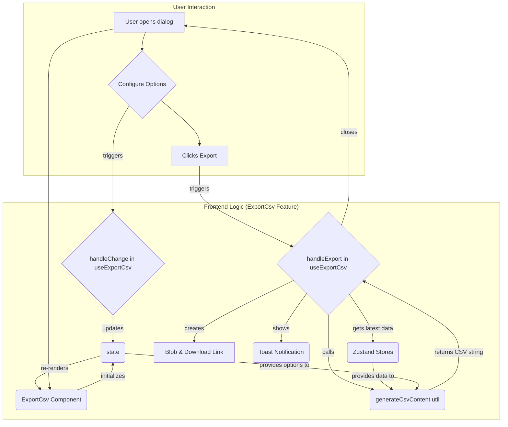

# Export to CSV Feature

This document provides a technical overview of the "Export to CSV" feature, detailing its functionality, architecture, and workflow in accordance with the project's architectural guidelines.

## 1. Overview

This feature provides a modal dialog that allows users to export the current dataset to a CSV (Comma-Separated Values) file. It offers a range of configuration options to customize the output format, ensuring compatibility with various data analysis tools and workflows. The feature also includes an interactive tour guide to help users understand the available options.

## 2. Functionality Explained

The user can configure the following aspects of the CSV export:

-   **File Name**: A custom name for the exported file (the `.csv` extension is added automatically).
-   **Delimiter**: The character used to separate values. Options include comma (`,`), semicolon (`;`), pipe (`|`), and tab (`\t`).
-   **Include Variable Names**: An option to include a header row containing the names of the variables.
-   **Include Variable Properties**: A special option to prepend a commented-out block at the start of the file containing detailed variable metadata (type, label, measure, value labels, etc.). This is useful for data dictionary purposes.
-   **Quote Strings**: An option to wrap all string values in double quotes.
-   **Encoding**: The character encoding for the file, with options like UTF-8, UTF-16 LE, and Windows-1252.

## 3. Architecture and Data Flow

The feature is structured using a feature-sliced design, separating concerns into distinct files.

### 3.1. Core Components

-   **`ExportCsv` (`index.tsx`)**: The **Orchestrator** component. It assembles the UI and wires up the state and handlers. It initializes the `useExportCsv` hook to manage logic and the `useTourGuide` hook for the interactive tour. It is responsible for rendering the UI elements and passing props, but contains no business logic itself.
-   **`hooks/useExportCsv.ts`**: The **Logic Core**. This hook manages all state related to the export options (filename, delimiter, etc.) and handles the core export process. It interacts with Zustand stores to fetch the latest data, validates user input, and uses `exportCsvUtils` to generate the final file content.
-   **`hooks/useTourGuide.ts`**: A dedicated hook to manage the state and logic for the interactive feature tour.
-   **`utils/exportCsvUtils.ts`**: Contains the pure function `generateCsvContent`, which is solely responsible for converting the raw data and variable arrays into a formatted CSV string based on the provided options.

### 3.2. Data Flow

1.  **Initialization**: The user opens the modal. The `ExportCsv` component renders, and the `useExportCsv` hook initializes the state with default or provided initial values.
2.  **Configuration**: The user interacts with the UI (e.g., changes the filename or selects a delimiter). Each change calls a handler in `useExportCsv` (like `handleChange` or `handleFilenameChange`) to update the component's state.
3.  **Execution**: The user clicks the "Export" button.
    -   The `handleExport` function in `useExportCsv` is triggered.
    -   It fetches the most up-to-date data and variables from the `useDataStore` and `useVariableStore` to ensure freshness.
    -   The data, variables, and user-configured options are passed to the `generateCsvContent` utility function.
    -   This utility returns a single, formatted CSV string.
4.  **File Generation**: `handleExport` creates a `Blob` from the CSV string, specifying the chosen character encoding. It then generates a temporary object URL for the blob and programmatically clicks a hidden `<a>` tag to trigger the browser's file download dialog.
5.  **Feedback & Cleanup**: A toast notification is displayed to inform the user of the success or failure of the export. If successful, the modal is closed. The temporary object URL is revoked to free up memory.

## 4. Component Properties (`ExportCsvProps`)

The `ExportCsv` component accepts the following props:

-   `onClose: () => void`: **(Required)** A callback function that is called to close the modal.
-   `containerType?: "dialog" | "sidebar" | "panel"`: **(Optional)** Specifies the rendering context, which is primarily used to adjust the positioning of the tour guide popups.
-   It also accepts `UseExportCsvOptions` (e.g., `initialFilename`, `initialDelimiter`) to pre-fill the export form with custom default values.

## 5. Testing Strategy

-   **Component Testing (`__test__/index.test.tsx`)**:
    -   Focuses on the UI rendering and user interaction.
    -   The `useExportCsv` and `useTourGuide` hooks are mocked to isolate the component.
    -   Tests verify that all form elements are rendered, that event handlers (like `onChange`, `onClick`) call the correct functions from the mocked hooks, and that the component's disabled and loading states work as expected.
-   **Hook Testing (`__test__/useExportCsv.test.ts`)**:
    -   Tests the core business logic within the `useExportCsv` hook.
    -   It would mock the Zustand stores and `generateCsvContent` utility.
    -   Tests would cover state initialization, state changes via handlers, input validation (e.g., empty filename), and the successful execution of the `handleExport` flow.
-   **Utility Testing (`__test__/exportCsvUtils.test.ts`)**:
    -   Tests the pure function `generateCsvContent` in isolation.
    -   It would be provided with various mock datasets and options to assert that the generated CSV string is correctly formatted (e.g., correct delimiters, headers, quoted strings, and properties block).