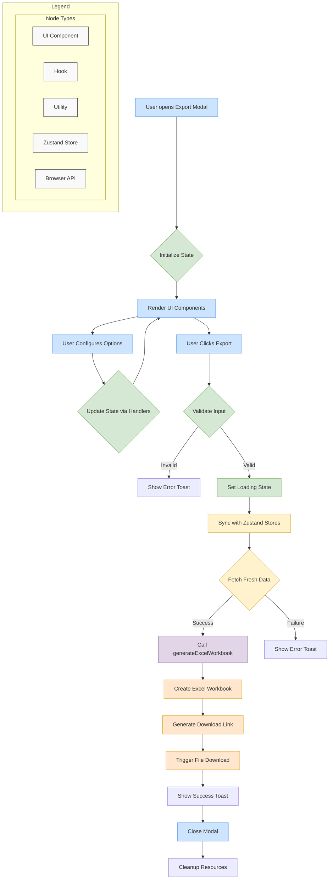

# Export to Excel Feature

This document provides a comprehensive technical overview of the "Export to Excel" feature for developers, detailing its implementation, architecture, and workflow.

## 1. Overview

The Export to Excel feature allows users to export the current dataset to Microsoft Excel formats (`.xlsx` or `.xls`) with customizable options. The implementation follows a feature-sliced design pattern, separating concerns into distinct components, hooks, and utilities.

## 2. Key Features

- **Customizable Export Options**:
  - File name configuration
  - Format selection (`.xlsx` or `.xls`)
  - Option to include variable names as headers
  - Option to include detailed variable properties in a separate sheet
  - Option to include project metadata in a separate sheet
  - Header styling options
  - Missing data representation (`SYSMIS`)

- **Interactive Tour Guide**:
  - Step-by-step walkthrough of the export options
  - Contextual help for each configuration element

- **Robust Error Handling**:
  - Data validation before export
  - User-friendly error messages via toast notifications
  - Graceful handling of edge cases

## 3. Architecture and Implementation

### 3.1. Core Components

#### `ExportExcel` (`index.tsx`)
- **Role**: UI orchestrator component
- **Responsibilities**:
  - Renders all UI elements (form fields, buttons, labels)
  - Manages UI state (loading, disabled states)
  - Initializes and consumes `useExportExcelLogic` and `useTourGuide` hooks
  - Handles user interactions and event propagation
- **Key Implementation Details**:
  - Uses React functional components with TypeScript
  - Implements accessibility features (ARIA labels, proper semantic HTML)
  - Integrates with UI component library (`@/components/ui/*`)
  - Uses `framer-motion` for tour popup animations
  - Implements element highlighting for tour steps

#### `hooks/useExportExcelLogic.ts`
- **Role**: Business logic core
- **Responsibilities**:
  - Manages export configuration state
  - Handles export process execution
  - Validates user input
  - Interacts with Zustand stores
  - Generates and triggers file download
- **Key Implementation Details**:
  - Uses React hooks (`useState`, `useTransition`)
  - Integrates with Zustand stores (`useDataStore`, `useVariableStore`, `useMetaStore`)
  - Implements filename sanitization to prevent invalid characters
  - Uses `useToast` for user feedback
  - Handles asynchronous operations with proper error boundaries

#### `hooks/useTourGuide.ts`
- **Role**: Interactive tour management
- **Responsibilities**:
  - Manages tour state (active, current step)
  - Handles tour navigation (next, previous, end)
  - Provides tour step definitions
  - Manages element highlighting

#### `utils/excelExporter.ts`
- **Role**: Data processing utilities
- **Responsibilities**:
  - Converts data and variables to Excel workbook format
  - Handles workbook creation with multiple sheets
  - Applies styling and formatting options
- **Key Functions**:
  - `generateExcelWorkbook`: Main function that creates the Excel workbook

### 3.2. Data Flow and Workflow

### 3.3. Detailed Workflow Steps

1. **Initialization**:
   - User opens the export modal
   - `ExportExcel` component mounts
   - `useExportExcelLogic` hook initializes with default or provided options
   - UI renders with initial state

2. **Configuration**:
   - User interacts with form elements (filename, format, options)
   - Each interaction triggers appropriate handler functions (`handleChange`, `handleFilenameChange`)
   - State updates trigger re-renders of the UI
   - Filename sanitization removes invalid characters

3. **Export Execution**:
   - User clicks the "Export" button
   - `handleExport` function is called
   - Input validation checks (filename not empty, data exists)
   - If validation fails, error toast is shown
   - If validation passes:
     - Loading state is set
     - Zustand stores are synced to get fresh data
     - `generateExcelWorkbook` is called with data, variables, metadata, and options
     - Excel workbook is generated
     - File download is triggered using `XLSX.writeFile`
     - Success toast is shown
     - Modal is closed

## 4. Component Properties (`ExportExcelProps`)

The `ExportExcel` component accepts the following props:

- `onClose: () => void`: **(Required)** Callback function to close the modal
- `containerType?: "dialog" | "sidebar" | "panel"`: **(Optional)** Rendering context for tour guide positioning

## 5. Error Handling

The feature implements comprehensive error handling:

- **Input Validation**:
  - Checks for empty filenames
  - Ensures data exists before export
  - Validates data after syncing with stores

- **Error Feedback**:
  - Uses toast notifications for user feedback
  - Provides specific error messages for different failure scenarios
  - Logs errors to console for debugging

- **Graceful Degradation**:
  - Handles edge cases in data processing
  - Properly cleans up resources even on failure

## 6. Testing Strategy

### 6.1. Component Testing (`__tests__/index.test.tsx`)
- **Focus**: UI rendering and user interactions
- **Approach**: Mock hooks to isolate component
- **Coverage**:
  - Form element rendering
  - Event handler calls
  - State-dependent UI changes
  - Loading and disabled states
  - Tour guide integration

### 6.2. Hook Testing (`__tests__/useExportExcelLogic.test.ts`)
- **Focus**: Business logic in `useExportExcelLogic` hook
- **Approach**: Mock Zustand stores and utilities
- **Coverage**:
  - State initialization
  - Handler function behavior
  - Input validation
  - Export process flow
  - Error scenarios
  - Toast notifications

### 6.3. Utility Testing (`__tests__/excelExporter.test.ts`)
- **Focus**: Pure functions in `excelExporter.ts`
- **Approach**: Test with various mock datasets
- **Coverage**:
  - Workbook generation
  - Proper sheet creation
  - Header inclusion/exclusion
  - Variable properties sheet
  - Metadata sheet
  - Different format handling
  - Edge cases in data values

## 7. Performance Considerations

- Uses `useTransition` for non-blocking export process
- Efficient state management with Zustand
- Proper resource cleanup
- Memoization techniques where applicable
- Optimized rendering with proper React patterns

## 8. Accessibility

- Semantic HTML structure
- Proper ARIA attributes
- Keyboard navigation support
- Sufficient color contrast
- Focus management
- Screen reader compatibility

## 9. Dependencies

- `xlsx`: Library for Excel file generation
- Zustand stores (`useDataStore`, `useVariableStore`, `useMetaStore`)
- UI component library (`@/components/ui/*`)
- `framer-motion` for animations
- `useToast` for notifications

## 10. Future Development Plans

- **Filtered Data Export**: Add option to export only currently active or selected cases (after filters are applied)
- **Advanced Styling Support**: Allow more customization of styles, such as cell colors, number formatting, and automatic column widths
- **Export to Google Sheets**: Add option to export directly to Google Sheets through API integration
- **Save Export Presets**: Allow users to save their favorite export configurations as presets for future use