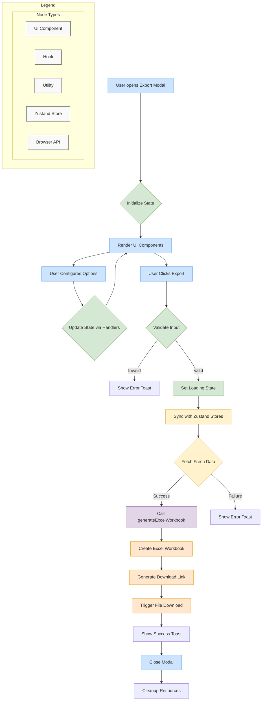

# Export Excel Modal - Advanced Excel Export System with Rich Formatting

Comprehensive Excel export system dalam Statify untuk providing professional Excel file generation, advanced formatting capabilities, dan multi-sheet workbook management. System ini menyediakan powerful Excel export dengan extensive customization dan enterprise-grade features.

## 📁 Component Architecture

```
ExportExcel/
├── index.tsx                  # Main modal component
├── types.ts                   # TypeScript type definitions
├── README.md                  # Documentation
│
├── __tests__/                 # Test suite
│   ├── excelExporter.test.ts          # Excel generation tests
│   ├── ExportExcel.test.tsx           # Main component tests
│   └── useExportExcelLogic.test.ts    # Hook logic tests
│
├── hooks/                     # Business logic hooks
│   ├── useExportExcelLogic.ts         # Core export logic
│   └── useTourGuide.ts               # Tour guide functionality
│
└── utils/                     # Utility functions
    ├── constants.ts                   # Excel export constants
    └── excelExporter.ts              # Excel generation and formatting utilities
```

## 🎯 Core Functionality

### Excel Export System
```typescript
interface ExcelExportSystem {
  // Workbook management
  workbookManagement: {
    workbookCreation: {
      createWorkbook: () => ExcelWorkbook;
      configureWorkbookProperties: (workbook: ExcelWorkbook) => void;
      setWorkbookMetadata: (metadata: WorkbookMetadata) => void;
      optimizeWorkbookSize: (workbook: ExcelWorkbook) => OptimizedWorkbook;
    };
    
    worksheetManagement: {
      createDataSheet: (data: DataMatrix) => ExcelWorksheet;
      createMetadataSheet: (metadata: DatasetMetadata) => ExcelWorksheet;
      createVariableSheet: (variables: Variable[]) => ExcelWorksheet;
      createSummarySheet: (summary: DataSummary) => ExcelWorksheet;
      createChartsSheet: (charts: Chart[]) => ExcelWorksheet;
    };
    
    sheetConfiguration: {
      configureSheetLayout: (sheet: ExcelWorksheet) => void;
      setSheetProperties: (sheet: ExcelWorksheet, properties: SheetProperties) => void;
      setupSheetProtection: (sheet: ExcelWorksheet, protection: SheetProtection) => void;
      optimizeSheetPerformance: (sheet: ExcelWorksheet) => void;
    };
    
    workbookFinalization: {
      finalizeWorkbook: (workbook: ExcelWorkbook) => FinalizedWorkbook;
      generateExcelFile: (workbook: FinalizedWorkbook) => ExcelFile;
      compressWorkbook: (workbook: FinalizedWorkbook) => CompressedWorkbook;
      validateWorkbook: (workbook: FinalizedWorkbook) => ValidationResult;
    };
  };
  
  // Advanced formatting
  advancedFormatting: {
    cellFormatting: {
      formatDataCells: (cells: ExcelCell[], format: CellFormat) => void;
      formatHeaderCells: (headers: ExcelCell[], format: HeaderFormat) => void;
      formatNumericCells: (cells: ExcelCell[], format: NumericFormat) => void;
      formatDateCells: (cells: ExcelCell[], format: DateFormat) => void;
      applyConditionalFormatting: (range: ExcelRange, rules: ConditionalFormattingRule[]) => void;
    };
    
    styleManagement: {
      createCustomStyles: (styleDefinition: StyleDefinition) => ExcelStyle;
      applyTheme: (workbook: ExcelWorkbook, theme: ExcelTheme) => void;
      manageColorScheme: (workbook: ExcelWorkbook, colorScheme: ColorScheme) => void;
      configureFontSettings: (workbook: ExcelWorkbook, fontSettings: FontSettings) => void;
    };
    
    layoutOptimization: {
      autoFitColumns: (worksheet: ExcelWorksheet) => void;
      adjustRowHeights: (worksheet: ExcelWorksheet) => void;
      freezePanes: (worksheet: ExcelWorksheet, freezeOptions: FreezeOptions) => void;
      configurePrintSettings: (worksheet: ExcelWorksheet, printSettings: PrintSettings) => void;
    };
    
    dataVisualization: {
      createCharts: (data: DataMatrix, chartSpecs: ChartSpecification[]) => ExcelChart[];
      insertPivotTables: (data: DataMatrix, pivotSpecs: PivotTableSpecification[]) => ExcelPivotTable[];
      addDataValidation: (range: ExcelRange, validationRules: DataValidationRule[]) => void;
      createNamedRanges: (worksheet: ExcelWorksheet, ranges: NamedRange[]) => void;
    };
  };
  
  // Enterprise features
  enterpriseFeatures: {
    securityFeatures: {
      passwordProtection: (workbook: ExcelWorkbook, password: string) => void;
      documentEncryption: (workbook: ExcelWorkbook, encryption: EncryptionSettings) => void;
      digitalSignatures: (workbook: ExcelWorkbook, signature: DigitalSignature) => void;
      accessControl: (workbook: ExcelWorkbook, permissions: AccessPermissions) => void;
    };
    
    collaborationFeatures: {
      trackChanges: (workbook: ExcelWorkbook, tracking: ChangeTracking) => void;
      addComments: (cells: ExcelCell[], comments: CellComment[]) => void;
      shareWorkbook: (workbook: ExcelWorkbook, sharing: SharingSettings) => void;
      versionControl: (workbook: ExcelWorkbook, versioning: VersioningSettings) => void;
    };
    
    automationFeatures: {
      addMacros: (workbook: ExcelWorkbook, macros: ExcelMacro[]) => void;
      createFormulas: (cells: ExcelCell[], formulas: ExcelFormula[]) => void;
      setupDataConnections: (workbook: ExcelWorkbook, connections: DataConnection[]) => void;
      configureRefreshSettings: (workbook: ExcelWorkbook, refresh: RefreshSettings) => void;
    };
    
    performanceOptimization: {
      optimizeFileSize: (workbook: ExcelWorkbook) => OptimizationResult;
      improveCalculationSpeed: (workbook: ExcelWorkbook) => PerformanceResult;
      manageMemoryUsage: (workbook: ExcelWorkbook) => MemoryOptimizationResult;
      implementStreaming: (largeData: LargeDataMatrix) => StreamingExportResult;
    };
  };
}
```

### Excel Data Processing
```typescript
interface ExcelDataProcessing {
  // Data transformation
  dataTransformation: {
    convertDataTypes: {
      convertToExcelTypes: (data: RawData) => ExcelCompatibleData;
      handleDateTimeConversion: (dates: Date[]) => ExcelDateValue[];
      convertNumericPrecision: (numbers: number[]) => ExcelNumericValue[];
      formatTextData: (text: string[]) => ExcelTextValue[];
    };
    
    handleMissingValues: {
      identifyMissingValues: (data: RawData) => MissingValueMap;
      convertMissingToExcel: (missingValues: MissingValue[]) => ExcelMissingValue[];
      setupMissingValueRules: (rules: MissingValueRule[]) => ExcelValidationRule[];
      documentMissingValueStrategy: (strategy: MissingValueStrategy) => ExcelDocumentation;
    };
    
    dataValidation: {
      validateDataIntegrity: (data: RawData) => DataIntegrityResult;
      checkDataConsistency: (data: RawData) => ConsistencyCheckResult;
      verifyDataTypes: (data: RawData) => TypeVerificationResult;
      assessDataQuality: (data: RawData) => DataQualityAssessment;
    };
    
    dataOptimization: {
      optimizeDataStructure: (data: RawData) => OptimizedDataStructure;
      compressLargeDatasets: (data: LargeDataMatrix) => CompressedData;
      partitionDataForExport: (data: LargeDataMatrix) => DataPartition[];
      streamDataProcessing: (data: DataStream) => ProcessedDataStream;
    };
  };
  
  // Excel-specific processing
  excelSpecificProcessing: {
    formatCompatibility: {
      ensureExcelCompatibility: (data: RawData) => ExcelCompatibleData;
      handleExcelLimitations: (data: LargeDataMatrix) => LimitationHandlingResult;
      optimizeForExcelVersion: (data: RawData, version: ExcelVersion) => VersionOptimizedData;
      maintainDataFidelity: (data: RawData) => FidelityPreservationResult;
    };
    
    sheetOptimization: {
      calculateOptimalSheetLayout: (data: DataMatrix) => SheetLayoutPlan;
      distributeDataAcrossSheets: (data: LargeDataMatrix) => SheetDistributionPlan;
      optimizeSheetNavigation: (sheets: ExcelWorksheet[]) => NavigationOptimization;
      implementCrossSheetReferences: (sheets: ExcelWorksheet[]) => ReferenceMap;
    };
    
    formulaGeneration: {
      generateSummaryFormulas: (data: DataMatrix) => ExcelFormula[];
      createDataValidationFormulas: (validation: ValidationRule[]) => ExcelFormula[];
      buildConditionalFormulas: (conditions: ConditionalRule[]) => ExcelFormula[];
      optimizeFormulaPerformance: (formulas: ExcelFormula[]) => OptimizedFormula[];
    };
    
    metadataIntegration: {
      embedDatasetMetadata: (metadata: DatasetMetadata) => ExcelMetadata;
      createVariableDocumentation: (variables: Variable[]) => ExcelDocumentation;
      generateDataDictionary: (variables: Variable[]) => ExcelDataDictionary;
      addAnalysisHistory: (history: AnalysisHistory) => ExcelHistorySheet;
    };
  };
}
```

## 🔧 Hook Implementation

### useExportExcelLogic Hook
```typescript
interface UseExportExcelLogicHook {
  // Export configuration state
  exportConfigurationState: {
    filename: string;
    fileFormat: ExcelFormat;
    includeHeaders: boolean;
    includeVariableProperties: boolean;
    includeMetadata: boolean;
    createSeparateSheets: boolean;
    customFormatting: ExcelFormattingOptions;
  };
  
  // Configuration management
  configurationManagement: {
    setFilename: (filename: string) => void;
    setFileFormat: (format: ExcelFormat) => void;
    setIncludeHeaders: (include: boolean) => void;
    setIncludeVariableProperties: (include: boolean) => void;
    setIncludeMetadata: (include: boolean) => void;
    setCreateSeparateSheets: (create: boolean) => void;
    updateFormattingOptions: (options: Partial<ExcelFormattingOptions>) => void;
  };
  
  // Export validation
  exportValidation: {
    validateConfiguration: () => ConfigurationValidationResult;
    validateDataForExcel: () => ExcelDataValidationResult;
    validateFilename: (filename: string) => FilenameValidationResult;
    estimateFileSize: () => FileSizeEstimation;
    checkExcelLimitations: () => LimitationCheckResult;
  };
  
  // Export execution
  exportExecution: {
    exportToExcel: () => Promise<ExcelExportResult>;
    previewExcelStructure: () => ExcelStructurePreview;
    cancelExport: () => void;
    retryExport: () => Promise<ExcelExportResult>;
    exportWithProgress: (onProgress: ProgressCallback) => Promise<ExcelExportResult>;
  };
  
  // Advanced features
  advancedFeatures: {
    templateManagement: {
      saveExportTemplate: (template: ExcelExportTemplate) => void;
      loadExportTemplate: (templateId: string) => void;
      deleteExportTemplate: (templateId: string) => void;
      listAvailableTemplates: () => ExcelExportTemplate[];
    };
    
    customization: {
      configureWorkbookProperties: (properties: WorkbookProperties) => void;
      setupCustomStyles: (styles: CustomExcelStyle[]) => void;
      configureChartGeneration: (chartConfig: ChartGenerationConfig) => void;
      setupDataValidation: (validationRules: ExcelValidationRule[]) => void;
    };
    
    qualityControl: {
      performQualityCheck: () => ExcelQualityCheckResult;
      validateExcelOutput: () => ExcelOutputValidationResult;
      compareWithOriginal: () => DataComparisonResult;
      generateQualityReport: () => ExcelQualityReport;
    };
    
    performanceOptimization: {
      optimizeExportSettings: () => OptimizationRecommendation[];
      estimateExportTime: () => TimeEstimation;
      calculateMemoryRequirements: () => MemoryEstimation;
      suggestPerformanceImprovements: () => PerformanceRecommendation[];
    };
  };
  
  // State management
  stateManagement: {
    exportState: {
      isExporting: boolean;
      exportProgress: ExportProgress;
      exportError: ExportError | null;
      exportSuccess: boolean;
      canExport: boolean;
    };
    
    uiState: {
      showAdvancedOptions: boolean;
      activeTab: ExportTab;
      previewMode: boolean;
      tourActive: boolean;
    };
    
    dataState: {
      dataSize: number;
      variableCount: number;
      estimatedFileSize: number;
      complexityLevel: ExportComplexity;
    };
  };
}
```

### Excel Exporter Utility
```typescript
interface ExcelExporterUtility {
  // Core export functions
  coreExportFunctions: {
    createExcelWorkbook: (
      data: DataMatrix,
      variables: Variable[],
      options: ExcelExportOptions
    ) => Promise<ExcelWorkbook>;
    
    generateDataSheet: (
      data: DataMatrix,
      variables: Variable[],
      sheetOptions: DataSheetOptions
    ) => ExcelWorksheet;
    
    generateMetadataSheet: (
      metadata: DatasetMetadata,
      sheetOptions: MetadataSheetOptions
    ) => ExcelWorksheet;
    
    finalizeAndSave: (
      workbook: ExcelWorkbook,
      filename: string
    ) => Promise<ExcelFile>;
  };
  
  // Formatting utilities
  formattingUtilities: {
    applyHeaderFormatting: (
      headers: ExcelRange,
      format: HeaderFormatting
    ) => void;
    
    formatDataColumns: (
      columns: ExcelColumn[],
      variables: Variable[]
    ) => void;
    
    applyConditionalFormatting: (
      range: ExcelRange,
      rules: ConditionalFormattingRule[]
    ) => void;
    
    setupCellValidation: (
      cells: ExcelCell[],
      validationRules: CellValidationRule[]
    ) => void;
  };
  
  // Advanced features
  advancedFeatures: {
    createPivotTables: (
      data: DataMatrix,
      pivotConfig: PivotTableConfiguration[]
    ) => ExcelPivotTable[];
    
    generateCharts: (
      data: DataMatrix,
      chartConfig: ChartConfiguration[]
    ) => ExcelChart[];
    
    addFormulas: (
      worksheet: ExcelWorksheet,
      formulas: FormulaDefinition[]
    ) => void;
    
    setupNamedRanges: (
      workbook: ExcelWorkbook,
      namedRanges: NamedRangeDefinition[]
    ) => void;
  };
  
  // Quality assurance
  qualityAssurance: {
    validateExcelOutput: (
      excelFile: ExcelFile
    ) => ExcelValidationResult;
    
    checkDataIntegrity: (
      originalData: DataMatrix,
      excelWorkbook: ExcelWorkbook
    ) => DataIntegrityCheckResult;
    
    verifyFormatting: (
      excelWorkbook: ExcelWorkbook,
      expectedFormatting: FormattingExpectation[]
    ) => FormattingVerificationResult;
    
    performCompatibilityCheck: (
      excelFile: ExcelFile,
      targetVersion: ExcelVersion
    ) => CompatibilityCheckResult;
  };
}
```

## 🧪 Testing Strategy

### Test Coverage Areas
```typescript
// Excel export functionality testing
describe('ExportExcelModal', () => {
  describe('Configuration management', () => {
    it('manages export configuration correctly');
    it('validates Excel-specific settings');
    it('handles format selection properly');
    it('preserves user preferences');
  });
  
  describe('Excel generation', () => {
    it('creates valid Excel workbooks');
    it('generates properly formatted worksheets');
    it('handles various data types correctly');
    it('manages large datasets efficiently');
  });
  
  describe('Advanced formatting', () => {
    it('applies custom styles correctly');
    it('creates charts and pivot tables');
    it('implements conditional formatting');
    it('manages named ranges properly');
  });
  
  describe('Quality assurance', () => {
    it('validates Excel output format');
    it('ensures data integrity');
    it('checks Excel compatibility');
    it('maintains formatting accuracy');
  });
  
  describe('Performance optimization', () => {
    it('handles large datasets efficiently');
    it('optimizes file size');
    it('manages memory usage properly');
    it('implements streaming for huge datasets');
  });
});

// Excel utility testing
describe('excelExporter', () => {
  describe('Workbook creation', () => {
    it('creates workbooks correctly');
    it('manages worksheets properly');
    it('applies formatting accurately');
    it('handles metadata integration');
  });
  
  describe('Data processing', () => {
    it('converts data types correctly');
    it('handles missing values properly');
    it('maintains data precision');
    it('validates data integrity');
  });
});
```

## 📋 Development Guidelines

### Adding Excel Features
```typescript
// 1. Define Excel feature interface
interface NewExcelFeature extends ExcelFeature {
  id: 'newFeature';
  name: 'New Excel Feature';
  description: 'Feature description';
  type: 'formatting' | 'data' | 'visualization' | 'automation';
  compatibility: ExcelVersion[];
  implementation: FeatureImplementation;
}

// 2. Implement feature logic
const newExcelFeatureImplementation = {
  apply: (
    workbook: ExcelWorkbook,
    options: FeatureOptions
  ) => {
    // Feature implementation
  },
  
  validate: (
    workbook: ExcelWorkbook
  ) => {
    // Feature validation
  },
  
  optimize: (
    workbook: ExcelWorkbook
  ) => {
    // Performance optimization
  }
};

// 3. Register feature
const EXCEL_FEATURES = {
  ...existingFeatures,
  newFeature: newExcelFeatureImplementation
};

// 4. Add comprehensive tests
describe('New Excel Feature', () => {
  it('applies feature correctly');
  it('validates properly');
  it('optimizes performance');
  it('maintains compatibility');
});
```

### Excel Performance Guidelines
```typescript
// 1. Large dataset optimization
const optimizeExcelPerformance = (data: LargeDataMatrix) => {
  return {
    sheetPartitioning: calculateOptimalSheetSplit(data.size),
    streamingStrategy: implementStreamingExport(data.characteristics),
    memoryManagement: setupMemoryOptimization(data.estimatedSize),
    compressionLevel: determineCompressionSettings(data.type)
  };
};

// 2. Quality assurance
const ensureExcelQuality = (exportOperation: ExcelExportOperation) => {
  return {
    dataIntegrityCheck: validateDataIntegrity(exportOperation.data),
    formatValidation: validateExcelFormat(exportOperation.output),
    compatibilityCheck: validateExcelCompatibility(exportOperation.settings),
    performanceAssessment: assessExportPerformance(exportOperation.metrics)
  };
};
```

---

Export Excel modal menyediakan comprehensive Excel export capabilities dengan advanced formatting options, enterprise-grade features, dan professional workbook generation untuk optimal Excel integration dalam Statify.
  - Handles export process execution
  - Validates user input
  - Interacts with Zustand stores
  - Generates and triggers file download
- **Key Implementation Details**:
  - Uses React hooks (`useState`, `useTransition`)
  - Integrates with Zustand stores (`useDataStore`, `useVariableStore`, `useMetaStore`)
  - Implements filename sanitization to prevent invalid characters
  - Uses `useToast` for user feedback
  - Handles asynchronous operations with proper error boundaries

#### `hooks/useTourGuide.ts`
- **Role**: Interactive tour management
- **Responsibilities**:
  - Manages tour state (active, current step)
  - Handles tour navigation (next, previous, end)
  - Provides tour step definitions
  - Manages element highlighting

#### `utils/excelExporter.ts`
- **Role**: Data processing utilities
- **Responsibilities**:
  - Converts data and variables to Excel workbook format
  - Handles workbook creation with multiple sheets
  - Applies styling and formatting options
- **Key Functions**:
  - `generateExcelWorkbook`: Main function that creates the Excel workbook

### 3.2. Data Flow and Workflow



### 3.3. Detailed Workflow Steps

1. **Initialization**:
   - User opens the export modal
   - `ExportExcel` component mounts
   - `useExportExcelLogic` hook initializes with default or provided options
   - UI renders with initial state

2. **Configuration**:
   - User interacts with form elements (filename, format, options)
   - Each interaction triggers appropriate handler functions (`handleChange`, `handleFilenameChange`)
   - State updates trigger re-renders of the UI
   - Filename sanitization removes invalid characters

3. **Export Execution**:
   - User clicks the "Export" button
   - `handleExport` function is called
   - Input validation checks (filename not empty, data exists)
   - If validation fails, error toast is shown
   - If validation passes:
     - Loading state is set
     - Zustand stores are synced to get fresh data
     - `generateExcelWorkbook` is called with data, variables, metadata, and options
     - Excel workbook is generated
     - File download is triggered using `XLSX.writeFile`
     - Success toast is shown
     - Modal is closed

## 4. Component Properties (`ExportExcelProps`)

The `ExportExcel` component accepts the following props:

- `onClose: () => void`: **(Required)** Callback function to close the modal
- `containerType?: "dialog" | "sidebar" | "panel"`: **(Optional)** Rendering context for tour guide positioning

## 5. Error Handling

The feature implements comprehensive error handling:

- **Input Validation**:
  - Checks for empty filenames
  - Ensures data exists before export
  - Validates data after syncing with stores

- **Error Feedback**:
  - Uses toast notifications for user feedback
  - Provides specific error messages for different failure scenarios
  - Logs errors to console for debugging

- **Graceful Degradation**:
  - Handles edge cases in data processing
  - Properly cleans up resources even on failure

## 6. Testing Strategy

### 6.1. Component Testing (`__tests__/index.test.tsx`)
- **Focus**: UI rendering and user interactions
- **Approach**: Mock hooks to isolate component
- **Coverage**:
  - Form element rendering
  - Event handler calls
  - State-dependent UI changes
  - Loading and disabled states
  - Tour guide integration

### 6.2. Hook Testing (`__tests__/useExportExcelLogic.test.ts`)
- **Focus**: Business logic in `useExportExcelLogic` hook
- **Approach**: Mock Zustand stores and utilities
- **Coverage**:
  - State initialization
  - Handler function behavior
  - Input validation
  - Export process flow
  - Error scenarios
  - Toast notifications

### 6.3. Utility Testing (`__tests__/excelExporter.test.ts`)
- **Focus**: Pure functions in `excelExporter.ts`
- **Approach**: Test with various mock datasets
- **Coverage**:
  - Workbook generation
  - Proper sheet creation
  - Header inclusion/exclusion
  - Variable properties sheet
  - Metadata sheet
  - Different format handling
  - Edge cases in data values

## 7. Performance Considerations

- Uses `useTransition` for non-blocking export process
- Efficient state management with Zustand
- Proper resource cleanup
- Memoization techniques where applicable
- Optimized rendering with proper React patterns

## 8. Accessibility

- Semantic HTML structure
- Proper ARIA attributes
- Keyboard navigation support
- Sufficient color contrast
- Focus management
- Screen reader compatibility

## 9. Dependencies

- `xlsx`: Library for Excel file generation
- Zustand stores (`useDataStore`, `useVariableStore`, `useMetaStore`)
- UI component library (`@/components/ui/*`)
- `framer-motion` for animations
- `useToast` for notifications

## 10. Future Development Plans

- **Filtered Data Export**: Add option to export only currently active or selected cases (after filters are applied)
- **Advanced Styling Support**: Allow more customization of styles, such as cell colors, number formatting, and automatic column widths
- **Export to Google Sheets**: Add option to export directly to Google Sheets through API integration
- **Save Export Presets**: Allow users to save their favorite export configurations as presets for future use