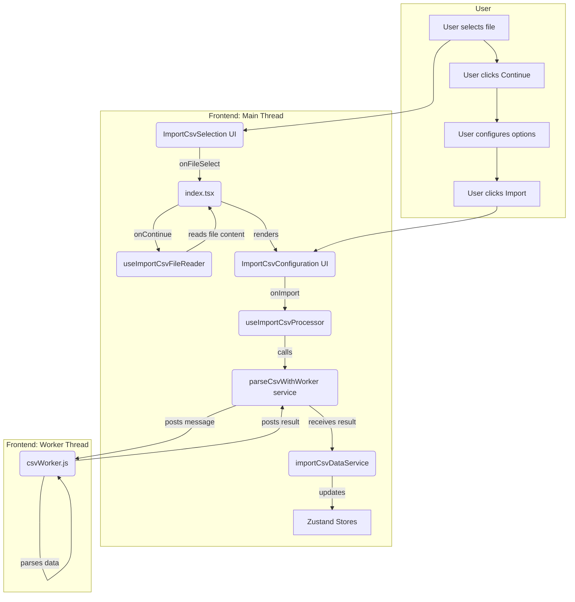

# Import from CSV Feature

This document provides a technical overview of the "Import from CSV" feature, detailing its two-stage workflow, architecture, and testing strategy.

## 1. Overview

This feature enables users to import data from a local `.csv` file. The process is designed as a two-stage wizard to provide a flexible and user-friendly experience:

1.  **File Selection**: The user selects a `.csv` file from their local system using a file picker or by dragging and dropping it into a designated area.
2.  **Configuration & Preview**: After the file is read, the user is presented with a configuration screen. Here, they can see a preview of the data and adjust parsing options to ensure the data is interpreted correctly.

To maintain UI responsiveness, especially with large files, the core CSV parsing logic is executed in a **Web Worker**, offloading the heavy processing from the main browser thread.

## 2. Functionality Explained

### Stage 1: File Selection (`ImportCsvSelection.tsx`)

-   **File Input**: Supports both clicking to open a file dialog and dragging and dropping a file.
-   **Validation**: Basic client-side checks can be performed (e.g., file extension).
-   **Feedback**: Shows the selected file's name and size, or an error if the file reading fails.

### Stage 2: Configuration (`ImportCsvConfiguration.tsx`)

-   **Data Preview**: Displays the first 10 lines of the file so the user can visually verify the effect of their settings.
-   **Parsing Options**:
    -   **Variable Names**: A checkbox to indicate if the first line of the file contains variable names.
    -   **Delimiter**: A dropdown to select the character separating data values (comma, semicolon, or tab).
    -   **Decimal Symbol**: A dropdown to specify the character for numeric decimal points (period or comma).
    -   **Text Qualifier**: A dropdown to select the character used to enclose string values (double quote, single quote, or none).
    -   **Whitespace Trimming**: Checkboxes to automatically remove leading or trailing spaces from data values.

## 3. Architecture and Data Flow

The feature is architected with a clear separation of concerns, using a main orchestrator, distinct UI components for each stage, and dedicated hooks and services for logic and side effects.

### 3.1. Core Components & Hooks

-   **`ImportCsv` (`index.tsx`)**: The main **Orchestrator**. It manages the current stage (`select` or `configure`) and renders the appropriate UI component. It uses `useImportCsvFileReader` to manage the file reading process.
-   **`components/ImportCsvSelection.tsx`**: UI for the file selection stage.
-   **`components/ImportCsvConfiguration.tsx`**: UI for the configuration stage. It triggers the final import by using the `useImportCsvProcessor` hook.
-   **`hooks/useImportCsvFileReader.ts`**: A hook dedicated to reading the selected `File` object asynchronously and providing its text content, along with loading and error states.
-   **`hooks/useImportCsvProcessor.ts`**: A hook that orchestrates the final import. It calls the `parseCsvWithWorker` service and, upon success, the `importCsvDataService` to populate the application's state.
-   **`services/services.ts`**:
    -   `parseCsvWithWorker`: Manages the Web Worker lifecycle. It creates the worker, sends it the file content and options, and returns a Promise that resolves with the parsed data or rejects with an error.
    -   `importCsvDataService`: An abstraction layer over the Zustand stores. Its `populateStores` method calls `overwriteAll` on the variable store, which atomically replaces the application's existing variables and data with the newly imported content.
-   **`public/workers/DataManagement/csvWorker.js`**: The **Web Worker** script. It receives the file content and parsing options, performs the intensive CSV parsing, and posts the structured result (variables and data rows) back to the main thread.

### 3.2. Data Flow

1.  **Selection**: The user interacts with `ImportCsvSelection` and selects a file.
2.  **File Reading**: On "Continue", `index.tsx` calls `useImportCsvFileReader` to read the file's text content.
3.  **Configuration**: Once the content is read, `index.tsx` switches the view to `ImportCsvConfiguration`.
4.  **Processing**: On "Import", `useImportCsvProcessor` is called. It sends the file content and configuration to the `parseCsvWithWorker` service.
5.  **Worker Task**: The service spawns a Web Worker, which parses the CSV off the main thread.
6.  **State Update**: Once the worker returns the structured data, the service calls `importCsvDataService.populateStores`. This service call atomically overwrites the variables and data in the Zustand stores.
7.  **Completion**: The stores are updated, the UI re-renders with the new data, and the modal closes.

## 4. Testing Strategy

-   **Component Testing (`__tests__/index.test.tsx`)**: Tests the main orchestrator component's ability to switch between the `select` and `configure` stages correctly based on the state of the mocked `useImportCsvFileReader` hook.
-   **Hook Testing**:
    -   `useImportCsvFileReader.test.ts`: Mocks the browser's `FileReader` API to test the hook's ability to handle successful reads, errors, and state changes (e.g., `isLoading`).
    -   `useImportCsvProcessor.test.ts`: Mocks the service layer (`parseCsvWithWorker`, `importCsvDataService`) to verify that the hook correctly orchestrates the import flow, calling the services in the right order.
    -   `useCsvWorker.test.ts`: Mocks the `parseCsvWithWorker` service to ensure the hook correctly manages the `isProcessing` and `error` states based on the Promise returned by the service.
-   **Utility/Worker Logic**: The logic inside the web worker (likely `importCsvUtils.ts`) would be tested as a pure function, providing it with various CSV strings and asserting that the output data structure is correct. 