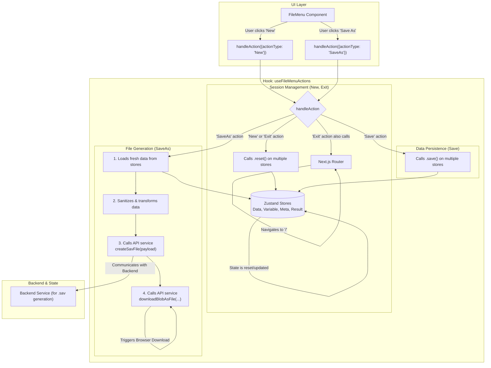

# `useFileMenuActions` Hook

## 1. Overview

The `useFileMenuActions` hook is a critical component for managing the application's core session and file operations. It provides a single, centralized `handleAction` function that orchestrates all actions typically found in a "File" menu, such as creating a new session, saving data, and exiting the application.

This hook abstracts the complex interactions between various Zustand stores (`Data`, `Variable`, `Meta`, `Result`), API services (for file generation), and the Next.js router, ensuring these fundamental operations are handled consistently and robustly.

## 2. Architecture and Data Flow

The hook acts as a high-level controller, dispatching commands to different parts of the application's infrastructure based on user actions.

### Dependencies

-   **`@/hooks/useModal`**: To open other modals if needed (e.g., a "Save As" dialog in the future).
-   **Zustand Stores**:
    -   `useDataStore`: For managing the main data grid content.
    -   `useVariableStore`: For managing variable metadata.
    -   `useMetaStore`: For managing dataset-level metadata (e.g., file weightings).
    -   `useResultStore`: For managing analysis outputs.
-   **`next/navigation`**: To redirect the user (e.g., on "Exit").
-   **`@/services/api`**: To interact with backend services for tasks like generating and downloading `.sav` files.

### Data Flow Diagram

The following diagram illustrates how the hook processes different types of actions:



## 3. Usage Example

The hook is designed to be called from UI components like a main navigation menu.

```tsx
import React from 'react';
import { DropdownMenu, DropdownMenuItem } from '@/components/ui/dropdown-menu';
import { useFileMenuActions, FileMenuActionType } from './hooks/useFileMenuActions';

const FileMenu = () => {
    const { handleAction } = useFileMenuActions();

    const onSelect = (action: FileMenuActionType) => {
        handleAction({ actionType: action });
    };

    return (
        <DropdownMenu>
            <DropdownMenuItem onSelect={() => onSelect("New")}>New</DropdownMenuItem>
            <DropdownMenuItem onSelect={() => onSelect("Save")}>Save</DropdownMenuItem>
            <DropdownMenuItem onSelect={() => onSelect("SaveAs")}>Save As...</DropdownMenuItem>
            <DropdownMenuSeparator />
            <DropdownMenuItem onSelect={() => onSelect("Exit")}>Exit</DropdownMenuItem>
        </DropdownMenu>
    );
};

export default FileMenu;
```

## 4. Detailed Action Explanations

The `handleAction` function accepts a payload `{ actionType: FileMenuActionType; data?: any; }`.

### `New`

-   **Purpose**: To start a fresh, clean session without leaving the main application view.
-   **Action**: Calls the `.reset()` method on the `useDataStore`, `useVariableStore`, `useMetaStore`, and `useResultStore`. This effectively clears all user data, variable definitions, metadata, and analysis results from the current session's state.

### `Save`

-   **Purpose**: To explicitly persist the current state of the application to its storage backend (e.g., IndexedDB).
-   **Action**: Calls the `.save()` method (e.g., `saveMeta`, `saveVariables`, `saveData`) on each of the primary stores. This is intended to be a fast, client-side operation to ensure the user's work is not lost.

### `SaveAs`

-   **Purpose**: To export the entire dataset, including data and variable metadata, into a single `.sav` (SPSS) file.
-   **Action**: This is a multi-step process:
    1.  **Sync**: Fetches the latest data from the stores to ensure the export is up-to-date.
    2.  **Trim**: Calculates the actual used range of the data grid to avoid exporting large amounts of empty rows and columns.
    3.  **Sanitize & Transform**:
        -   It filters for valid, defined variables.
        -   It sanitizes variable names to be compliant with the `.sav` format specifications (e.g., must start with a letter, no special characters, max length of 64).
        -   It transforms the variable metadata and data matrix into the specific JSON structure required by the backend service.
    4.  **API Call**: Sends the transformed JSON payload to the `/api/createSavFile` endpoint.
    5.  **Download**: Receives a `Blob` from the API and uses a helper function to trigger a file download in the user's browser.

### `Exit`

-   **Purpose**: To end the user's session and return them to the application's landing page.
-   **Action**:
    1.  Performs the same state-clearing action as `New`, calling `.reset()` on all major stores.
    2.  Uses the Next.js `router` to redirect the user to the root path (`/`). 