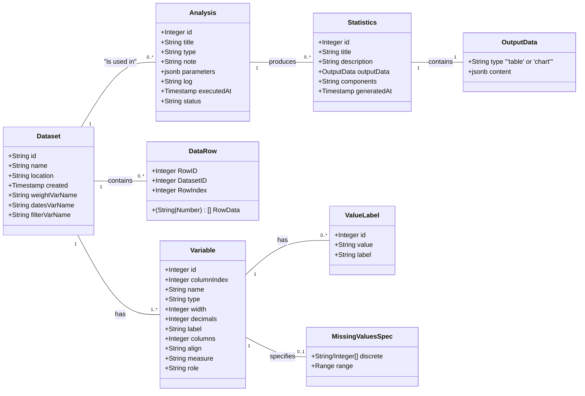
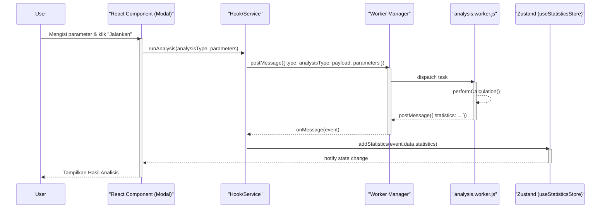

# Artefak 1: Model Objek Keseluruhan

Dokumen ini adalah **artefak utama** dari **Proses 1 FDD**. Tujuannya adalah untuk membangun model objek domain yang "dangkal namun luas" (*broad and shallow*) sebagai kerangka konseptual untuk pengembangan selanjutnya.

---

## A. Konteks FDD

Proses ini, *"Mengembangkan Model Objek Keseluruhan"*, berfokus pada identifikasi kelas-kelas domain utama dan hubungan antar kelas tersebut. Model ini berfungsi sebagai peta yang akan memandu proses-proses FDD selanjutnya, terutama dalam penyusunan daftar fitur (Proses 2).

Model ini terdiri dari dua bagian utama:
1.  **Model Domain Statis (UML Class Diagram):** Merepresentasikan entitas inti dalam sistem.
2.  **Model Proses Dinamis (Sequence Diagram):** Menggambarkan pola interaksi utama dalam arsitektur.

---

## B. Model Domain Keseluruhan (UML Class Diagram)

Diagram kelas berikut memvisualisasikan model domain untuk aplikasi Statify. Diagram ini mendefinisikan entitas-entitas inti sistem, atribut utamanya, dan bagaimana mereka saling terhubung. Model ini secara akurat mencerminkan struktur data yang didefinisikan dalam direktori `/types` dan dikelola oleh state management aplikasi (Zustand).

**Diagram Model Domain Statify:**

---

## C. Diagram Proses Sistem Utama (Sequence Diagram)

Untuk melengkapi model statis, diagram urutan berikut menggambarkan salah satu proses dinamis yang paling fundamental dalam sistem: **menjalankan sebuah analisis**. 

Diagram ini mengilustrasikan pola arsitektur utama yang digunakan di seluruh aplikasi. Pola ini memanfaatkan delegasi komputasi berat ke **Web Worker** untuk menjaga antarmuka pengguna (UI) tetap responsif. Ini menunjukkan interaksi antara komponen UI, logika bisnis (hooks/services), dan pemrosesan latar belakang secara asinkron.

**Skenario: Pola Umum Pemrosesan Analisis Asinkron**
