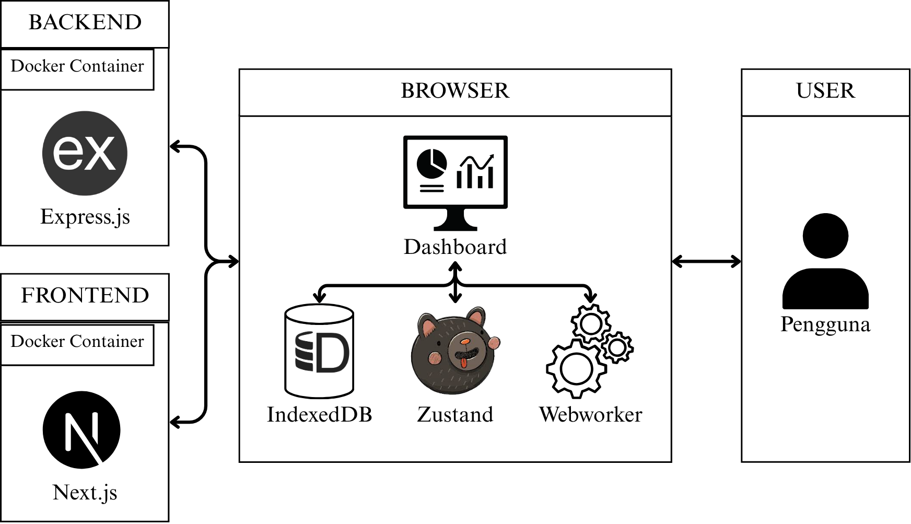
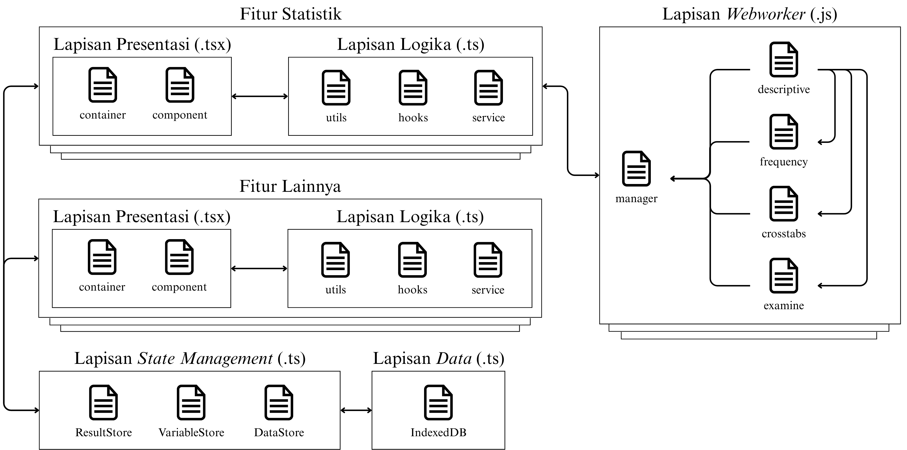

# Artefak 2: Catatan Model (Model Notes)

Dokumen ini adalah **artefak pendukung** dari **Proses 1 FDD**. Tujuannya adalah untuk memberikan justifikasi, asumsi, dan penjelasan mendalam untuk keputusan desain yang diambil dalam **Artefak 1: Model Objek Keseluruhan**.

---

## A. Konteks FDD

Catatan ini berfungsi sebagai "risalah teknis" dari sesi pemodelan. Ini penting untuk memastikan pemahaman yang konsisten di seluruh tim dan memberikan konteks historis bagi pengembang di masa depan mengenai mengapa model dibentuk dengan cara tertentu. Bagian-bagian berikut merinci justifikasi, asumsi, dan area kompleks dari model yang telah disepakati.

---

## B. Keputusan Desain Utama (Design Justification)

- **Keputusan:** Pemodelan Entitas `Dataset` dan `Variable` secara Terpisah.
  - **Alasan:** Memisahkan `Dataset` (representasi file data) dari `Variable` (kolom-kolom di dalamnya) memungkinkan setiap variabel untuk dikelola sebagai entitas individual. Pendekatan ini memfasilitasi analisis yang menargetkan subset variabel tertentu dan menyederhanakan fitur-fitur seperti pengeditan properti variabel (`ValueLabels`, `MissingValues`, dll.) tanpa harus memanipulasi seluruh dataset.
  - **Alternatif yang Dipertimbangkan:** Menyimpan variabel sebagai array properti di dalam objek `Dataset`. Ditolak karena akan mempersulit manajemen state dan logika bisnis untuk fitur-fitur manipulasi variabel.

- **Keputusan:** Penggunaan Referensi Nama Variabel untuk Fungsi Spesial.
  - **Alasan:** Pada kelas `Dataset`, atribut seperti `weightVarName` dan `filterVarName` disimpan sebagai `String` (nama variabel) daripada sebagai objek `Variable` utuh. Ini mencegah duplikasi data dan potensi inkonsistensi. State aplikasi hanya perlu menyimpan satu sumber kebenaran (source of truth) untuk setiap variabel, dan `Dataset` hanya menunjuk ke variabel yang relevan melalui namanya.

- **Keputusan:** Pemisahan Konsep `Analysis` dan `Statistics`.
  - **Alasan:** Proses analisis dibagi menjadi dua entitas utama: `Analysis` yang merepresentasikan *permintaan* atau *konfigurasi* analisis (input, parameter), dan `Statistics` yang merepresentasikan *hasil* dari analisis tersebut. Pemisahan ini memungkinkan pelacakan riwayat analisis yang dijalankan dan memberikan fleksibilitas untuk menghasilkan berbagai jenis output (tabel, grafik) dari satu permintaan analisis.

- **Keputusan:** Arsitektur Klien-Berat dengan Backend sebagai Utilitas File.
  - **Alasan:** Sebagian besar logika bisnis, termasuk kalkulasi statistik, dijalankan di sisi klien menggunakan Web Workers. Backend hanya bertindak sebagai utilitas sederhana untuk membaca/menulis format file tertentu (seperti `.sav`). Pendekatan ini secara drastis mengurangi beban server, meningkatkan skalabilitas, dan memungkinkan aplikasi memiliki fungsionalitas offline yang kaya.
  - **Diagram Arsitektur Sistem:**
    

## C. Asumsi Fundamental

- **Asumsi:** Pengguna memiliki pemahaman dasar tentang konsep statistik (misalnya, nominal, ordinal, scale).
  - **Implikasi:** Antarmuka pengguna (UI) tidak perlu memberikan penjelasan ekstensif tentang teori statistik dasar, tetapi harus memandu pengguna dengan jelas dalam setiap langkah analisis.

- **Asumsi:** Ukuran dataset yang diproses di sisi klien memiliki batasan praktis (misalnya, < 500MB).
  - **Implikasi:** Untuk file yang sangat besar, performa browser bisa menjadi bottleneck. Asumsi ini memvalidasi arsitektur pemrosesan di klien untuk sebagian besar kasus penggunaan umum, namun menyiratkan perlunya strategi berbeda untuk dataset skala enterprise di masa depan.

## D. Area Arsitektur Kompleks

- **Area:** Pola Pemrosesan Analisis Asinkron via Web Workers.
  - **Penjelasan:** Untuk menjaga responsivitas UI selama kalkulasi yang bisa memakan waktu, semua proses komputasi didelegasikan ke *thread* latar belakang menggunakan Web Worker. Alur kerjanya adalah sebagai berikut:
    1.  **UI (React Component):** Menerima input dari pengguna.
    2.  **Logic Layer (Hook/Service):** Mengumpulkan parameter dan memanggil Worker Manager dengan jenis analisis dan payload yang sesuai.
    3.  **Web Worker:** Melakukan perhitungan statistik secara terisolasi.
    4.  **State Management (Zustand):** Setelah worker selesai, hasilnya dikirim kembali ke thread utama dan disimpan di *store* Zustand.
    5.  **Pembaruan UI:** Komponen React yang berlangganan ke store tersebut akan secara otomatis me-render ulang untuk menampilkan hasil `Statistics`.
    Pola ini adalah inti dari arsitektur aplikasi dan digunakan secara konsisten di semua fitur analisis.
  - **Diagram Alur:** Pola ini divisualisasikan dalam Diagram Urutan di dokumen *1-Model-Objek-Keseluruhan.md* dan diilustrasikan lebih detail pada diagram arsitektur frontend di bawah ini.
    

- **Area:** Logika untuk `calculateStatistics()` pada kelas `Variable`.
  - **Penjelasan:** Metode ini harus cukup fleksibel untuk menangani berbagai jenis perhitungan (rata-rata, median, modus, dll.) tergantung pada tipe variabel (scale, nominal). Logika percabangan (if/else atau switch) akan diperlukan di sini, dan mungkin akan didelegasikan ke kelas `StatisticCalculator` lain di masa depan. 