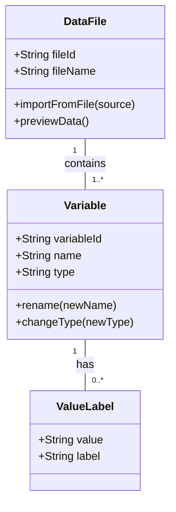
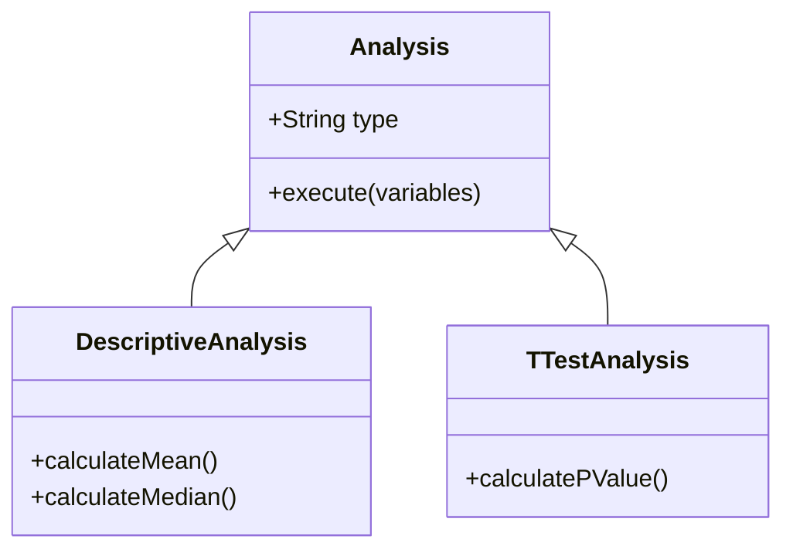

# Artefak 3: Model Area Domain

Dokumen ini adalah artefak "bahan baku" atau *working document* dari **Proses 1 FDD**. Ini berisi kumpulan model-model awal yang dibuat oleh kelompok-kelompok kecil selama sesi *walkthrough* domain.

---

## A. Konteks FDD

Dalam FDD, tim sering dipecah menjadi kelompok-kelompok kecil untuk mengeksplorasi berbagai pendekatan pemodelan untuk area domain tertentu. Model-model yang terdokumentasi di sini adalah hasil dari eksplorasi tersebut. Mereka berfungsi sebagai draf awal yang kemudian digabungkan, disempurnakan, dan diformalkan menjadi **[Artefak 1: Model Objek Keseluruhan](./1-Model-Objek-Keseluruhan.md)**.

*Catatan: Konten di bawah ini bersifat arsip dan mungkin tidak sepenuhnya mencerminkan model final.*

---

## B. Area 1: Manajemen Data

*Fokus: Bagaimana pengguna mengimpor, melihat, dan mengelola file data dan variabelnya.*

### Diagram

### Catatan
- Model ini berfokus pada entitas inti `DataFile` dan `Variable`.
- Adanya kelas `ValueLabel` untuk menangani pelabelan nilai (misal: 1 = "Pria", 2 = "Wanita").
- **Visualisasi Arsitektur:** Struktur lapisan statis dari pola ini dapat dilihat pada diagram di bawah, sedangkan alur dinamisnya divisualisasikan dalam Diagram Urutan di dokumen *1-Model-Objek-Keseluruhan.md*.
- **Diagram Lapisan Frontend:**
  

---

## Area 2: Analisis Statistik

*Fokus: Bagaimana sebuah analisis dijalankan menggunakan data yang ada.*

### Diagram

### Catatan
- Menggunakan pola pewarisan (inheritance) di mana ada kelas `Analysis` dasar, dan jenis analisis spesifik (`DescriptiveAnalysis`, `TTestAnalysis`) adalah turunannya.
- Ini memungkinkan penambahan jenis analisis baru di masa depan dengan lebih mudah.
- **Visualisasi Arsitektur:** Struktur lapisan statis dari pola ini dapat dilihat pada diagram di bawah, sedangkan alur dinamisnya divisualisasikan dalam Diagram Urutan di dokumen *1-Model-Objek-Keseluruhan.md*.
- **Diagram Lapisan Frontend:**
  

--- 