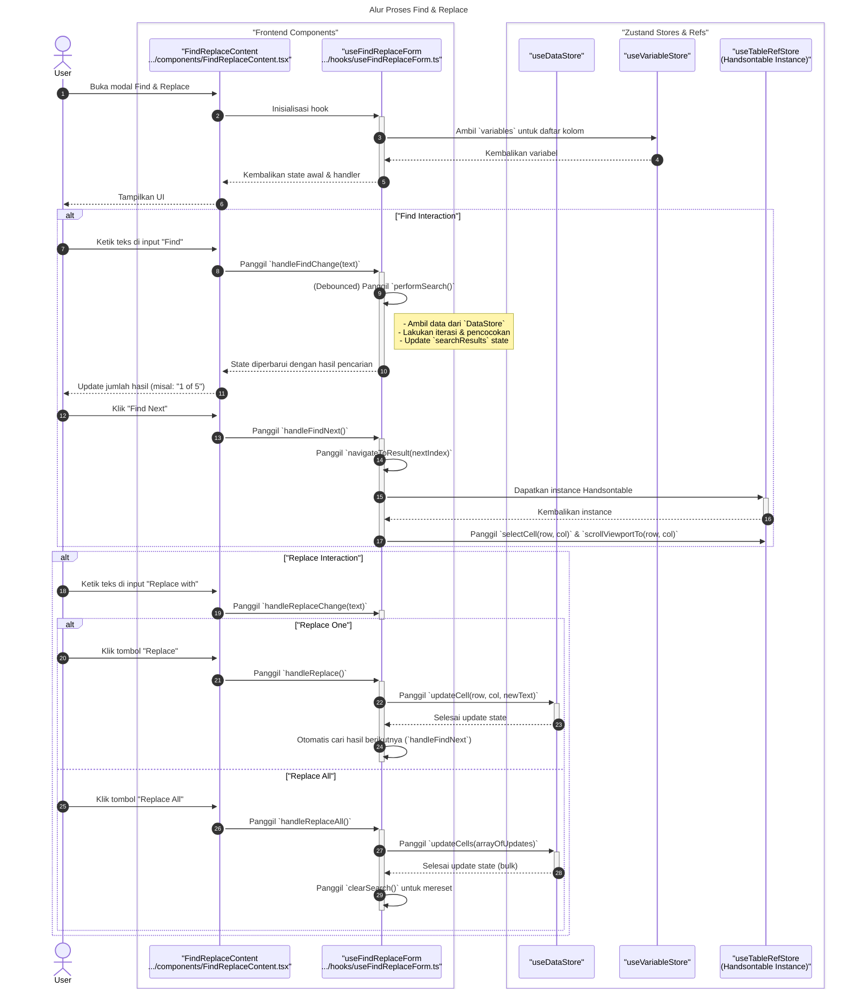

# Desain Fitur: Tampilan Data

Dokumen ini berisi paket desain (Design Package) untuk Feature Set `Tampilan Data`.

---

## 2. Design Package

### 2.1. Diagram Urutan (Sequence Diagrams)

Dokumentasi ini berisi diagram sekuens (sequence diagrams) yang menjelaskan alur kerja utama dan interaksi komponen dalam fitur `DataTable`.

---

### 1. Alur Proses Pengeditan Sel (Fitur #28, #30)

Diagram ini menunjukkan bagaimana perubahan data oleh pengguna pada satu sel diproses dari antarmuka hingga disimpan dalam state management (Zustand), termasuk validasi, transformasi, dan mekanisme *debouncing* untuk efisiensi.

```mermaid
sequenceDiagram
    title: Alur Proses Pengeditan Sel pada DataTable
    autonumber
    actor User
    
    box "Frontend Components"
        participant View as "DataTable (View)"
        participant Updates as "useTableUpdates"
    end

    box "Zustand Stores"
        participant DataStore as "useDataStore"
    end

    User->>+View: Mengedit nilai sel di tabel
    View->>+Updates: Memicu `handleAfterChange(changes)`
    
    Updates->>Updates: Validasi & transformasi data
    Updates->>Updates: Panggil `debouncedUpdateCells(updates)`
    
    Note over Updates, DataStore: Setelah 100ms
    
    Updates->>DataStore: `updateCells(updates)`
    deactivate Updates
    deactivate View
    
    DataStore->>DataStore: Memperbarui state `data`
    Note right of DataStore: UI akan re-render jika perlu
end
```

---

### 2. Alur Proses Penambahan Kolom Baru (Fitur #33)

Diagram berikut menjelaskan proses transaksional saat pengguna menambahkan kolom baru melalui menu konteks, yang melibatkan pembaruan sinkron pada `useVariableStore` dan `useDataStore`.

```mermaid
sequenceDiagram
    title: Alur Proses Penambahan Kolom Baru
    autonumber
    actor User
    
    box "Frontend Components"
        participant View as "DataTable (View)"
        participant ContextMenu as "useContextMenuLogic"
        participant Service as "contextMenuService"
    end
    
    box "Zustand Stores"
        participant VarStore as "useVariableStore"
        participant DataStore as "useDataStore"
    end

    User->>+View: Klik kanan -> "Insert column"
    View->>+ContextMenu: Memicu `handleInsertColumn()`
    ContextMenu->>+Service: Memanggil `insertColumn(index)`
    
    rect rgb(220, 220, 220)
        note over Service, DataStore: Transaksi Penambahan Kolom
        Service->>+VarStore: `addVariable()`
        VarStore-->>-Service: Variabel baru ditambahkan
        
        Service->>+DataStore: `addColumns()`
        DataStore-->>-Service: Kolom data baru ditambahkan
    end
    
    deactivate Service
    deactivate ContextMenu
    deactivate View

    VarStore-->>View: Notifikasi state update
    DataStore-->>View: Notifikasi state update
end
```

---

### 3. Alur Proses Menyisipkan Data ke Kolom Baru (Fitur #29)

Diagram ini mengilustrasikan logika saat pengguna melakukan *paste* data yang ukurannya melebihi grid yang ada. Sistem akan secara otomatis membuat variabel baru dengan tipe data yang diinferensi.

```mermaid
sequenceDiagram
    title: Alur Proses Menyisipkan Data ke Kolom Baru (Paste)
    autonumber
    actor User

    box "Frontend Components"
        participant View as "DataTable (View)"
        participant Updates as "useTableUpdates"
    end
    
    box "Zustand Stores"
        participant VarStore as "useVariableStore"
        participant DataStore as "useDataStore"
    end

    User->>+View: Menyisipkan (paste) data ke area kolom baru
    View->>+Updates: Memicu `handleAfterChange(changes)`
    
    alt Jika ada kolom baru
        Updates->>Updates: `handleNewColumns(updates)`
        Updates->>+VarStore: `addMultipleVariables(newVars)`
        Updates->>+DataStore: `addColumns(newCols)`
    end

    Updates->>Updates: Panggil `debouncedUpdateCells(updates)`
    Updates->>DataStore: `updateCells(updates)`
    
    deactivate Updates
    deactivate View
    
    Note right of DataStore: Kolom & sel baru diperbarui
end
```

### **Sequence Diagrams: Go To Case/Variable**

Dokumentasi ini berisi diagram sekuens yang merinci alur kerja untuk fitur "Go To Case/Variable".

---

### 1. Alur Proses Go To Case/Variable

Diagram ini menunjukkan bagaimana pengguna menavigasi ke baris (Case) atau kolom (Variable) tertentu dalam grid data.

```mermaid
sequenceDiagram
    title: Alur Proses Go To Case/Variable
    autonumber
    actor User

    box "Frontend Components"
        participant View as "GoToContent<br>.../components/GoToContent.tsx"
        participant Hook as "useGoToForm<br>.../hooks/useGoToForm.ts"
    end
    
    box "Zustand Stores & Refs"
        participant DataStore as "useDataStore"
        participant VarStore as "useVariableStore"
        participant TableRef as "useTableRefStore<br>(Handsontable Instance)"
    end

    User->>+View: Buka dialog "Go To"
    View->>+Hook: Inisialisasi hook
    Hook->>VarStore: Ambil `variables` untuk daftar kolom
    VarStore-->>Hook: Kembalikan variabel
    Hook->>DataStore: Ambil `data` untuk total kasus
    DataStore-->>Hook: Kembalikan data
    Hook-->>-View: Kembalikan state awal & handler
    View-->>User: Tampilkan UI

    alt "Go To Case"
        User->>View: Masukkan nomor kasus
        View->>+Hook: Panggil `handleCaseNumberChange(value)`
        Hook->>Hook: Validasi input terhadap total kasus
        Hook-->>-View: Perbarui state (misal: tampilkan error jika tidak valid)
        
        User->>View: Klik tombol "Go"
        View->>+Hook: Panggil `handleGo()`
        Hook->>Hook: Panggil `navigateToTarget('case')`
        Hook->>+TableRef: Dapatkan instance Handsontable
        TableRef-->>-Hook: Kembalikan instance
        Hook->>TableRef: Panggil `scrollViewportTo(rowIndex, 0)` & `selectRows(rowIndex)`
        Note right of TableRef: Menyorot seluruh baris
        deactivate Hook
    end

    alt "Go To Variable"
        User->>View: Pindah ke tab "Variable"
        View->>+Hook: Panggil `setActiveTab('variable')`
        deactivate Hook

        User->>View: Pilih variabel dari dropdown
        View->>+Hook: Panggil `handleSelectedVariableChange(varName)`
        deactivate Hook
        
        User->>View: Klik tombol "Go"
        View->>+Hook: Panggil `handleGo()`
        Hook->>Hook: Panggil `navigateToTarget('variable')`
        Hook->>VarStore: Dapatkan `columnIndex` dari variabel yang dipilih
        Hook->>+TableRef: Dapatkan instance Handsontable
        TableRef-->>-Hook: Kembalikan instance
        Hook->>TableRef: Panggil `scrollViewportTo(0, colIndex)` & `selectColumns(colIndex)`
        Note right of TableRef: Menyorot seluruh kolom
        deactivate Hook
    end

    User->>View: Click "Close"
    View->>-Hook: onClose()
    deactivate View
```

### **Sequence Diagram: Find & Replace**

Dokumentasi ini berisi diagram sekuens yang merinci alur kerja untuk fitur "Find & Replace".

---

### 1. Alur Proses Find & Replace

Diagram ini menunjukkan interaksi antara komponen UI, hook, dan data store saat pengguna melakukan operasi pencarian dan penggantian.



### **Sequence Diagram: Edit Menu Actions**

Dokumentasi ini berisi diagram sekuens yang merinci alur kerja untuk berbagai aksi yang dipicu dari menu "Edit".

---

### 1. Alur Proses Aksi pada Menu Edit

Diagram ini menunjukkan bagaimana interaksi pengguna pada `EditMenu` di-handle oleh hook `useEditMenuActions` dan bagaimana hook tersebut berinteraksi dengan Handsontable, Zustand store, dan Browser API untuk melakukan berbagai operasi.

```mermaid
sequenceDiagram
    title: Alur Proses Aksi pada Menu Edit
    autonumber
    actor User

    box "Frontend"
        participant Menu as "EditMenu<br>/Modals/Edit/EditMenu.tsx"
        participant Hook as "useEditMenuActions<br>.../hooks/useEditMenuActions.ts"
        participant HOT as "Handsontable Instance"
        participant Store as "useVariableStore"
        participant Clipboard as "Browser Clipboard API"
    end

    User->>+Menu: Klik sebuah item di menu Edit (misal: "Copy with Variable Names")
    Menu->>+Hook: Panggil `handleAction('...')`

    alt "Aksi Dasar" (Undo, Redo, Cut, Copy, Paste, Clear)
        Hook->>HOT: Dapatkan instance plugin `copyPaste`
        Hook->>HOT: Panggil metode yang sesuai<br>(undo, redo, cut, copy, paste, emptySelectedCells)
        Note right of HOT: Aksi ditangani langsung oleh<br>plugin internal Handsontable.

    else "Copy with Headers" (CopyWithVariableNames, CopyWithVariableLabels)
        Hook->>HOT: Dapatkan data dari sel yang dipilih
        HOT-->>Hook: Kembalikan data
        Hook->>+Store: Dapatkan nama/label variabel untuk kolom yang dipilih
        Store-->>-Hook: Kembalikan info variabel
        Hook->>Hook: Format data sebagai string TSV (Tab-Separated Values)
        Hook->>+Clipboard: Panggil `navigator.clipboard.writeText(tsvData)`
        Clipboard-->>-Hook: Selesai menulis ke clipboard

    else "Paste with Headers" (PasteWithVariableNames)
        Hook->>+Clipboard: Panggil `navigator.clipboard.readText()`
        Clipboard-->>-Hook: Kembalikan teks dari clipboard
        Hook->>Hook: Parse teks menjadi header dan baris data
        Hook->>+Store: Panggil `addMultipleVariables(headers)`
        Store-->>-Hook: Selesai menambah variabel (memicu penambahan kolom di grid)
        Hook->>HOT: Panggil `populateFromArray(dataRows)` untuk mengisi data
        
    else "Alterasi Grid" (InsertVariable, InsertCases)
        Hook->>HOT: Dapatkan sel yang dipilih
        Hook->>HOT: Panggil `alter('insert_col_start', ...)` atau `alter('insert_row_below', ...)`
        Note right of HOT: Handsontable menyisipkan baris/kolom baru.
    
    end

    Hook-->>-Menu: Aksi selesai
    deactivate Hook
    deactivate Menu
```

### 2.2. Penyempurnaan Model Objek (Object Model Refinements)

*Perubahan pada model objek (kelas, atribut, metode baru) yang ditemukan selama desain.*

- **Hooks Baru:**
  - `useTableDimensions.ts`: Mengelola dimensi (lebar, tinggi) grid agar sesuai dengan viewport.
  - `useTableStructure.ts`: Membangun struktur grid, termasuk header, tipe kolom, dan renderer (misal: mode nilai vs. label).
  - `useTableUpdates.ts`: Menangani semua operasi pembaruan data, seperti edit sel, paste, dan pembuatan kolom otomatis.
  - `useContextMenuLogic.ts`: Mengelola logika untuk menampilkan dan menangani aksi dari menu konteks (klik kanan).
- **Utilitas Baru:**
  - `dataTable/utils/utils.ts`: Kumpulan fungsi pembantu untuk validasi data, pemformatan, dan tugas-tugas kecil lainnya.
- **Komponen Baru:**
  - `dataTable/index.tsx`: Komponen utama yang mengintegrasikan semua hook dan merender grid data menggunakan Handsontable.

### 2.3. Catatan Alternatif Desain (Design Alternatives)

*Diskusi dan keputusan mengenai pilihan desain yang signifikan.*

- **Alternatif 1:** Menggunakan library data grid pihak ketiga yang kaya fitur seperti AG-Grid.
  - **Kelebihan:** Menyediakan banyak fungsionalitas siap pakai (sorting, filtering, grouping) dan dokumentasi yang ekstensif.
  - **Kekurangan:** Lisensi berbayar untuk fitur-fitur canggih, potensi *bundle size* yang besar, dan kustomisasi untuk fitur spesifik aplikasi (seperti mode value/label) bisa menjadi rumit.
- **Keputusan:** Membangun data grid kustom menggunakan `Handsontable` sebagai basis. Pilihan ini memberikan fleksibilitas penuh untuk mengimplementasikan fungsionalitas yang dibutuhkan secara presisi dan terintegrasi erat dengan state management aplikasi (`Zustand`), sambil tetap memanfaatkan engine grid yang kuat dan open-source untuk performa. 