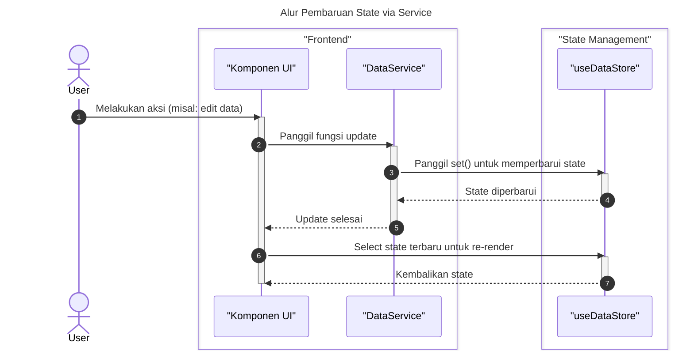

# Desain Fitur: Manajemen State (Domain)

Dokumen ini berisi paket desain (Design Package) untuk Feature Set `Manajemen State (Domain)`.

---

## 2. Design Package

### 2.1. Diagram Urutan (Sequence Diagrams)

*Diagram berikut menunjukkan bagaimana sebuah komponen UI berinteraksi dengan store untuk mengambil dan memperbarui data.*

### 2.2. Penyempurnaan Model Objek (Object Model Refinements)

*Perubahan pada model objek (kelas, atribut, metode baru) yang ditemukan selama desain.*

- **Store Baru (Zustand):**
  - `stores/useDataStore.ts`: Menyimpan dan mengelola state `data` (semua baris).
  - `stores/useMetaStore.ts`: Menyimpan dan mengelola state `variables` dan `meta` proyek.
  - `stores/useResultStore.ts`: Menyimpan dan mengelola state `results` dari analisis.
  - `stores/useTimeSeriesStore.ts`: Menyimpan dan mengelola state khusus untuk data deret waktu.

### 2.3. Catatan Alternatif Desain (Design Alternatives)

*Diskusi dan keputusan mengenai pilihan desain yang signifikan.*

- **Alternatif 1:** Menggunakan React Context API untuk manajemen state.
  - **Kelebihan:** Solusi bawaan React, tidak perlu dependensi eksternal.
  - **Kekurangan:** Dapat menyebabkan masalah performa (re-render yang tidak perlu) pada aplikasi yang kompleks dengan state yang sering berubah. Sulit untuk mengelola state di luar pohon komponen React.
- **Keputusan:** Menggunakan `Zustand`. Library ini memberikan solusi yang lebih performan dengan mencegah re-render yang tidak perlu, API yang sederhana, dan kemampuan untuk menggunakan state di luar komponen React (misalnya di dalam services), yang sangat sesuai untuk arsitektur aplikasi ini. 