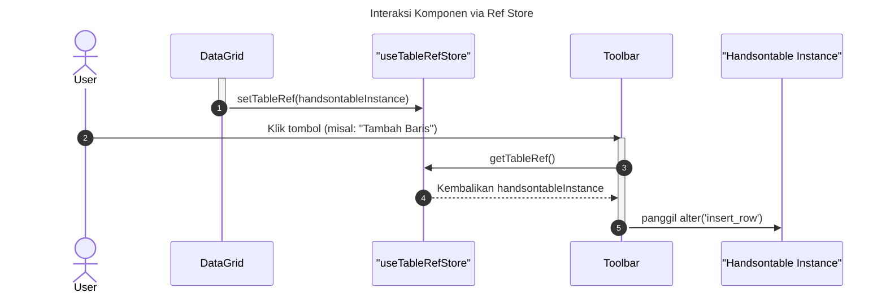

# Desain Fitur: Manajemen State (UI)

Dokumen ini berisi paket desain (Design Package) untuk Feature Set `Manajemen State (UI)`.

---

## 2. Design Package

### 2.1. Diagram Urutan (Sequence Diagrams)

*Diagram berikut mengilustrasikan bagaimana sebuah komponen (misal: DataGrid) mendaftarkan referensinya ke store, dan bagaimana komponen lain (misal: Toolbar) menggunakan referensi tersebut untuk memanggil sebuah metode pada instance DataGrid.*

### 2.2. Penyempurnaan Model Objek (Object Model Refinements)

*Perubahan pada model objek (kelas, atribut, metode baru) yang ditemukan selama desain.*

- **Store Baru (Zustand):**
  - `stores/useTableRefStore.ts`: Menyimpan referensi ke instance `Handsontable` untuk Data View dan Variable View, memungkinkan komponen lain untuk memanggil API tabel secara imperatif.

### 2.3. Catatan Alternatif Desain (Design Alternatives)

*Diskusi dan keputusan mengenai pilihan desain yang signifikan.*

- **Alternatif 1:** Menggunakan React `forwardRef` dan mengangkat state referensi ke komponen induk bersama.
  - **Kelebihan:** Pola standar React untuk meneruskan ref.
  - **Kekurangan:** Akan menyebabkan "prop drilling" yang signifikan jika komponen yang membutuhkan referensi berada jauh di dalam pohon komponen. Membuat arsitektur menjadi sangat terikat dan kurang fleksibel.
- **Keputusan:** Menggunakan store `Zustand` untuk menyimpan referensi. Ini bertindak sebagai "portal" atau event bus, memungkinkan komponen yang tidak berhubungan langsung untuk berinteraksi secara bersih tanpa perlu prop-drilling. Ini sangat berguna untuk Aksi global seperti tombol di Toolbar yang perlu berinteraksi dengan tabel yang sedang aktif. 