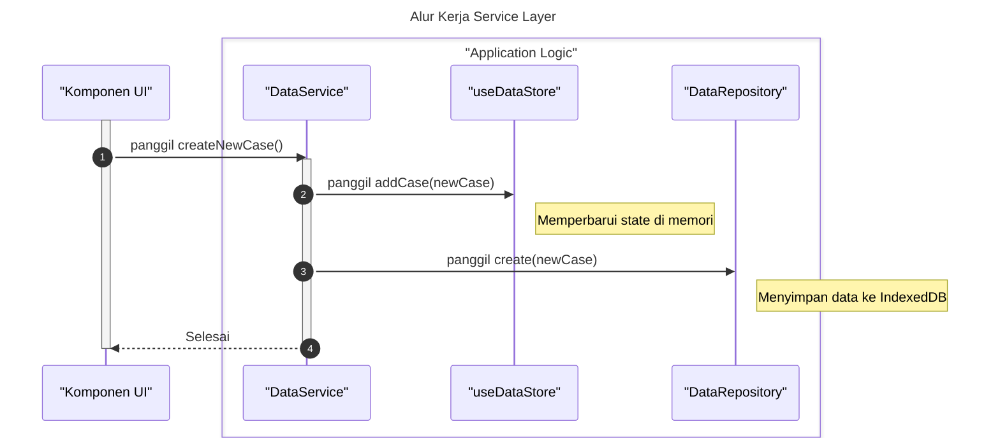

# Desain Fitur: Lapisan Layanan (Data)

Dokumen ini berisi paket desain (Design Package) untuk Feature Set `Lapisan Layanan (Data)`.

---

## 2. Design Package

### 2.1. Diagram Urutan (Sequence Diagrams)

*Diagram ini menunjukkan alur kerja di mana sebuah komponen menggunakan Service untuk melakukan operasi, yang kemudian berinteraksi dengan Store dan Repository.*

### 2.2. Penyempurnaan Model Objek (Object Model Refinements)

*Perubahan pada model objek (kelas, atribut, metode baru) yang ditemukan selama desain.*

- **Service Baru:**
  - `services/data/DataService.ts`: Mengandung semua logika bisnis terkait data mentah (misal: `addCase`, `updateCell`, `deleteCase`).
  - `services/data/VariableService.ts`: Mengandung logika bisnis untuk variabel (misal: `addVariable`, `updateVariableProperties`).
  - `services/data/ResultService.ts`: Mengandung logika bisnis untuk hasil analisis (misal: `saveResult`).
  - `services/data/MetaService.ts`: Mengandung logika bisnis untuk metadata proyek (misal: `setFileName`).
- **Prinsip Desain:**
  - **Single Responsibility:** Setiap service bertanggung jawab atas satu domain data.
  - **Facade Pattern:** Service bertindak sebagai fasad yang menyederhanakan interaksi dengan sistem di bawahnya (stores, repositories). Komponen UI hanya perlu tahu tentang service, bukan detail implementasi penyimpanan data.

### 2.3. Catatan Alternatif Desain (Design Alternatives)

*Diskusi dan keputusan mengenai pilihan desain yang signifikan.*

- **Alternatif 1:** Meletakkan semua logika bisnis langsung di dalam komponen React.
  - **Kelebihan:** Cepat untuk implementasi awal pada komponen sederhana.
  - **Kekurangan:** Logika bisnis menjadi tersebar, sulit diuji, dan diduplikasi di banyak tempat. Komponen menjadi sangat besar dan melanggar prinsip Single Responsibility.
- **Keputusan:** Membuat lapisan layanan (Service Layer) terpisah. Ini memusatkan logika bisnis, membuatnya dapat digunakan kembali (reusable), lebih mudah diuji secara terisolasi, dan memisahkan 'concerns' antara UI dan logika aplikasi. 