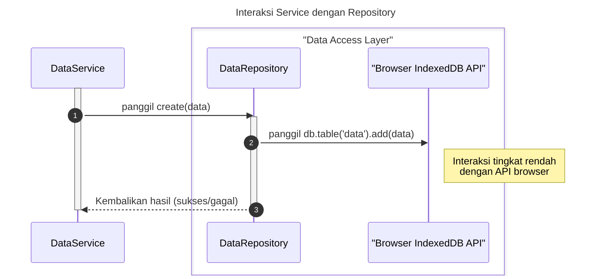

# Desain Fitur: Lapisan Repositori

Dokumen ini berisi paket desain (Design Package) untuk Feature Set `Lapisan Repositori`.

---

## 1. Work Package

- **Fitur yang Dikerjakan:**
  - Menyediakan abstraksi akses ke IndexedDB untuk entitas Data
  - Menyediakan abstraksi akses ke IndexedDB untuk entitas Variabel
  - Menyediakan abstraksi akses ke IndexedDB untuk entitas Hasil
  - Menyediakan abstraksi akses ke IndexedDB untuk entitas Meta
- **Tim Fitur (Class Owners):**
  - `[Nama Tim/Developer]`
- **Jadwal (Estimasi):**
  - **Walkthrough:** `[Tanggal]`
  - **Design:** `[Tanggal]`
  - **Design Review:** `[Tanggal]`

---

## 2. Design Package

### 2.1. Diagram Urutan (Sequence Diagrams)

*Diagram ini menggambarkan bagaimana sebuah Service menggunakan Repository untuk menyimpan data ke penyimpanan persisten (IndexedDB) tanpa mengetahui detail implementasi IndexedDB.*

### 2.2. Penyempurnaan Model Objek (Object Model Refinements)

*Perubahan pada model objek (kelas, atribut, metode baru) yang ditemukan selama desain.*

- **Repository Baru:**
  - `repositories/DataRepository.ts`: Menyediakan metode CRUD (Create, Read, Update, Delete) untuk entitas `Data` di IndexedDB.
  - `repositories/VariableRepository.ts`: Menyediakan metode CRUD untuk entitas `Variable` di IndexedDB.
  - `repositories/ResultRepository.ts`: Menyediakan metode CRUD untuk entitas `Result` di IndexedDB.
  - `repositories/MetaRepository.ts`: Menyediakan metode CRUD untuk entitas `Meta` di IndexedDB.
- **Pola Desain:**
  - **Repository Pattern:** Mengabstraksi dan memisahkan logika akses data dari logika bisnis. Service tidak perlu tahu apakah data disimpan di IndexedDB, localStorage, atau dikirim ke server. Ini membuat penggantian mekanisme penyimpanan di masa depan lebih mudah.

### 2.3. Catatan Alternatif Desain (Design Alternatives)

*Diskusi dan keputusan mengenai pilihan desain yang signifikan.*

- **Alternatif 1:** Service langsung berinteraksi dengan IndexedDB (menggunakan library seperti `dexie.js`).
  - **Kelebihan:** Mengurangi satu lapisan abstraksi, mungkin sedikit lebih cepat untuk ditulis pada awalnya.
  - **Kekurangan:** Mencampuradukkan logika bisnis dengan logika akses data. Jika suatu saat ingin mengganti IndexedDB dengan teknologi lain (misal: `SQLite Wasm`, `API backend`), maka semua service harus ditulis ulang.
- **Keputusan:** Menggunakan Repository Pattern. Ini memberikan pemisahan tanggung jawab yang jelas dan membuat sistem lebih modular dan mudah beradaptasi terhadap perubahan teknologi penyimpanan data.

---

## 3. Laporan Inspeksi Desain (Design Inspection Report)

- **Hasil:** `[Diterima / Diterima dengan Revisi / Ditolak]`
- **Cacat yang Ditemukan:**
  1. `[Deskripsi Cacat 1]`
- **Daftar Tugas (To-Do List):**
  - `[Tindakan perbaikan 1]` 