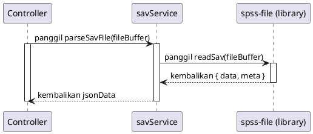

# Desain Fitur: Pemrosesan File .sav (Server)

Dokumen ini berisi paket desain (Design Package) untuk Feature Set `Pemrosesan File .sav (Server)`.

---

## 2. Design Package

### 2.1. Diagram Urutan (Sequence Diagrams)

*Diagram berikut mengilustrasikan proses di mana service menerima buffer file, memprosesnya, dan mengembalikan data dalam format JSON.*

### 2.2. Penyempurnaan Model Objek (Object Model Refinements)

*Perubahan pada model objek (kelas, atribut, metode baru) yang ditemukan selama desain.*

- **Service Baru:**
  - `backend/server/services/savService.ts`: Sebuah modul yang berisi logika inti untuk berinteraksi dengan file `.sav`.
    - `parseSavFile(buffer)`: Menerima buffer file dan mengembalikan promise yang resolve dengan data dan metadata dalam format JSON.
    - `createSavFile(jsonData)`: Menerima objek JSON dari data dan metadata, dan mengembalikan promise yang resolve dengan buffer file `.sav` yang baru.
- **Dependensi:**
  - Menggunakan library npm seperti `spss-file` atau sejenisnya untuk menangani pembacaan dan penulisan format file biner `.sav`.

### 2.3. Catatan Alternatif Desain (Design Alternatives)

*Diskusi dan keputusan mengenai pilihan desain yang signifikan.*

- **Alternatif 1:** Melakukan pemrosesan file `.sav` di sisi klien (browser) menggunakan WebAssembly (WASM).
  - **Kelebihan:** Tidak memerlukan infrastruktur server, pemrosesan terjadi langsung di mesin pengguna yang bisa lebih cepat.
  - **Kekurangan:** Kompleksitas yang tinggi dalam mengkompilasi library C/C++ yang ada untuk format SPSS ke WASM. Menambah ukuran bundel aplikasi klien secara signifikan.
- **Keputusan:** Menggunakan backend Node.js. Ini menyederhanakan manajemen dependensi (cukup `npm install`) dan menjaga agar aplikasi klien tetap ringan. Interaksi dengan file biner lebih mudah ditangani di lingkungan Node.js. 