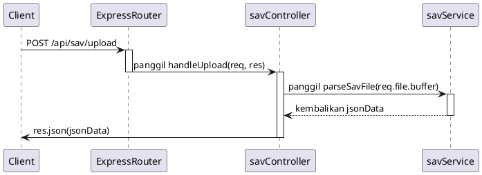

# Desain Fitur: API (Server)

Dokumen ini berisi paket desain (Design Package) untuk Feature Set `API (Server)`.

---

## 2. Design Package

### 2.1. Diagram Urutan (Sequence Diagrams)

*Diagram ini menunjukkan alur penanganan permintaan API dari rute ke controller, lalu ke service.*

### 2.2. Penyempurnaan Model Objek (Object Model Refinements)

*Perubahan pada model objek (kelas, atribut, metode baru) yang ditemukan selama desain.*

- **Framework:**
  - Menggunakan **Express.js** sebagai kerangka kerja server.
- **Router Baru:**
  - `backend/server/routes/savRoutes.ts`: Mendefinisikan endpoint API.
    - `POST /api/sav/upload`: Menerima unggahan file (menggunakan middleware seperti `multer` untuk menangani `multipart/form-data`).
    - `POST /api/sav/create`: Menerima data JSON dan menghasilkan file untuk diunduh.
- **Controller Baru:**
  - `backend/server/controllers/savController.ts`: Menangani logika permintaan dan respons HTTP.
    - `handleUpload(req, res)`: Mengambil file dari request, memanggil service untuk memprosesnya, dan mengirimkan kembali JSON.
    - `handleCreate(req, res)`: Mengambil JSON dari body request, memanggil service untuk membuat file, dan mengirimkan kembali file `.sav`.

### 2.3. Catatan Alternatif Desain (Design Alternatives)

*Diskusi dan keputusan mengenai pilihan desain yang signifikan.*

- **Alternatif 1:** Menggabungkan semua logika (rute, controller, service) dalam satu file `server.js`.
  - **Kelebihan:** Sangat sederhana untuk API yang sangat kecil dengan satu atau dua endpoint.
  - **Kekurangan:** Cepat menjadi tidak terkelola seiring bertambahnya kompleksitas. Melanggar Prinsip Pemisahan Tanggung Jawab (Separation of Concerns) dan sulit untuk diuji dan dipelihara.
- **Keputusan:** Menggunakan struktur arsitektur MVC-like (Model-View-Controller) atau lebih tepatnya (Routes-Controllers-Services). Ini adalah pola standar dalam pengembangan backend yang mempromosikan kode yang terorganisir, modular, dan dapat diskalakan. 