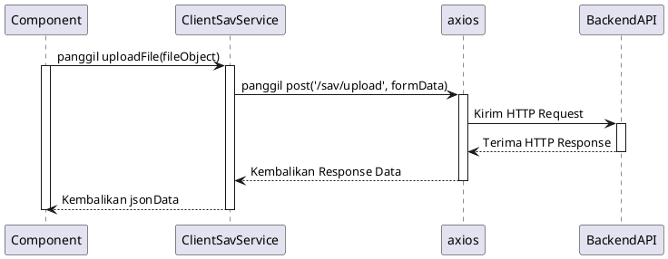

# Desain Fitur: Layanan API (Klien)

Dokumen ini berisi paket desain (Design Package) untuk Feature Set `Layanan API (Klien)`.

---

## 2. Design Package

### 2.1. Diagram Urutan (Sequence Diagrams)

*Diagram ini menunjukkan bagaimana sebuah komponen UI di klien menggunakan service API untuk berkomunikasi dengan backend.*

### 2.2. Penyempurnaan Model Objek (Object Model Refinements)

*Perubahan pada model objek (kelas, atribut, metode baru) yang ditemukan selama desain.*

- **Layanan API Klien Baru:**
  - `services/api/savService.ts`: Sebuah modul yang mengenkapsulasi semua interaksi dengan API `.sav` di backend.
    - `uploadFile(file)`: Menerima objek File, membuat `FormData`, dan mengirimkannya ke backend.
    - `createFile(data)`: Menerima data JSON, mengirimkannya ke backend, dan menangani respons file.
- **Konfigurasi API:**
  - `services/api/config.ts`: File untuk mengkonfigurasi dan mengekspor instance `axios` yang sudah dikonfigurasi sebelumnya.
    - Mengatur `baseURL` agar tidak perlu menulis URL lengkap di setiap permintaan.
    - Mengatur `headers` default jika diperlukan (misal: `Content-Type`).

### 2.3. Catatan Alternatif Desain (Design Alternatives)

*Diskusi dan keputusan mengenai pilihan desain yang signifikan.*

- **Alternatif 1:** Melakukan pemanggilan `fetch` atau `axios` langsung dari dalam komponen UI.
  - **Kelebihan:** Tidak memerlukan lapisan abstraksi tambahan, mungkin terasa lebih cepat untuk satu pemanggilan.
  - **Kekurangan:** Mencampuradukkan logika UI dengan logika komunikasi jaringan. Konfigurasi API (URL, headers) tersebar dan harus diulang-ulang. Sulit untuk mengelola state API (loading, error) secara konsisten.
- **Keputusan:** Membuat lapisan layanan API khusus di klien. Ini sesuai dengan prinsip pemisahan tanggung jawab, memusatkan semua logika API di satu tempat, membuatnya mudah untuk dikonfigurasi, dipelihara, dan diuji. 