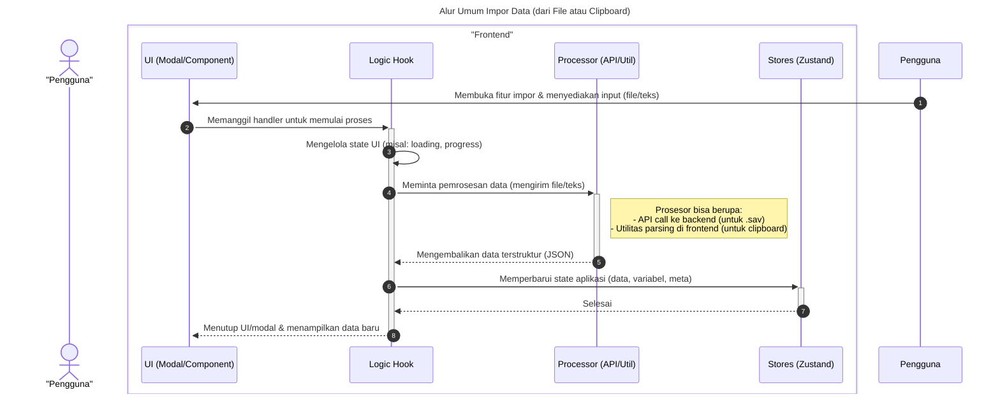
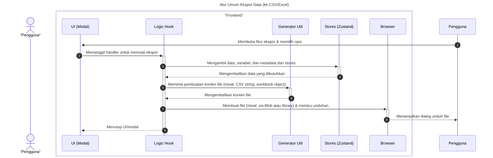

# Desain Fitur: Sistem Modal File

Dokumen ini berisi paket desain (Design Package) untuk Feature Set `Sistem Modal File`.

---

## 2. Design Package

### 2.1. Diagram Urutan (Sequence Diagrams)

*Diagram ini menggambarkan bagaimana sistem modal generik digunakan untuk meluncurkan modal manajemen file spesifik (misalnya, Open, Import, Export) dari menu File.*

### **Sequence Diagrams: Interaksi Manajemen File**

Dokumentasi ini berisi generalisasi diagram sekuens (sequence diagrams) yang menjelaskan alur kerja utama untuk fitur-fitur manajemen file, seperti impor, ekspor, dan aksi menu lainnya.

---

### 1. Alur Umum Impor Data

Diagram ini menggeneralisasi proses impor data, baik dari file lokal (seperti `.sav`) maupun dari clipboard.



---

### 2. Alur Umum Ekspor Data

Diagram berikut merangkum alur kerja ekspor data ke berbagai format (misalnya CSV, Excel).



---

### 3. Alur Proses Aksi pada Menu File

Diagram ini menunjukkan bagaimana interaksi pengguna pada `FileMenu` (seperti "New", "Save As", "Exit") di-handle oleh hook `useFileMenuActions` dan bagaimana hook tersebut berinteraksi dengan berbagai store, servis, dan router.

```mermaid
sequenceDiagram
    title: Alur Proses Aksi pada Menu File
    actor User as "Pengguna"

    box "Frontend"
        participant Menu as "FileMenu<br>/Modals/File/FileMenu.tsx"
        participant Hook as "useFileMenuActions<br>/Modals/File/hooks/useFileMenuActions.ts"
        participant Stores as "Zustand Stores"
        participant Router as "Next.js Router"
        participant API as "API Service<br>/services/api.ts"
    end
    
    box "Backend"
        participant Backend as "Backend API"
    end

    autonumber

    Pengguna->>+Menu: Klik sebuah aksi (misal: "New")
    Menu->>+Hook: Panggil `handleAction({ actionType: '...' })`

    alt "New" (Proyek Baru)
        Hook->>Stores: Panggil `resetData()`, `resetVariables()`,<br>`resetMeta()`, `clearAll()`
        Note right of Stores: Membersihkan state aplikasi
        Stores-->>Hook: Selesai
    
    else "Save" (Simpan ke Local Storage)
        Hook->>Stores: Panggil `saveMeta()`, `saveVariables()`, `saveData()`
        Note right of Stores: Menyimpan state ke local storage browser
        Stores-->>Hook: Selesai

    else "Save As" (Simpan sebagai .sav)
        Hook->>Stores: Ambil data, variabel, dan metadata
        Stores-->>Hook: Kembalikan state
        Hook->>Hook: Lakukan sanitasi & transformasi data
        Hook->>+API: Panggil `createSavFile(payload)`
        API->>+Backend: POST /api/sav-upload dengan data JSON
        Backend-->>-API: Kembalikan file dalam bentuk Blob
        API-->>-Hook: Kembalikan Blob
        Hook->>Hook: Panggil `downloadBlobAsFile(blob, 'data.sav')`
        Note right of Hook: Memicu unduhan file di browser

    else "Exit" (Keluar)
        Hook->>Stores: Panggil `resetData()`, `resetVariables()`,<br>`resetMeta()`, `clearAll()`
        Stores-->>Hook: Selesai
        Hook->>Router: Panggil `router.push('/')`
        Router-->>Pengguna: Arahkan ke halaman utama
    end

    Hook-->>-Menu: Aksi selesai
    deactivate Hook
    deactivate Menu
```

### 2.2. Penyempurnaan Model Objek (Object Model Refinements)

*Perubahan pada model objek (kelas, atribut, metode baru) yang ditemukan selama desain.*

- **Komponen Menu:**
  - `FileMenu.tsx`: Komponen yang membangun struktur menu "File" (misalnya, Buka, Impor, Ekspor). Setiap item menu tidak secara langsung memanggil modal, melainkan memanggil `useModalStore.openModal` dengan ID unik dari modal yang diinginkan.
- **Registry Spesifik:**
  - `FileRegistry.tsx`: Sebuah file yang berisi objek pemetaan (map) dari ID modal file ke komponen modal sebenarnya. Contoh: `{ "ImportCsv": lazy(() => import('./ImportCsv')), ... }`. Registry ini kemudian digabungkan ke dalam `ModalRegistry` utama.
- **Pola Desain:**
  - **Registry Pattern:** Memungkinkan pendaftaran dan pemanggilan komponen secara dinamis berdasarkan string ID.
  - **Lazy Loading:** Menggunakan `React.lazy` untuk memastikan kode untuk sebuah modal hanya diunduh ketika modal tersebut pertama kali dibuka, yang secara signifikan mengurangi ukuran bundel awal aplikasi.

### 2.3. Catatan Alternatif Desain (Design Alternatives)

*Diskusi dan keputusan mengenai pilihan desain yang signifikan.*

- **Alternatif 1:** Setiap item menu mengimpor dan mengelola state (misal: `isOpen`) untuk modalnya sendiri.
  - **Kelebihan:** Konsepnya sederhana.
  - **Kekurangan:** Tidak ada cara terpusat untuk mengelola modal, bisa jadi beberapa modal terbuka secara bersamaan. Kode untuk menampilkan modal akan tersebar di seluruh menu. Tidak mendukung lazy loading dengan baik.
- **Keputusan:** Menggunakan sistem `ModalManager` dan `Registry` terpusat. Ini memastikan hanya satu modal yang bisa aktif pada satu waktu, memisahkan concern antara pemicu (menu) dan komponen (modal), dan terintegrasi dengan baik dengan lazy loading untuk performa yang optimal. 