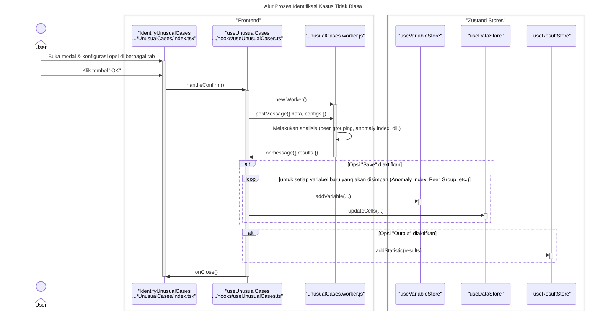

# Desain Fitur: Identifikasi Kasus Tidak Biasa

Dokumen ini berisi paket desain (Design Package) untuk Feature Set `Identifikasi Kasus Tidak Biasa`.

---

## 2. Design Package

### 2.1. Diagram Urutan (Sequence Diagrams)

*Diagram ini menunjukkan alur di mana pengguna mengonfigurasi analisis kompleks, yang kemudian dijalankan oleh worker.*

### **Sequence Diagram: Identify Unusual Cases**

Dokumentasi ini berisi diagram sekuens yang merinci alur kerja fitur "Identify Unusual Cases", yang menggunakan Web Worker untuk analisis intensif.

---

### 1. Alur Proses Identifikasi Kasus Tidak Biasa

Diagram ini menunjukkan bagaimana konfigurasi pengguna dari berbagai tab dikirim ke Web Worker untuk diproses. Hasilnya kemudian dapat memicu pembuatan variabel baru di `DataStore` dan `VariableStore`, serta laporan di `ResultStore`.

### 2.2. Penyempurnaan Model Objek (Object Model Refinements)

*Perubahan pada model objek (kelas, atribut, metode baru) yang ditemukan selama desain.*

- **Komponen Modal Bertab:**
  - `UnusualCases/index.tsx`: Komponen induk yang mengelola tab.
  - `VariablesTab.tsx`, `OptionsTab.tsx`, `OutputTab.tsx`, `SaveTab.tsx`, `MissingValuesTab.tsx`: Setiap tab bertanggung jawab untuk sebagian kecil dari konfigurasi yang sangat kompleks.
- **Web Worker:**
  - `unusualCasesWorker.js`: Karena kompleksitas algoritmik (clustering, perhitungan deviasi), seluruh logika analisis utama dijalankan di worker untuk mencegah UI freeze.
- **Hook/Service:**
  - Logika UI dikoordinasikan oleh hook atau langsung di dalam komponen `index.tsx`, yang tugas utamanya adalah mengumpulkan konfigurasi dari semua tab dan mengirimkannya ke worker.

### 2.3. Catatan Alternatif Desain (Design Alternatives)

*Diskusi dan keputusan mengenai pilihan desain yang signifikan.*

- **Alternatif 1:** Menempatkan semua opsi dalam satu dialog scrollable yang panjang.
  - **Kelebihan:** Implementasi UI lebih cepat.
  - **Kekurangan:** Akan menghasilkan antarmuka yang sangat panjang dan menakutkan. Pengguna akan kesulitan untuk memahami semua opsi yang tersedia.
- **Keputusan:** Menggunakan antarmuka bertab yang dikelompokkan secara logis. Ini adalah pola standar untuk dialog analisis yang kompleks dalam perangkat lunak statistik (seperti SPSS). Tab memecah konfigurasi menjadi bagian-bagian yang dapat dikelola (Variabel, Opsi, Output, dll.), yang jauh lebih mudah dinavigasi oleh pengguna.

--- 