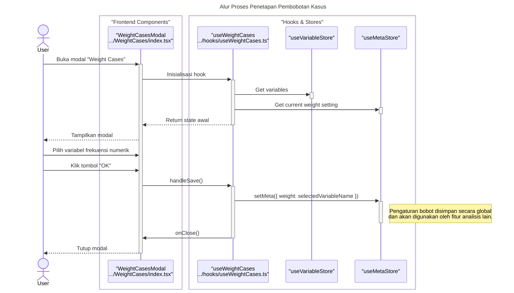

# Desain Fitur: Pembobotan Kasus

Dokumen ini berisi paket desain (Design Package) untuk Feature Set `Pembobotan Kasus`.

---

## 2. Design Package

### 2.1. Diagram Urutan (Sequence Diagrams)

*Diagram ini menunjukkan alur sederhana untuk mengatur atau menghapus pembobotan.*

### **Sequence Diagram: Weight Cases**

Dokumentasi ini berisi diagram sekuens yang merinci alur kerja fitur "Weight Cases", yang digunakan untuk menerapkan pembobotan kasus berdasarkan variabel frekuensi.

---

### 1. Alur Proses Penetapan Pembobotan Kasus

Diagram ini menunjukkan bagaimana pemilihan variabel oleh pengguna hanya mengubah satu entri di `MetaStore`, yang kemudian akan digunakan oleh fitur analisis lainnya. Tidak ada data sel yang diubah secara langsung oleh fitur ini.

### 2.2. Penyempurnaan Model Objek (Object Model Refinements)

*Perubahan pada model objek (kelas, atribut, metode baru) yang ditemukan selama desain.*

- **Komponen Modal:**
  - `WeightCases/index.tsx`: Komponen UI sederhana yang berisi dropdown untuk memilih variabel dan tombol untuk menerapkan atau mematikan pembobotan.
- **Hook Logika:**
  - `useWeightCases.ts`: Mengelola state dialog. Memvalidasi bahwa variabel yang dipilih adalah numerik. Memanggil `MetaService` untuk mengatur variabel pembobotan.
- **State Management:**
  - Konfigurasi pembobotan (nama variabel yang digunakan sebagai bobot) disimpan sebagai properti global di `useMetaStore`.
  - Prosedur analisis statistik (misalnya, Frekuensi, Crosstabs) kemudian bertanggung jawab untuk memeriksa apakah ada variabel pembobot yang aktif di `useMetaStore`. Jika ya, mereka harus menggunakan nilainya dalam perhitungan mereka.

### 2.3. Catatan Alternatif Desain (Design Alternatives)

*Diskusi dan keputusan mengenai pilihan desain yang signifikan.*

- **Alternatif 1:** Setiap dialog analisis memiliki opsi pembobotannya sendiri.
  - **Kelebihan:** Konfigurasi eksplisit di setiap analisis.
  - **Kekurangan:** Sangat berulang. Pengguna harus memilih variabel pembobot yang sama berulang kali untuk setiap analisis yang mereka jalankan.
- **Keputusan:** Menggunakan status pembobotan global. Ini adalah perilaku standar dalam paket statistik seperti SPSS. Pengguna mengatur bobot sekali, dan itu berlaku untuk semua analisis berikutnya sampai dinonaktifkan. Ini jauh lebih efisien untuk alur kerja analisis tipikal.

--- 