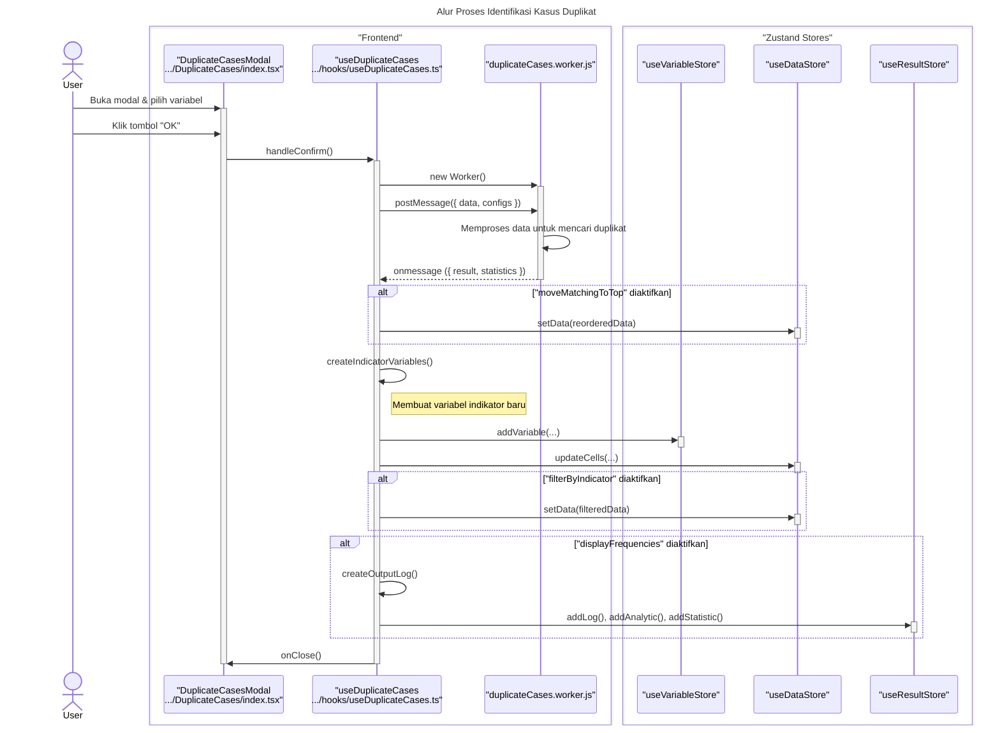

# Desain Fitur: Identifikasi Kasus Duplikat

Dokumen ini berisi paket desain (Design Package) untuk Feature Set `Identifikasi Kasus Duplikat`.

---

## 2. Design Package

### 2.1. Diagram Urutan (Sequence Diagrams)

*Diagram ini menunjukkan alur kerja untuk mengidentifikasi dan menandai kasus duplikat.*

### **Sequence Diagram: Identify Duplicate Cases**

Dokumentasi ini berisi diagram sekuens yang merinci alur kerja fitur "Identify Duplicate Cases", yang menggunakan Web Worker untuk pemrosesan latar belakang.

---

### 1. Alur Proses Identifikasi Kasus Duplikat

Diagram ini menunjukkan bagaimana interaksi pengguna memicu proses di Web Worker dan bagaimana hasilnya digunakan untuk memodifikasi state aplikasi, seperti membuat variabel indikator baru, memfilter/mengurutkan data, dan menampilkan laporan.

### 2.2. Penyempurnaan Model Objek (Object Model Refinements)

*Perubahan pada model objek (kelas, atribut, metode baru) yang ditemukan selama desain.*

- **Komponen Modal Bertab:**
  - `DuplicateCases/index.tsx`: Komponen induk dengan tab.
  - `VariableTab.tsx`: UI untuk memilih variabel yang akan digunakan untuk menentukan duplikasi.
  - `OptionsTab.tsx`: UI untuk mengonfigurasi output (misalnya, nama variabel indikator baru).
- **Hook Logika:**
  - `useDuplicateCases.ts`: Hook utama yang berisi semua logika:
    1.  Mengambil data dan konfigurasi.
    2.  Membuat "kunci" untuk setiap baris dengan menggabungkan nilai dari variabel pembanding.
    3.  Menggunakan Map atau Set untuk melacak kunci yang sudah terlihat dan mengidentifikasi duplikat.
    4.  Membuat kolom variabel indikator baru (`0` untuk unik, `1` untuk duplikat).
    5.  Memanggil `DataService` dan `MetaService` untuk menambahkan variabel baru ke dataset.

### 2.3. Catatan Alternatif Desain (Design Alternatives)

*Diskusi dan keputusan mengenai pilihan desain yang signifikan.*

- **Alternatif 1:** Menjalankan di web worker.
  - **Kelebihan:** Performa lebih baik pada data sangat besar.
  - **Kekurangan:** Kompleksitas tambahan.
- **Keputusan:** Melakukan di thread utama. Proses ini sebagian besar melibatkan iterasi dan pencarian di map, yang sangat cepat. Overhead untuk memindahkan data ke dan dari worker kemungkinan akan lebih lambat daripada menjalankan logika secara langsung untuk sebagian besar kasus penggunaan. Dapat dioptimalkan ke worker nanti jika terbukti menjadi bottleneck.

--- 