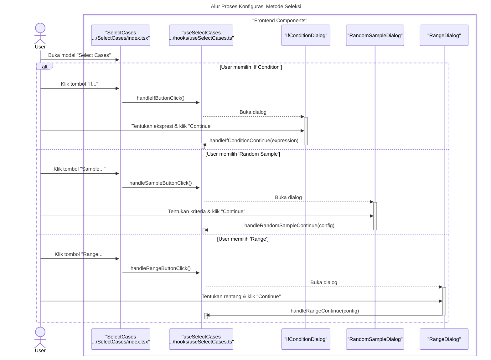

# Desain Fitur: Seleksi Kasus

Dokumen ini berisi paket desain (Design Package) untuk Feature Set `Seleksi Kasus`.

---

## 2. Design Package

### 2.1. Diagram Urutan (Sequence Diagrams)

*Diagram ini menunjukkan alur di mana pengguna mendefinisikan suatu kondisi dan menerapkannya untuk memfilter data.*

### **Sequence Diagram: Select Cases**

Dokumentasi ini berisi diagram sekuens yang merinci alur kerja fitur "Select Cases", yang memiliki beberapa metode seleksi yang berbeda.

---

### 1. Alur Proses Konfigurasi Metode Seleksi

Diagram ini menunjukkan bagaimana pengguna memilih salah satu dari beberapa metode seleksi yang tersedia (misalnya, "If Condition", "Random Sample", "Range") dan berinteraksi dengan sub-dialog yang sesuai untuk mengonfigurasi kriteria.



---

### 2. Alur Proses Konfirmasi dan Eksekusi

Setelah kriteria dikonfigurasi, diagram ini menunjukkan bagaimana proses dieksekusi setelah pengguna mengklik "OK". Alur ini mencakup pemanggilan service yang sesuai, pembuatan variabel filter, dan pembaruan data atau metadata.

```mermaid
sequenceDiagram
    title: Alur Proses Konfirmasi dan Eksekusi Seleksi
    actor User

    box "Frontend Components"
        participant Modal as "SelectCases<br>.../SelectCases/index.tsx"
        participant Hook as "useSelectCases<br>.../hooks/useSelectCases.ts"
        participant Service as "selectors<br>.../services/selectors.ts"
    end

    box "Zustand Stores"
        participant VarStore as "useVariableStore"
        participant DataStore as "useDataStore"
        participant MetaStore as "useMetaStore"
    end

    User->>+Modal: Pilih opsi output & klik "OK"
    Modal->>+Hook: handleConfirm()
    
    alt Berdasarkan Metode Seleksi yang Dikonfigurasi
        Hook->>Hook: Memanggil apply...Filter() yang sesuai
        Hook->>+Service: Memanggil selectBy...(data, config)
        Service-->>-Hook: Return selectedIndices
        deactivate Service
    end

    alt Output: 'Filter out unselected cases'
        Hook->>Hook: createFilterVariable(selectedIndices)
        Hook->>+VarStore: addVariable("filter_$")
        deactivate VarStore
        Hook->>+DataStore: updateCells(filterValues)
        deactivate DataStore
        Hook->>+MetaStore: setMeta({ filter: "filter_$" })
        deactivate MetaStore
    else Output: 'Delete unselected cases'
        Hook->>+DataStore: deleteRows(unselectedIndices)
        deactivate DataStore
    end
    
    Hook->>Modal: onClose()
    deactivate Hook
```

### 2.2. Penyempurnaan Model Objek (Object Model Refinements)

*Perubahan pada model objek (kelas, atribut, metode baru) yang ditemukan selama desain.*

- **Komponen:**
  - `SelectCases/index.tsx`: Komponen utama yang memungkinkan pemilihan tipe seleksi (Jika, Sampel, Rentang).
  - `dialogs/SelectCasesIfCondition.tsx`: UI builder yang kompleks untuk membuat ekspresi kondisional (misalnya, `AGE > 30 AND GENDER = 'M'`).
- **Service:**
  - `services/selectors.ts`: Berisi logika murni untuk setiap tipe seleksi:
    - `selectIf`: Menerima string ekspresi dan mengevaluasinya untuk setiap kasus.
    - `selectRandom`: Menerima persentase dan secara acak memilih kasus.
    - `selectRange`: Menerima rentang awal dan akhir dan memilih kasus di dalamnya.
    - Semua fungsi ini mengembalikan array boolean (`filter$`) yang panjangnya sama dengan jumlah kasus.
- **State Management:**
  - Filter yang aktif disimpan di `useMetaStore`, bukan dengan menghapus data dari `useDataStore`. Ini memastikan bahwa kasus yang tidak terpilih hanya "disembunyikan" atau dinonaktifkan, bukan dihapus secara permanen.

### 2.3. Catatan Alternatif Desain (Design Alternatives)

*Diskusi dan keputusan mengenai pilihan desain yang signifikan.*

- **Alternatif 1:** Menghapus kasus yang tidak terpilih secara fisik dari `useDataStore`.
  - **Kelebihan:** Konsepnya sederhana.
  - **Kekurangan:** Operasi yang merusak (destructive). Pengguna akan kehilangan data secara permanen jika mereka ingin membatalkan filter.
- **Keputusan:** Menggunakan variabel filter (`filter$`) yang disimpan secara terpisah di metadata. Ini adalah pendekatan non-destruktif yang merupakan standar dalam perangkat lunak statistik. Data asli tetap utuh, dan filter dapat dengan mudah diaktifkan, dinonaktifkan, atau diubah tanpa risiko kehilangan data. 