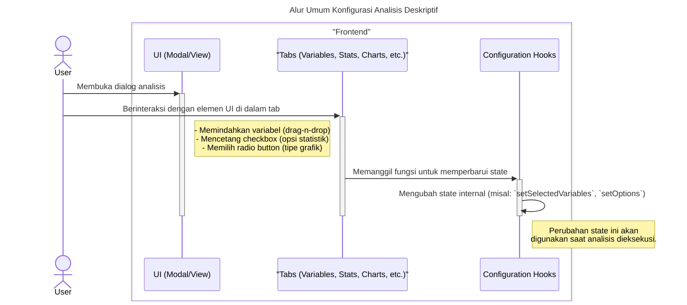
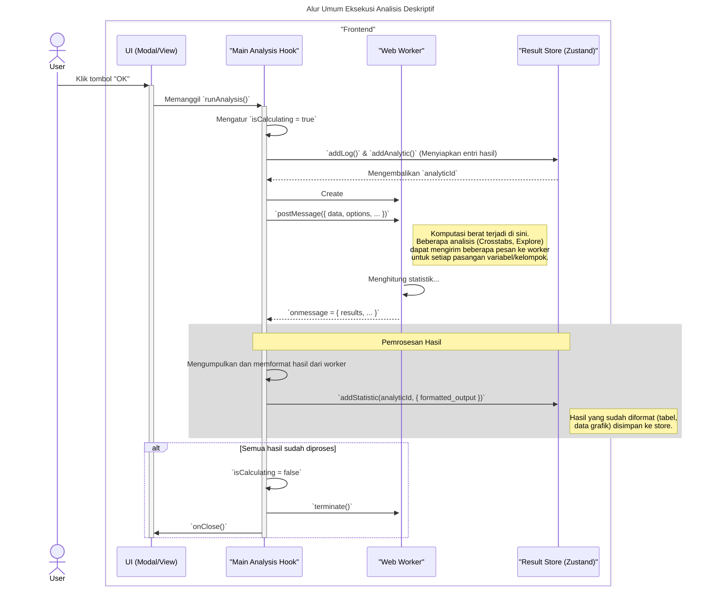

# Desain Fitur: Akses Analisis Deskriptif

Dokumen ini berisi paket desain (Design Package) untuk Feature Set `Akses Analisis Deskriptif`.

---

## 2. Design Package

### 2.1. Diagram Urutan (Sequence Diagrams)

*Diagram ini menggambarkan bagaimana sistem modal generik digunakan untuk meluncurkan modal analisis spesifik dari sub-menu Analyze > Descriptive Statistics.*

### **Sequence Diagrams: Interaksi Analisis Deskriptif**

Dokumentasi ini berisi generalisasi diagram sekuens (sequence diagrams) yang menjelaskan alur kerja dan pola interaksi yang umum ditemukan pada semua fitur analisis deskriptif (seperti Frequencies, Descriptives, Crosstabs, dan Explore).

---

### 1. Alur Umum Konfigurasi Analisis

Diagram ini menggeneralisasi proses di mana pengguna mengonfigurasi sebuah analisis sebelum menjalankannya. Ini mencakup pemilihan variabel dan pengaturan opsi spesifik (seperti statistik, sel, atau grafik) melalui antarmuka berbasis tab.

---

### 2. Alur Umum Eksekusi Analisis (via Web Worker)

Diagram berikut merangkum alur kerja utama saat analisis dieksekusi. Pola yang paling penting adalah pendelegasian komputasi statistik yang berat ke **Web Worker** untuk menjaga antarmuka tetap responsif.

### 2.2. Penyempurnaan Model Objek (Object Model Refinements)

*Perubahan pada model objek (kelas, atribut, metode baru) yang ditemukan selama desain.*

- **Komponen Menu:**
  - `DescriptiveMenu.tsx`: Komponen yang membangun struktur menu "Analyze > Descriptive Statistics" (misalnya, Frequencies, Descriptives, Crosstabs). Setiap item menu memanggil `useModalStore.openModal` dengan ID unik dari modal analisis yang diinginkan.
- **Registry Spesifik:**
  - `DescriptiveRegistry.tsx`: Sebuah objek pemetaan dari ID modal deskriptif ke komponen modal yang sebenarnya, menggunakan `React.lazy` untuk pemuatan kode on-demand. Registry ini akan digabungkan ke dalam `AnalyzeRegistry` yang lebih besar dan kemudian ke `ModalRegistry` utama.
- **Pola Desain:**
  - **Registry Pattern & Lazy Loading:** Sama seperti `FileRegistry`, ini memungkinkan pemanggilan komponen secara dinamis dan efisien, memastikan kode untuk analisis yang kompleks hanya dimuat saat diperlukan.

### 2.3. Catatan Alternatif Desain (Design Alternatives)

*Diskusi dan keputusan mengenai pilihan desain yang signifikan.*

- **Keputusan:** Menggunakan pola arsitektur yang sama dengan `FileMenu` dan `FileRegistry` untuk konsistensi di seluruh aplikasi. Pola `Manager` dan `Registry` terpusat terbukti efektif untuk mengelola puluhan modal yang berbeda secara bersih dan efisien.

--- 