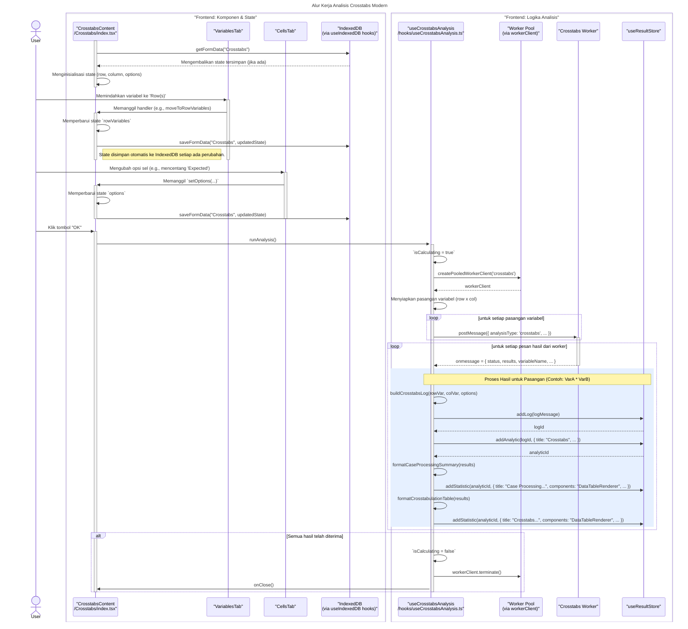

# Desain Fitur: Dialog Analisis Crosstabs

Dokumen ini berisi paket desain (Design Package) untuk Feature Set `Dialog Analisis Crosstabs`.

---

## 2. Design Package

### 2.1. Diagram Urutan (Sequence Diagrams)

*Diagram ini menunjukkan alur kerja komprehensif untuk analisis Crosstabs, mulai dari interaksi pengguna, manajemen state dengan IndexedDB, hingga eksekusi analisis oleh web worker yang dikoordinasikan oleh hook `useCrosstabsAnalysis`.*

### **Sequence Diagram: Alur Kerja Analisis Crosstabs Modern**

### 2.2. Penyempurnaan Model Objek (Object Model Refinements)

*Perubahan pada model objek (kelas, atribut, metode baru) yang ditemukan selama desain.*

- **Komponen Modal Bertab:**
  - `Crosstabs/index.tsx`: Komponen induk yang mengelola state UI (variabel yang dipilih, opsi) dan siklus hidup modal.
  - `VariablesTab.tsx`: UI untuk memilih variabel Baris dan Kolom.
  - `CellsTab.tsx`: UI yang berisi checkbox untuk memilih statistik yang akan ditampilkan di setiap sel.
- **Hook Logika & Utilitas:**
  - `hooks/useCrosstabsAnalysis.ts`: Hook sentral yang bertanggung jawab untuk:
    - Mengambil data dan konfigurasi yang relevan.
    - Mengelola interaksi dengan *web worker pool*.
    - Memproses hasil dari worker (memformat tabel, membuat log).
    - Memperbarui `useResultStore` dengan output analisis.
  - `hooks/useIndexedDB.ts`: Menyediakan fungsi `saveFormData` dan `getFormData` untuk menyimpan dan memulihkan state formulir secara otomatis, memastikan persistensi antar sesi.
  - `utils/workerClient.ts`: Menyediakan abstraksi `createPooledWorkerClient` untuk mengelola siklus hidup web worker, memungkinkan penggunaan kembali worker untuk efisiensi.
- **Web Worker:**
  - Worker khusus untuk analisis Crosstabs (`crosstabs.worker.js` atau sejenisnya) yang melakukan komputasi berat di luar *main thread*.

### 2.3. Catatan Alternatif Desain (Design Alternatives)

*Diskusi dan keputusan mengenai pilihan desain yang signifikan.*

- **Keputusan:** Menggunakan **IndexedDB untuk persistensi state otomatis**. Ini meningkatkan pengalaman pengguna secara signifikan dengan menyimpan konfigurasi dialog (variabel yang dipilih, opsi) bahkan jika pengguna menutup modal tanpa sengaja atau me-refresh halaman.
- **Keputusan:** Menggunakan **Worker Pool** (`createPooledWorkerClient`). Daripada membuat dan menghancurkan worker untuk setiap analisis, sistem sekarang mengelola sebuah pool. Ini mengurangi overhead pembuatan worker dan membuat eksekusi analisis berulang menjadi lebih cepat dan efisien.
- **Keputusan:** **Pemisahan output menjadi beberapa statistik**. Hasil analisis (misalnya, *Case Processing Summary* dan *Crosstabulation Table*) sekarang ditambahkan sebagai item statistik terpisah di `useResultStore`. Ini memberikan fleksibilitas lebih besar dalam menampilkan hasil di UI output. 