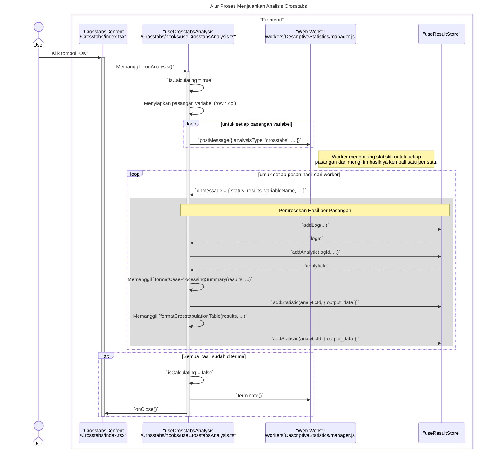

# Desain Fitur: Dialog Analisis Crosstabs

Dokumen ini berisi paket desain (Design Package) untuk Feature Set `Dialog Analisis Crosstabs`.

---

## 2. Design Package

### 2.1. Diagram Urutan (Sequence Diagrams)

*Diagram ini menunjukkan alur di mana pengguna mengonfigurasi dan menjalankan analisis Crosstabs, yang dieksekusi oleh web worker.*

### **Sequence Diagrams: Crosstabs Analysis**

Dokumentasi ini berisi diagram sekuens (sequence diagrams) yang menjelaskan alur kerja utama dan interaksi komponen dalam fitur `Crosstabs`.

---

### 1. Alur Proses Konfigurasi Variabel dan Opsi

Diagram ini menunjukkan bagaimana pengguna memilih variabel dan mengonfigurasi opsi pada tab yang berbeda, dan bagaimana state tersebut dikelola oleh komponen `CrosstabsContent`.

```mermaid
sequenceDiagram
    title: Alur Proses Konfigurasi Variabel dan Opsi
    actor User

    box "Frontend Components"
        participant View as "CrosstabsContent<br>/Crosstabs/index.tsx"
        participant VarTab as "VariablesTab<br>/Crosstabs/VariablesTab.tsx"
        participant CellTab as "CellsTab<br>/Crosstabs/CellsTab.tsx"
    end

    User->>+VarTab: Memindahkan variabel ke daftar "Row(s)"
    VarTab->>+View: Memanggil `moveToRowVariables(variable)`
    View->>View: `setRowVariables(...)` & `setAvailableVariables(...)`
    Note right of View: State untuk variabel diperbarui, memicu re-render.
    deactivate View
    deactivate VarTab

    User->>+View: Pindah ke tab "Cells"
    activate View
    User->>+CellTab: Mencetang checkbox "Expected"
    CellTab->>+View: Memanggil `setOptions(...)`
    View->>View: `setOptions({ cells: { expected: true, ... }})`
    Note right of View: State untuk opsi sel diperbarui.
    deactivate View
    deactivate CellTab

    Note across View, CellTab: Semua state ini (`rowVariables`, `columnVariables`, `options`)<br/>akan diteruskan ke hook `useCrosstabsAnalysis`<br/>saat pengguna menekan tombol "OK".
```

---

### 2. Alur Proses Menjalankan Analisis Crosstabs

Diagram berikut menjelaskan proses utama saat pengguna memulai analisis, termasuk pendelegasian komputasi ke Web Worker untuk setiap pasangan variabel.



### 2.2. Penyempurnaan Model Objek (Object Model Refinements)

*Perubahan pada model objek (kelas, atribut, metode baru) yang ditemukan selama desain.*

- **Komponen Modal Bertab:**
  - `Crosstabs/index.tsx`: Komponen induk yang mengelola tab.
  - `VariablesTab.tsx`: UI untuk memilih variabel Baris dan Kolom.
  - `CellsTab.tsx`: UI yang berisi checkbox untuk memilih statistik yang akan ditampilkan di setiap sel (misalnya, Observed Counts, Expected Counts, Row Percentages).
- **Hook Logika:**
  - `hooks/useCrosstabs.ts` (atau serupa): Mengumpulkan konfigurasi dari semua tab, memanggil web worker dengan data dan konfigurasi, dan mengirimkan hasilnya ke `ResultService`.
- **Web Worker:**
  - Worker khusus untuk analisis Crosstabs. Tugasnya adalah membangun matriks (tabel kontingensi) dari variabel baris dan kolom, menghitung frekuensi, dan kemudian menghitung statistik sel yang diminta.

### 2.3. Catatan Alternatif Desain (Design Alternatives)

*Diskusi dan keputusan mengenai pilihan desain yang signifikan.*

- **Keputusan:** Menggunakan Web Worker untuk perhitungan. Meskipun Crosstabs sederhana secara konseptual, proses iterasi melalui puluhan ribu kasus untuk membangun tabel kontingensi bisa menjadi lambat dan harus dipindahkan dari thread utama untuk menjaga responsivitas UI.

--- 