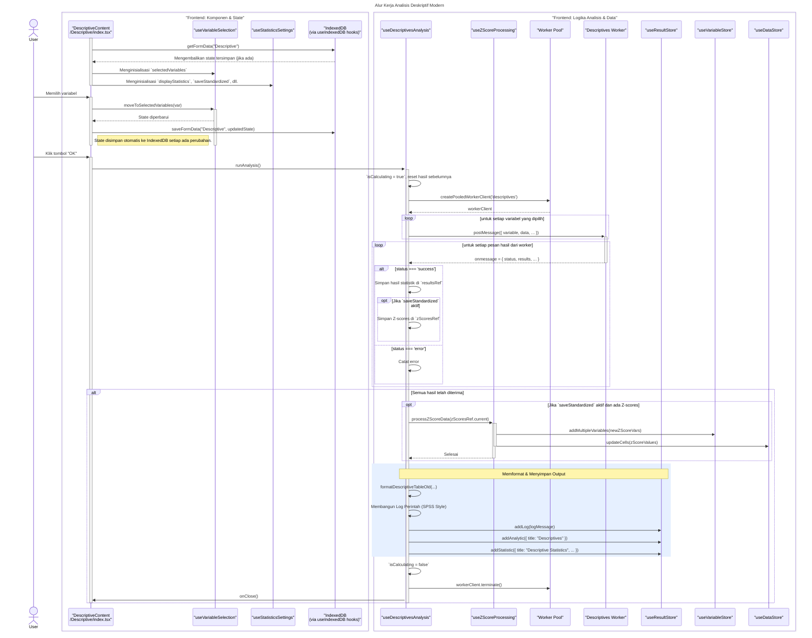

# Desain Fitur: Dialog Analisis Deskriptif

Dokumen ini berisi paket desain (Design Package) untuk Feature Set `Dialog Analisis Deskriptif`.

---

## 2. Design Package

### 2.1. Diagram Urutan (Sequence Diagrams)

*Diagram ini menunjukkan alur kerja komprehensif untuk analisis Deskriptif, mulai dari interaksi pengguna dan manajemen state otomatis dengan IndexedDB, hingga eksekusi analisis oleh web worker, pemrosesan Z-score, dan penyimpanan hasil.*

### **Sequence Diagram: Alur Kerja Analisis Deskriptif Modern**

### 2.2. Penyempurnaan Model Objek (Object Model Refinements)

*Perubahan pada model objek yang ditemukan selama desain.*

-   **Komponen Bertab:**
    -   `Descriptive/index.tsx`: Komponen induk yang mengintegrasikan semua *hooks* dan mengelola UI utama (tab, tombol).
    -   `components/VariablesTab.tsx`: UI untuk memilih variabel dan mengaktifkan/menonaktifkan penyimpanan Z-score.
    -   `components/StatisticsTab.tsx`: UI untuk memilih statistik spesifik (Mean, Std. Dev, dll.) dan urutan tampilannya.
-   **Hook Logika & Utilitas:**
    -   `hooks/useVariableSelection.ts`: Mengelola state untuk daftar variabel yang tersedia dan yang dipilih.
    -   `hooks/useStatisticsSettings.ts`: Mengelola state untuk semua opsi statistik yang dapat dikonfigurasi.
    -   `hooks/useDescriptivesAnalysis.ts`: Hook orkestrator utama yang:
        -   Memulai dan mengelola *worker pool*.
        -   Mengirim tugas analisis per variabel ke *worker*.
        -   Mengumpulkan hasil secara asinkron.
        -   Memicu pemrosesan Z-score.
        -   Memformat output akhir dan menyimpannya ke `useResultStore`.
    -   `hooks/useZScoreProcessing.ts`: Logika terisolasi untuk membuat variabel baru dan memperbarui data mentah dengan nilai Z-score.
    -   `hooks/useIndexedDB.ts`: Menyediakan persistensi state otomatis untuk dialog.
    -   `utils/workerClient.ts`: Menyediakan abstraksi *worker pool* untuk efisiensi.
-   **Web Worker:**
    -   Worker khusus untuk analisis Deskriptif yang menghitung semua statistik yang diminta untuk satu variabel per tugas.

### 2.3. Catatan Alternatif Desain (Design Alternatives)

*Diskusi dan keputusan mengenai pilihan desain yang signifikan.*

-   **Keputusan:** **Ekstraksi Logika ke Custom Hooks.** Logika yang kompleks untuk manajemen state (pemilihan variabel, pengaturan statistik) dan proses analisis dipisahkan ke dalam *custom hooks* React. Ini membuat komponen `DescriptiveContent` utama jauh lebih bersih, lebih mudah dibaca, dan mempromosikan penggunaan kembali logika.
-   **Keputusan:** **Persistensi State Otomatis via IndexedDB.** Daripada meminta pengguna menyimpan pengaturan secara manual, state dialog (variabel terpilih, statistik) disimpan secara otomatis saat diubah. Ini memberikan pengalaman pengguna yang mulus, memungkinkan mereka untuk melanjutkan analisis nanti tanpa harus mengkonfigurasi ulang dari awal.
-   **Keputusan:** **Pemrosesan Hasil Agregat dengan Z-Score Opsional.** Alur analisis dirancang untuk menangani banyak hasil *worker* secara asinkron. Logika untuk menyimpan Z-score dipisahkan ke dalam `useZScoreProcessing` dan hanya dipanggil jika diperlukan, menjaga alur utama tetap bersih.

--- 