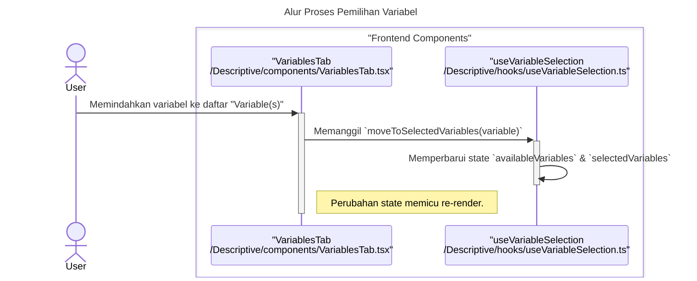
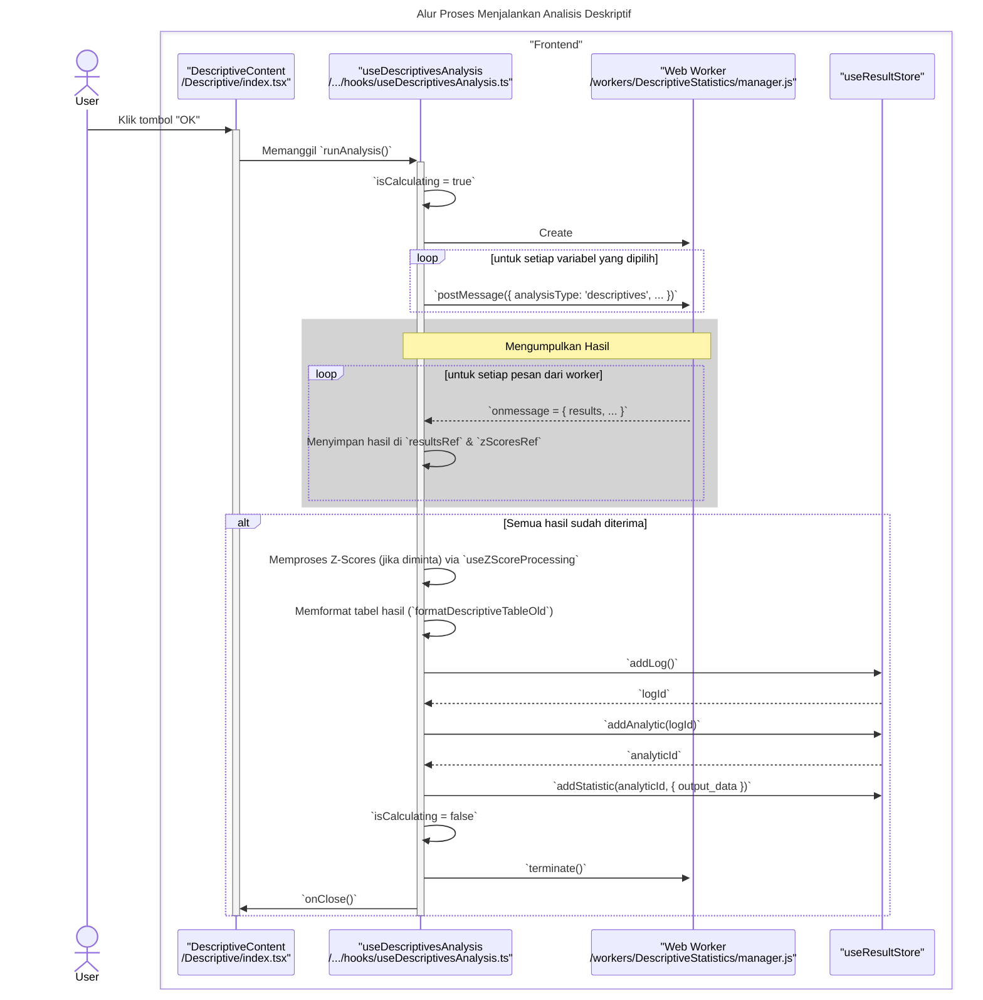
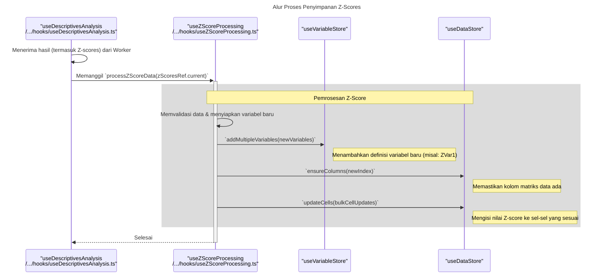

# Desain Fitur: Dialog Analisis Deskriptif

Dokumen ini berisi paket desain (Design Package) untuk Feature Set `Dialog Analisis Deskriptif`.

---

## 2. Design Package

### 2.1. Diagram Urutan (Sequence Diagrams)

*Diagram ini menunjukkan alur kerja analisis Deskriptif.*

### **Sequence Diagrams: Descriptive Statistics**

Dokumentasi ini berisi diagram sekuens (sequence diagrams) yang menjelaskan alur kerja utama dan interaksi komponen dalam fitur `Descriptive Statistics`.

---

### 1. Alur Proses Pemilihan Variabel

Diagram ini menunjukkan bagaimana pengguna memilih variabel untuk dianalisis, yang dikelola oleh hook `useVariableSelection`.

---

### 2. Alur Proses Menjalankan Analisis

Diagram berikut menjelaskan proses utama saat pengguna memulai analisis, termasuk pendelegasian komputasi ke Web Worker dan agregasi hasil.

---

### 3. Alur Proses Penyimpanan Z-Scores

Diagram ini mengilustrasikan logika spesifik yang dieksekusi oleh `useZScoreProcessing` ketika opsi "Save standardized values as variables" diaktifkan.

### 2.2. Penyempurnaan Model Objek (Object Model Refinements)

*Perubahan pada model objek (kelas, atribut, metode baru) yang ditemukan selama desain.*

- **Komponen Modal:**
  - `Descriptive/index.tsx`: Komponen modal utama.
  - `components/OptionsDialog.tsx` (atau serupa): Dialog sekunder yang terbuka dari modal utama untuk memilih statistik spesifik yang akan dihitung (Mean, Std. deviation, Variance, Range, S.E. mean, dll).
- **Hook Logika:**
  - `hooks/useDescriptives.ts`: Mengumpulkan daftar variabel dan opsi statistik, memanggil worker, dan menangani output.
- **Web Worker:**
  - Worker khusus untuk analisis Deskriptif. Menerima data (hanya kolom numerik yang relevan) dan daftar statistik yang harus dihitung. Melakukan satu kali iterasi melalui data untuk menghitung semua statistik yang diminta secara efisien.

### 2.3. Catatan Alternatif Desain (Design Alternatives)

*Diskusi dan keputusan mengenai pilihan desain yang signifikan.*

- **Alternatif 1:** Membuka dialog terpisah untuk setiap statistik (satu untuk Mean, satu untuk Min/Max, dll).
  - **Kelebihan:** Dialog yang sangat sederhana.
  - **Kekurangan:** Pengalaman pengguna yang sangat buruk dan tidak efisien. Pengguna harus menjalankan analisis berulang kali untuk mendapatkan satu set statistik deskriptif dasar.
- **Keputusan:** Menggunakan dialog utama dengan dialog "Opsi" sekunder. Ini adalah pola UI/UX yang sudah terbukti di banyak paket statistik. Ini memungkinkan pengguna untuk menjalankan satu analisis komprehensif dalam satu langkah, yang jauh lebih efisien.

--- 