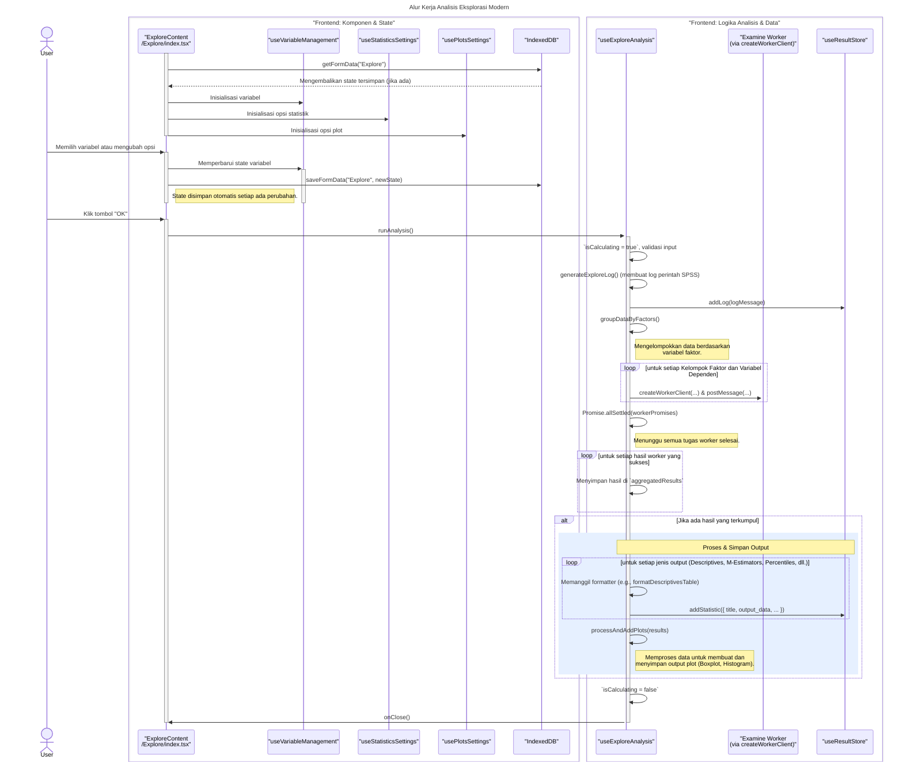

# Desain Fitur: Dialog Analisis Eksplorasi

Dokumen ini berisi paket desain (Design Package) untuk Feature Set `Dialog Analisis Eksplorasi`.

---

## 2. Design Package

### 2.1. Diagram Urutan (Sequence Diagrams)

*Diagram ini menunjukkan alur kerja komprehensif untuk analisis Eksplorasi (Explore), mulai dari interaksi pengguna, manajemen state otomatis dengan IndexedDB, hingga eksekusi analisis paralel yang dikoordinasikan oleh `useExploreAnalysis`.*

### **Sequence Diagram: Alur Kerja Analisis Eksplorasi Modern**

### 2.2. Penyempurnaan Model Objek (Object Model Refinements)

*Perubahan pada model objek yang ditemukan selama desain.*

-   **Komponen Bertab:**
    -   `Explore/index.tsx`: Komponen induk yang mengintegrasikan semua *hooks* dan mengelola UI utama.
    -   `VariablesTab.tsx`: UI untuk memilih variabel Dependen, Faktor, dan Label.
    -   `StatisticsTab.tsx`: UI untuk memilih output statistik (Deskriptif, M-estimators, Outliers, Persentil).
    -   `PlotsTab.tsx`: UI untuk memilih output visual (Boxplot, Stem-and-leaf, Histogram, Uji Normalitas).
-   **Hook Logika & Utilitas:**
    -   `hooks/useVariableManagement.ts`: Mengelola state untuk semua daftar variabel (dependen, faktor, label).
    -   `hooks/useStatisticsSettings.ts`: Mengelola state untuk opsi-opsi pada tab "Statistics".
    -   `hooks/usePlotsSettings.ts`: Mengelola state untuk opsi-opsi pada tab "Plots".
    -   `hooks/useExploreAnalysis.ts`: Hook orkestrator utama yang:
        -   Mengelompokkan data berdasarkan variabel faktor.
        -   Membuat dan mengelola banyak *worker* secara paralel untuk setiap kelompok data dan variabel dependen.
        -   Mengagregasi hasil dari semua *worker* menggunakan `Promise.allSettled`.
        -   Memanggil serangkaian *formatter* untuk membuat tabel-tabel output.
        -   Memanggil pemroses plot untuk menghasilkan visualisasi.
        -   Menyimpan semua output (log, tabel, plot) ke `useResultStore`.
    -   `hooks/useIndexedDB.ts`: Menyediakan persistensi state otomatis untuk dialog.
    -   `utils/workerClient.ts`: Menyediakan abstraksi untuk membuat instance *worker*.
-   **Web Worker:**
    -   `workers/DescriptiveStatistics/examine.worker.js`: Worker khusus yang mampu menghitung berbagai statistik deskriptif dan terkait eksplorasi untuk satu set data.

### 2.3. Catatan Alternatif Desain (Design Alternatives)

*Diskusi dan keputusan mengenai pilihan desain yang signifikan.*

-   **Keputusan:** **Ekstraksi Logika ke Custom Hooks.** Seperti dialog analisis lainnya, logika untuk manajemen variabel, statistik, dan plot dipisahkan ke dalam *hooks* tersendiri. Ini menjaga komponen UI tetap bersih dan mempromosikan pemisahan masalah (*separation of concerns*).
-   **Keputusan:** **Eksekusi Paralel dengan `Promise.allSettled`.** Analisis Eksplorasi secara inheren paralel (setiap sub-kelompok dapat dianalisis secara independen). Menggunakan `Promise.allSettled` memungkinkan semua tugas komputasi dikirim ke *worker* secara bersamaan dan hasilnya dikumpulkan saat semuanya selesai. Ini secara signifikan mempercepat analisis pada dataset dengan banyak kelompok faktor.
-   **Keputusan:** **Modularitas Output dengan Formatter.** Daripada memiliki satu fungsi besar untuk membuat semua output, logika untuk setiap tabel (Deskriptif, M-Estimator, dll.) dan plot dipisahkan menjadi fungsi *formatter* atau *processor* sendiri. Ini membuat kode lebih mudah dikelola dan diperluas di masa depan.
-   **Keputusan:** **Pemisahan dari Dialog Deskriptif.** Meskipun ada tumpang tindih, Analisis Eksplorasi tetap menjadi prosedur yang berbeda karena fokusnya pada perbandingan antar kelompok dan opsi plot/statistik yang lebih spesifik. Memisahkannya menjadi dialog sendiri menghasilkan pengalaman pengguna yang lebih jelas dan terarah.

--- 