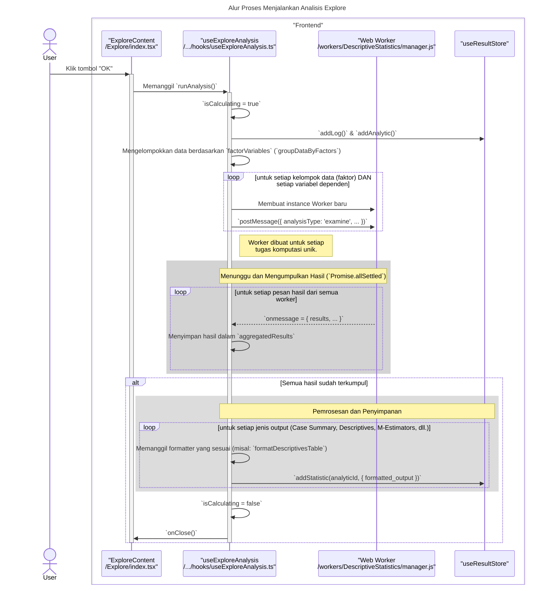

# Desain Fitur: Dialog Analisis Eksplorasi

Dokumen ini berisi paket desain (Design Package) untuk Feature Set `Dialog Analisis Eksplorasi`.

---

## 2. Design Package

### 2.1. Diagram Urutan (Sequence Diagrams)

*Diagram ini menunjukkan alur kerja analisis Eksplorasi, yang memisahkan data berdasarkan faktor sebelum menghitung statistik.*

### **Sequence Diagrams: Explore Analysis**

Dokumentasi ini berisi diagram sekuens (sequence diagrams) yang menjelaskan alur kerja utama dan interaksi komponen dalam fitur `Explore`.

---

### 1. Alur Proses Konfigurasi Variabel dan Opsi

Diagram ini menunjukkan bagaimana pengguna memilih variabel dan mengatur opsi pada tab yang berbeda, dengan state dikelola oleh `ExploreContent` melalui berbagai hook.

```mermaid
sequenceDiagram
    title: Alur Proses Konfigurasi Variabel dan Opsi Statistik
    actor User

    box "Frontend Components"
        participant View as "ExploreContent<br>/Explore/index.tsx"
        participant VarTab as "VariablesTab<br>/Explore/VariablesTab.tsx"
        participant StatsTab as "StatisticsTab<br>/Explore/StatisticsTab.tsx"
        participant VarHook as "useVariableManagement"
        participant StatsHook as "useStatisticsSettings"
    end

    User->>+VarTab: Memindahkan variabel ke "Dependent List"
    VarTab->>+View: Memanggil `moveToDependentVariables`
    View->>+VarHook: Memanggil `moveToDependentVariables(variable)`
    VarHook->>VarHook: Memperbarui state `dependentVariables`
    deactivate VarHook
    deactivate VarTab

    User->>View: Pindah ke tab "Statistics"
    User->>+StatsTab: Mencetang checkbox "M-estimators"
    StatsTab->>View: Memanggil prop `setShowMEstimators`
    View->>+StatsHook: Memanggil `setShowMEstimators(true)`
    Note right of StatsHook: State untuk opsi statistik diperbarui.
    deactivate StatsHook

    Note across View, StatsHook: Semua state dari `useVariableManagement` dan `useStatisticsSettings`<br/>diteruskan sebagai parameter ke `useExploreAnalysis` saat analisis dijalankan.
```

---

### 2. Alur Proses Menjalankan Analisis Explore

Diagram berikut menjelaskan proses utama saat pengguna memulai analisis, termasuk pengelompokan data berdasarkan faktor dan pendelegasian ke banyak Web Worker.



### 2.2. Penyempurnaan Model Objek (Object Model Refinements)

*Perubahan pada model objek (kelas, atribut, metode baru) yang ditemukan selama desain.*

- **Komponen Modal Bertab:**
  - `Explore/index.tsx`: Komponen induk yang mengelola tab.
  - `VariablesTab.tsx`: UI untuk memilih variabel Dependen (yang dianalisis) dan Faktor (yang digunakan untuk mengelompokkan).
  - `StatisticsTab.tsx`: UI untuk memilih statistik yang akan ditampilkan (Deskriptif, M-estimators, Outliers, Persentil).
- **Hook Logika:**
  - `hooks/useExplore.ts`: Mengumpulkan konfigurasi, memanggil worker, dan menangani hasilnya.
- **Web Worker:**
  - Worker khusus untuk analisis Eksplorasi. Logikanya adalah perpanjangan dari worker Deskriptif: pertama, data dipecah menjadi sub-kelompok berdasarkan nilai-nilai dalam variabel Faktor. Kemudian, statistik deskriptif yang diminta dihitung untuk setiap sub-kelompok secara terpisah.

### 2.3. Catatan Alternatif Desain (Design Alternatives)

*Diskusi dan keputusan mengenai pilihan desain yang signifikan.*

- **Alternatif 1:** Menggabungkan fungsionalitas Eksplorasi ke dalam dialog Deskriptif dengan menambahkan bidang "Faktor" opsional.
  - **Kelebihan:** Mengurangi jumlah dialog analisis.
  - **Kekurangan:** Akan membuat dialog Deskriptif menjadi lebih kompleks. Analisis Eksplorasi secara konseptual berbeda; tujuannya adalah untuk membandingkan distribusi di seluruh kelompok, dan seringkali memiliki opsi statistik yang berbeda (misalnya, uji normalitas, plot batang-dan-daun) yang tidak relevan untuk Deskriptif sederhana.
- **Keputusan:** Memisahkan Eksplorasi menjadi dialognya sendiri. Ini sejalan dengan bagaimana paket statistik tradisional memisahkan prosedur ini. Ini menjaga setiap dialog tetap fokus pada tujuan analisis spesifiknya dan menghindari UI yang terlalu rumit.

--- 