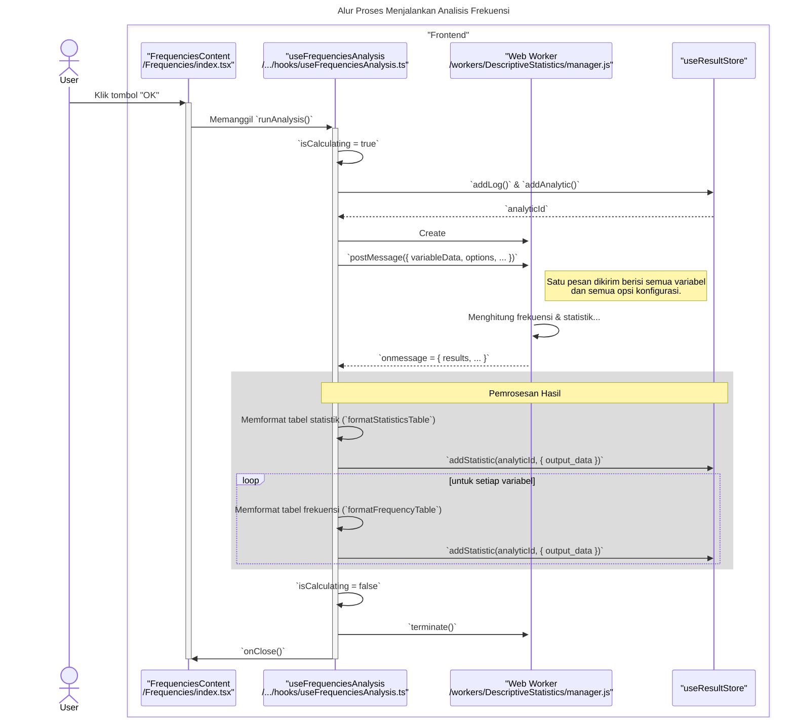

# Desain Fitur: Dialog Analisis Frekuensi

Dokumen ini berisi paket desain (Design Package) untuk Feature Set `Dialog Analisis Frekuensi`.

---

## 2. Design Package

### 2.1. Diagram Urutan (Sequence Diagrams)

*Diagram ini menunjukkan alur analisis Frekuensi, termasuk pembuatan grafik opsional.*

### **Sequence Diagrams: Frequencies Analysis**

Dokumentasi ini berisi diagram sekuens (sequence diagrams) yang menjelaskan alur kerja utama dan interaksi komponen dalam fitur `Frequencies`.

---

### 1. Alur Proses Konfigurasi Statistik dan Grafik

Diagram ini menunjukkan bagaimana pengguna mengonfigurasi opsi pada tab yang berbeda, dengan state dikelola oleh hook-nya masing-masing.

```mermaid
sequenceDiagram
    title: Alur Proses Konfigurasi Statistik dan Grafik
    actor User

    box "Frontend Components"
        participant View as "FrequenciesContent<br>/Frequencies/index.tsx"
        participant StatsTab as "StatisticsTab<br>/Frequencies/StatisticsTab.tsx"
        participant ChartsTab as "ChartsTab<br>/Frequencies/ChartsTab.tsx"
        participant StatsHook as "useStatisticsSettings"
        participant ChartsHook as "useChartsSettings"
    end

    User->>+View: Pindah ke tab "Statistics"
    activate View
    User->>+StatsTab: Mencetang checkbox "Mean"
    StatsTab->>+StatsHook: Memanggil `setMeanChecked(true)`
    Note right of StatsHook: State untuk opsi statistik diperbarui di dalam hook.
    deactivate StatsHook
    deactivate StatsTab

    User->>View: Pindah ke tab "Charts"
    User->>+ChartsTab: Memilih radio button "Bar charts"
    ChartsTab->>+ChartsHook: Memanggil `setChartType('barCharts')`
    Note right of ChartsHook: State untuk opsi grafik diperbarui di dalam hook.
    deactivate ChartsHook
    deactivate ChartsTab
    deactivate View

    Note across View, ChartsHook: Hook analisis utama (`useFrequenciesAnalysis`) akan memanggil<br/>`getCurrentStatisticsOptions()` dan `getCurrentChartOptions()`<br/>dari hook-hook ini saat analisis dijalankan.
```

---

### 2. Alur Proses Menjalankan Analisis Frekuensi

Diagram berikut menjelaskan proses utama dari pengguna yang memulai analisis hingga hasilnya disimpan dan siap ditampilkan. Berbeda dengan analisis lain, Frequencies mengirim semua variabel dalam satu tugas ke worker.



### 2.2. Penyempurnaan Model Objek (Object Model Refinements)

*Perubahan pada model objek (kelas, atribut, metode baru) yang ditemukan selama desain.*

- **Komponen Modal Bertab:**
  - `Frequencies/index.tsx`: Komponen induk yang mengelola tab.
  - `VariablesTab.tsx`: UI untuk memilih variabel yang akan dianalisis.
  - `StatisticsTab.tsx`: UI untuk memilih statistik (Persentil, Mean, Median, Mode, dll.).
  - `ChartsTab.tsx`: UI untuk memilih jenis grafik (Bar, Pie, Histogram) dan apakah akan menampilkan kurva normal pada histogram.
- **Hook Logika:**
  - `hooks/useFrequencies.ts`: Mengumpulkan konfigurasi dari semua tab, memanggil worker, dan kemudian secara kondisional memanggil `ChartBuilder` jika grafik diminta.
- **Web Worker:**
  - Worker khusus untuk analisis Frekuensi. Tugas utamanya adalah membuat tabel frekuensi (menghitung kemunculan setiap nilai unik) untuk variabel yang diberikan, lalu menghitung statistik ringkasan yang diminta.

### 2.3. Catatan Alternatif Desain (Design Alternatives)

*Diskusi dan keputusan mengenai pilihan desain yang signifikan.*

- **Alternatif 1:** Menggabungkan Frekuensi dan Deskriptif.
  - **Kelebihan:** Mengurangi satu dialog.
  - **Kekurangan:** Tujuan kedua prosedur ini berbeda. Frekuensi berfokus pada hitungan dan distribusi nilai-nilai diskrit (dan dapat menghasilkan grafik), sementara Deskriptif berfokus pada tendensi sentral dan dispersi variabel kontinu. Menggabungkannya akan membuat dialog menjadi kurang terarah dan membingungkan.
- **Keputusan:** Memisahkan Frekuensi sebagai dialognya sendiri. Ini adalah prosedur analisis yang paling mendasar dan umum digunakan, dan layak mendapatkan dialognya sendiri yang terfokus, terutama dengan adanya tab Grafik khusus.

--- 