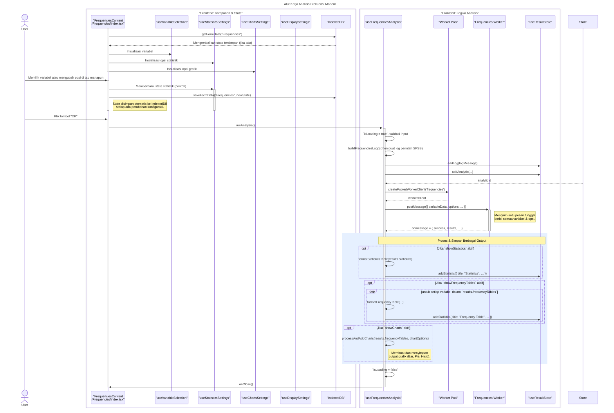

# Desain Fitur: Dialog Analisis Frekuensi

Dokumen ini berisi paket desain (Design Package) untuk Feature Set `Dialog Analisis Frekuensi`.

---

## 2. Design Package

### 2.1. Diagram Urutan (Sequence Diagrams)

*Diagram ini menunjukkan alur kerja komprehensif untuk analisis Frekuensi, mulai dari interaksi pengguna dan manajemen state otomatis dengan IndexedDB, hingga eksekusi analisis oleh web worker dan pembuatan output statistik serta grafik.*

### **Sequence Diagram: Alur Kerja Analisis Frekuensi Modern**

### 2.2. Penyempurnaan Model Objek (Object Model Refinements)

*Perubahan pada model objek yang ditemukan selama desain.*

-   **Komponen Bertab:**
    -   `Frequencies/index.tsx`: Komponen induk yang mengintegrasikan semua *hooks* dan mengelola UI utama.
    -   `VariablesTab.tsx`: UI untuk memilih variabel dan mengelola opsi tampilan dasar.
    -   `StatisticsTab.tsx`: UI kompleks untuk memilih berbagai statistik (persentil, tendensi sentral, dispersi, distribusi).
    -   `ChartsTab.tsx`: UI untuk memilih jenis grafik (Bar, Pie, Histogram).
-   **Hook Logika & Utilitas:**
    -   `hooks/useVariableSelection.ts`: Mengelola state untuk daftar variabel yang dipilih.
    -   `hooks/useStatisticsSettings.ts`: Mengelola state untuk semua opsi statistik yang dapat dikonfigurasi pada tab "Statistics".
    -   `hooks/useChartsSettings.ts`: Mengelola state untuk semua opsi grafik pada tab "Charts".
    -   `hooks/useDisplaySettings.ts`: Mengelola state untuk opsi tampilan (misalnya, menampilkan tabel frekuensi).
    -   `hooks/useFrequenciesAnalysis.ts`: Hook orkestrator utama yang:
        -   Mengumpulkan semua konfigurasi dari *hooks* lain.
        -   Membuat log perintah gaya SPSS.
        -   Mengirim satu tugas komprehensif ke *worker pool*.
        -   Menerima hasil tunggal dari *worker*.
        -   Memanggil berbagai *formatter* dan *processor* untuk menghasilkan semua output yang diminta (tabel statistik, tabel frekuensi, dan grafik).
        -   Menyimpan semua output ke `useResultStore`.
    -   `hooks/useIndexedDB.ts`: Menyediakan persistensi state otomatis untuk dialog.
-   **Web Worker:**
    -   Worker khusus untuk analisis Frekuensi yang dirancang untuk memproses beberapa variabel dalam satu kali jalan, menghitung tabel frekuensi dan semua statistik yang diminta secara efisien.

### 2.3. Catatan Alternatif Desain (Design Alternatives)

*Diskusi dan keputusan mengenai pilihan desain yang signifikan.*

-   **Keputusan:** **Pemisahan Logika Konfigurasi ke Hooks.** Dengan banyaknya opsi di tab Statistik dan Grafik, memisahkannya ke dalam `useStatisticsSettings` dan `useChartsSettings` membuat state management menjadi jauh lebih terorganisir dan terkelola dibandingkan dengan menyimpannya semua di komponen utama.
-   **Keputusan:** **Tugas Worker Tunggal vs. Ganda.** Berbeda dengan analisis Deskriptif atau Eksplorasi yang mengirim tugas per variabel atau per kelompok, Frekuensi mengirim satu tugas besar berisi semua variabel. Ini lebih efisien untuk kasus penggunaan Frekuensi di mana *worker* dapat mengulang data sekali dan menghitung statistik untuk semua variabel yang diminta dalam satu proses terpadu.
-   **Keputusan:** **Pemroses Output Modular.** Setelah hasil diterima dari *worker*, hook `useFrequenciesAnalysis` tidak langsung memanipulasi DOM atau data. Sebaliknya, ia mendelegasikan tugas ke fungsi-fungsi yang lebih kecil dan murni (`format...`, `process...`) untuk mengubah data mentah menjadi struktur tabel atau grafik yang siap ditampilkan. Ini meningkatkan keterbacaan dan kemudahan pengujian.

--- 