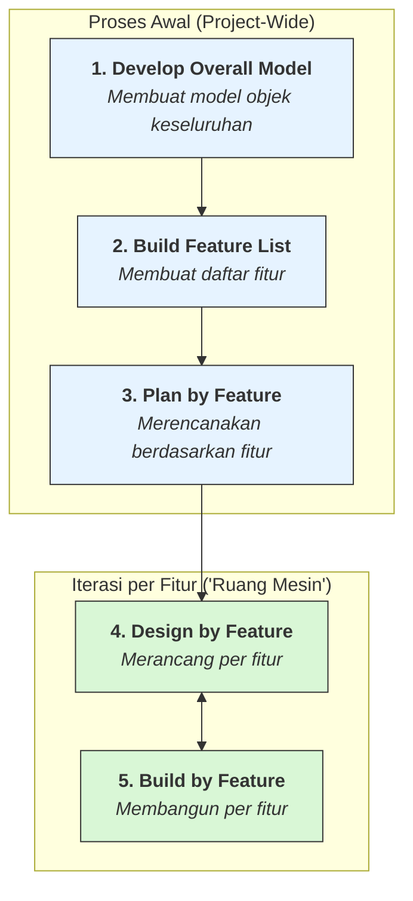

# Dokumentasi Proses Feature-Driven Development (FDD)

Repository ini berisi artefak dan template dokumentasi untuk mengimplementasikan kelima proses dalam metodologi Feature-Driven Development (FDD). Gunakan dokumen ini sebagai panduan utama dan titik awal untuk setiap tahap proyek.

---

## Alur Proses FDD

Berikut adalah visualisasi dari kelima proses FDD yang saling terkait. Proses 1, 2, dan 3 adalah aktivitas awal yang bersifat *project-wide*. Proses 4 dan 5 adalah aktivitas iteratif yang membentuk "ruang mesin" pengembangan.

---

## Panduan Proses

### 1. [Mengembangkan Model Objek Keseluruhan](./1-Develop%20an%20Overall%20Model/README.md)
- **Tujuan:** Membangun pemahaman bersama tentang domain masalah dan menciptakan kerangka kerja konseptual (model objek) untuk sistem.
- **Artefak Utama:** Model Objek Keseluruhan, Catatan Model.

### 2. [Membangun Daftar Fitur](./2-Build%20a%20Feature%20List/README.md)
- **Tujuan:** Mengurai fungsionalitas sistem menjadi daftar fitur yang terorganisir secara hierarkis.
- **Artefak Utama:** Daftar Fitur (dipisahkan berdasarkan Problem Domain, UI, dan System Interaction).

### 3. [Merencanakan Berdasarkan Fitur](./3-Plan%20by%20Feature/README.md)
- **Tujuan:** Membuat rencana pengembangan awal, termasuk urutan, penugasan Chief Programmer, dan kepemilikan kelas.
- **Artefak Utama:** Rencana Pengembangan, Daftar Kepemilikan Kelas, Laporan "Parking Lot".

### 4. [Merancang Berdasarkan Fitur](./4-Design%20by%20Feature/README.md)
- **Tujuan:** Menghasilkan paket desain (design package) yang terperinci dan telah diinspeksi untuk sekelompok kecil fitur.
- **Artefak Utama:** Paket Pekerjaan (Work Package), Diagram Urutan, Laporan Inspeksi Desain.

### 5. [Membangun Berdasarkan Fitur](./5-Build%20by%20Feature/README.md)
- **Tujuan:** Mengubah desain menjadi kode yang berfungsi, teruji, terinspeksi, dan terintegrasi ke dalam build utama.
- **Artefak Utama:** Kode Sumber, Kode Tes, Laporan Inspeksi Kode. 