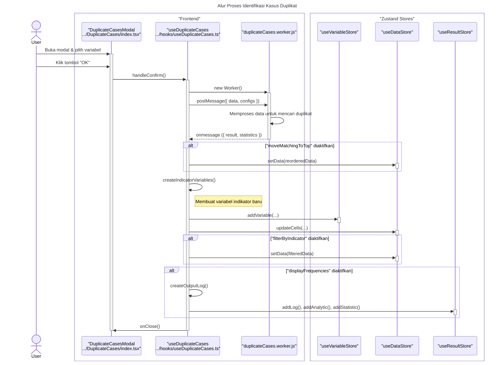

### **Sequence Diagram: Identify Duplicate Cases**

Dokumentasi ini berisi diagram sekuens yang merinci alur kerja fitur "Identify Duplicate Cases", yang menggunakan Web Worker untuk pemrosesan latar belakang.

---

### 1. Alur Proses Identifikasi Kasus Duplikat

Diagram ini menunjukkan bagaimana interaksi pengguna memicu proses di Web Worker dan bagaimana hasilnya digunakan untuk memodifikasi state aplikasi, seperti membuat variabel indikator baru, memfilter/mengurutkan data, dan menampilkan laporan.

