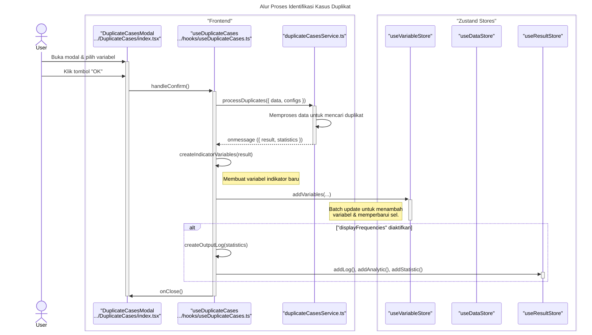

### **Sequence Diagram: Identify Duplicate Cases**

Dokumentasi ini berisi diagram sekuens yang merinci alur kerja fitur "Identify Duplicate Cases", yang memproses data secara sinkron untuk menemukan duplikat.

---

### 1. Alur Proses Identifikasi Kasus Duplikat

Diagram ini menunjukkan bagaimana interaksi pengguna memicu pemrosesan data oleh `duplicateCasesService`. Hasilnya kemudian digunakan untuk memodifikasi state aplikasi, seperti membuat variabel indikator baru dan menampilkan laporan.

