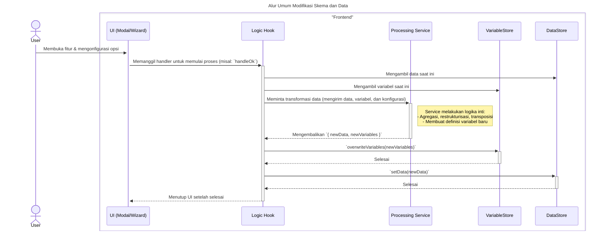
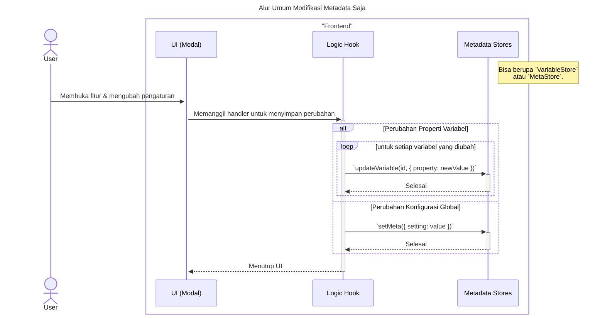
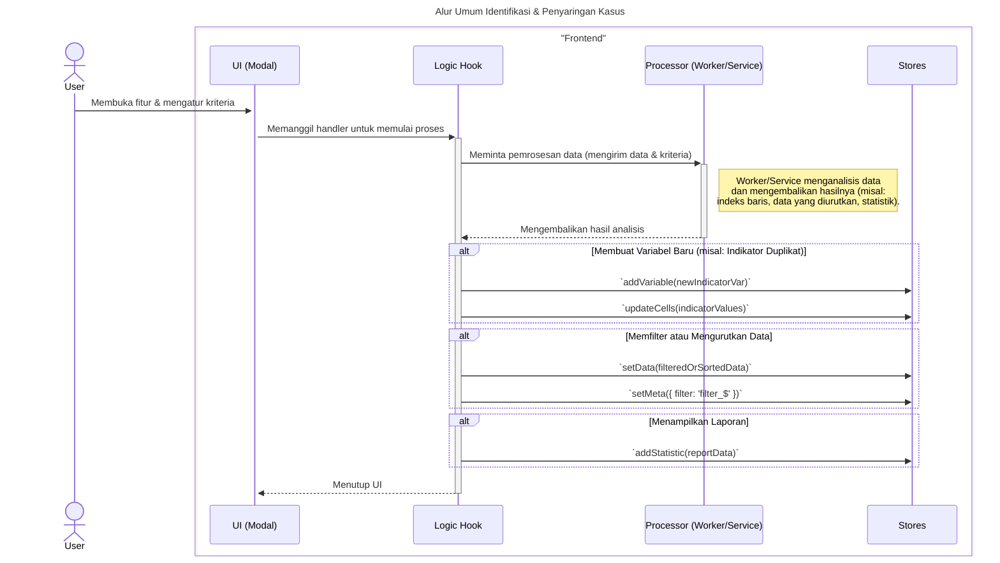

### **Sequence Diagrams: Interaksi Transformasi Data**

Dokumentasi ini berisi generalisasi diagram sekuens (sequence diagrams) yang menjelaskan alur kerja dan pola interaksi yang umum ditemukan pada berbagai fitur transformasi data.

---

### 1. Alur Umum Modifikasi Skema dan Data

Diagram ini menggeneralisasi fitur yang mengubah struktur atau konten data secara signifikan. Ini termasuk menambah/mengurutkan variabel, merestrukturisasi, atau mentransposisi data. Pola umumnya adalah memodifikasi definisi variabel (`VariableStore`) terlebih dahulu, kemudian memperbarui atau mengganti seluruh data (`DataStore`).

---

### 2. Alur Umum Modifikasi Metadata Saja

Diagram berikut merangkum alur kerja untuk fitur yang hanya mengubah metadata tanpa memengaruhi data sel itu sendiri. Contohnya termasuk mengubah properti variabel (seperti level pengukuran) atau mengatur konfigurasi global (seperti pembobotan kasus).

---

### 3. Alur Umum Identifikasi Kasus (via Worker/Service)

Diagram ini mengilustrasikan fitur yang menganalisis dataset untuk mengidentifikasi kasus tertentu (duplikat, tidak biasa) atau menyaring data. Proses ini seringkali didelegasikan ke *Web Worker* atau *Service* dan dapat menghasilkan variabel indikator baru, memfilter data, atau membuat laporan.

