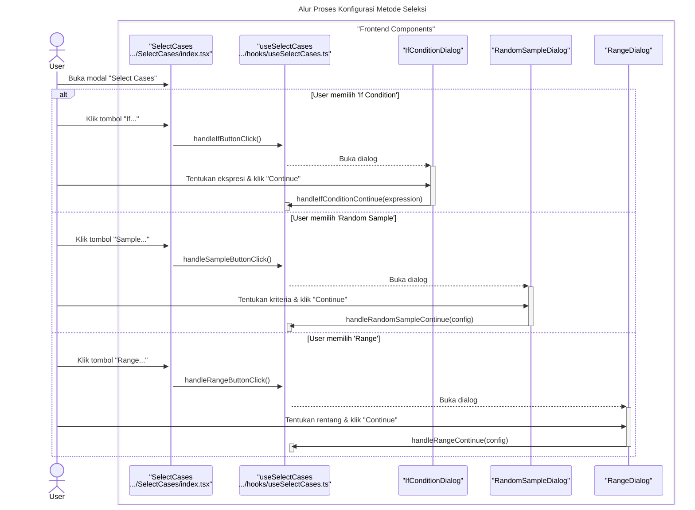

### **Sequence Diagram: Select Cases**

Dokumentasi ini berisi diagram sekuens yang merinci alur kerja fitur "Select Cases", yang memiliki beberapa metode seleksi yang berbeda.

---

### 1. Alur Proses Konfigurasi Metode Seleksi

Diagram ini menunjukkan bagaimana pengguna memilih salah satu dari beberapa metode seleksi yang tersedia (misalnya, "If Condition", "Random Sample", "Range") dan berinteraksi dengan sub-dialog yang sesuai untuk mengonfigurasi kriteria.



---

### 2. Alur Proses Konfirmasi dan Eksekusi

Setelah kriteria dikonfigurasi, diagram ini menunjukkan bagaimana proses dieksekusi setelah pengguna mengklik "OK". Alur ini mencakup pemanggilan service yang sesuai, pembuatan variabel filter, dan pembaruan data atau metadata.

```mermaid
sequenceDiagram
    title: Alur Proses Konfirmasi dan Eksekusi Seleksi
    actor User

    box "Frontend Components"
        participant Modal as "SelectCases<br>.../SelectCases/index.tsx"
        participant Hook as "useSelectCases<br>.../hooks/useSelectCases.ts"
        participant Service as "selectors<br>.../services/selectors.ts"
    end

    box "Zustand Stores"
        participant VarStore as "useVariableStore"
        participant DataStore as "useDataStore"
        participant MetaStore as "useMetaStore"
    end

    User->>+Modal: Pilih opsi output & klik "OK"
    Modal->>+Hook: handleConfirm()
    
    alt Berdasarkan Metode Seleksi yang Dikonfigurasi
        Hook->>Hook: Memanggil apply...Filter() yang sesuai
        Hook->>+Service: Memanggil selectBy...(data, config)
        Service-->>-Hook: Return selectedIndices
        deactivate Service
    end

    alt Output: 'Filter out unselected cases'
        Hook->>Hook: createFilterVariable(selectedIndices)
        Hook->>+VarStore: addVariable("filter_$")
        deactivate VarStore
        Hook->>+DataStore: updateCells(filterValues)
        deactivate DataStore
        Hook->>+MetaStore: setMeta({ filter: "filter_$" })
        deactivate MetaStore
    else Output: 'Delete unselected cases'
        Hook->>+DataStore: deleteRows(unselectedIndices)
        deactivate DataStore
    end
    
    Hook->>Modal: onClose()
    deactivate Hook
``` 