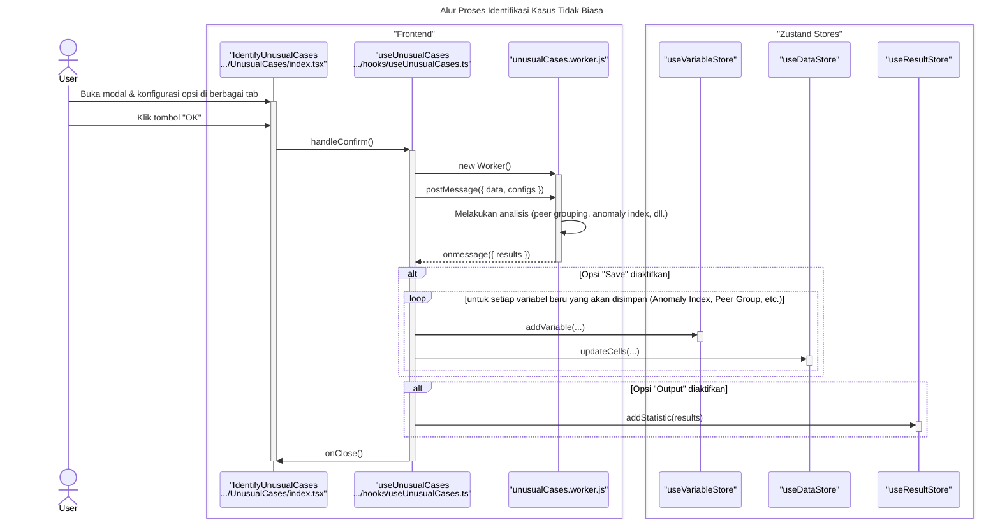

### **Sequence Diagram: Identify Unusual Cases**

Dokumentasi ini berisi diagram sekuens yang merinci alur kerja fitur "Identify Unusual Cases", yang menggunakan Web Worker untuk analisis intensif.

---

### 1. Alur Proses Identifikasi Kasus Tidak Biasa

Diagram ini menunjukkan bagaimana konfigurasi pengguna dari berbagai tab dikirim ke Web Worker untuk diproses. Hasilnya kemudian dapat memicu pembuatan variabel baru di `DataStore` dan `VariableStore`, serta laporan di `ResultStore`.

