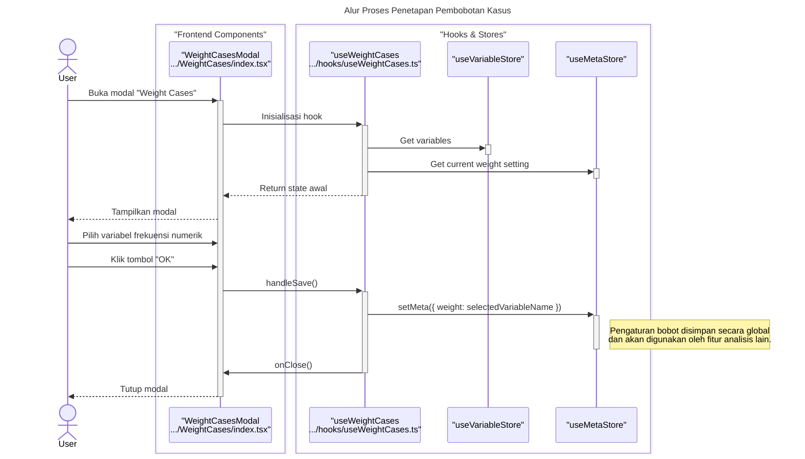

### **Sequence Diagram: Weight Cases**

Dokumentasi ini berisi diagram sekuens yang merinci alur kerja fitur "Weight Cases", yang digunakan untuk menerapkan pembobotan kasus berdasarkan variabel frekuensi.

---

### 1. Alur Proses Penetapan Pembobotan Kasus

Diagram ini menunjukkan bagaimana pemilihan variabel oleh pengguna hanya mengubah satu entri di `MetaStore`, yang kemudian akan digunakan oleh fitur analisis lainnya. Tidak ada data sel yang diubah secara langsung oleh fitur ini.

