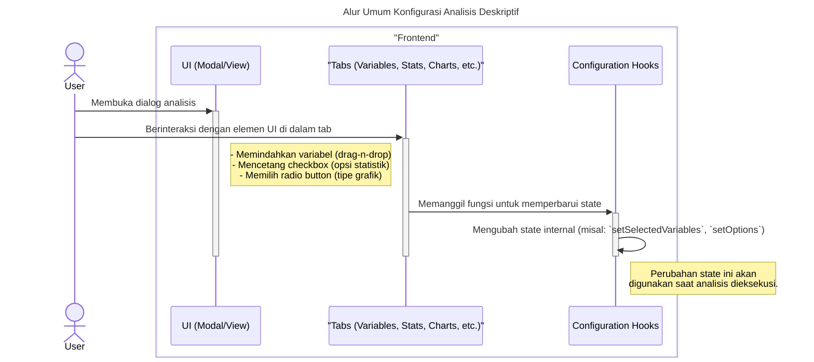
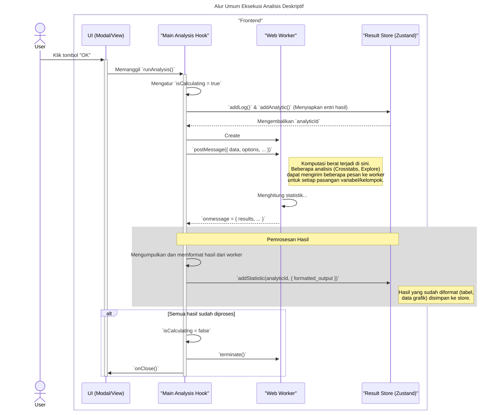

### **Sequence Diagrams: Interaksi Analisis Deskriptif**

Dokumentasi ini berisi generalisasi diagram sekuens (sequence diagrams) yang menjelaskan alur kerja dan pola interaksi yang umum ditemukan pada semua fitur analisis deskriptif (seperti Frequencies, Descriptives, Crosstabs, dan Explore).

---

### 1. Alur Umum Konfigurasi Analisis

Diagram ini menggeneralisasi proses di mana pengguna mengonfigurasi sebuah analisis sebelum menjalankannya. Ini mencakup pemilihan variabel dan pengaturan opsi spesifik (seperti statistik, sel, atau grafik) melalui antarmuka berbasis tab.

---

### 2. Alur Umum Eksekusi Analisis (via Web Worker)

Diagram berikut merangkum alur kerja utama saat analisis dieksekusi. Pola yang paling penting adalah pendelegasian komputasi statistik yang berat ke **Web Worker** untuk menjaga antarmuka tetap responsif.

