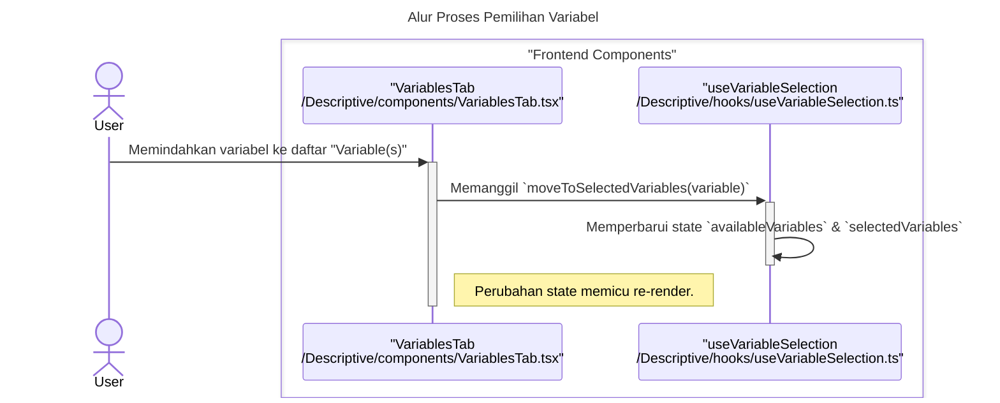
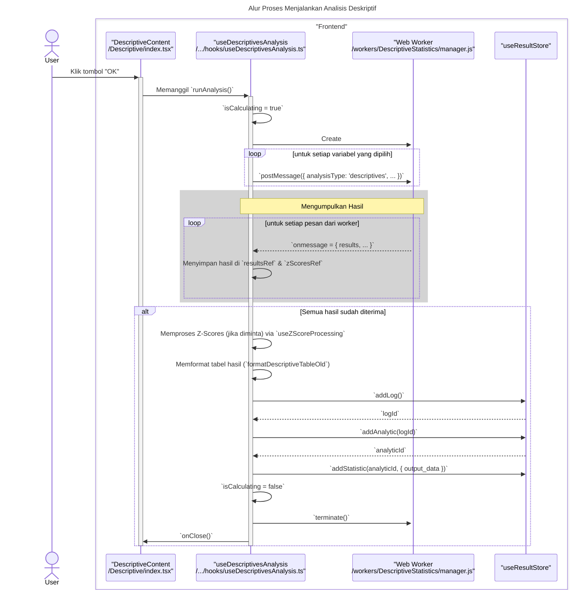
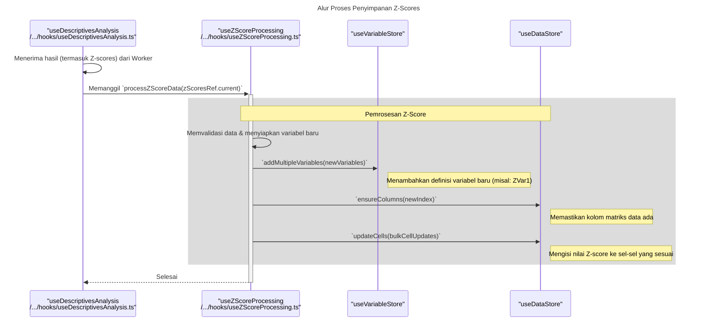

### **Sequence Diagrams: Descriptive Statistics**

Dokumentasi ini berisi diagram sekuens (sequence diagrams) yang menjelaskan alur kerja utama dan interaksi komponen dalam fitur `Descriptive Statistics`.

---

### 1. Alur Proses Pemilihan Variabel

Diagram ini menunjukkan bagaimana pengguna memilih variabel untuk dianalisis, yang dikelola oleh hook `useVariableSelection`.

---

### 2. Alur Proses Menjalankan Analisis

Diagram berikut menjelaskan proses utama saat pengguna memulai analisis, termasuk pendelegasian komputasi ke Web Worker dan agregasi hasil.

---

### 3. Alur Proses Penyimpanan Z-Scores

Diagram ini mengilustrasikan logika spesifik yang dieksekusi oleh `useZScoreProcessing` ketika opsi "Save standardized values as variables" diaktifkan.

