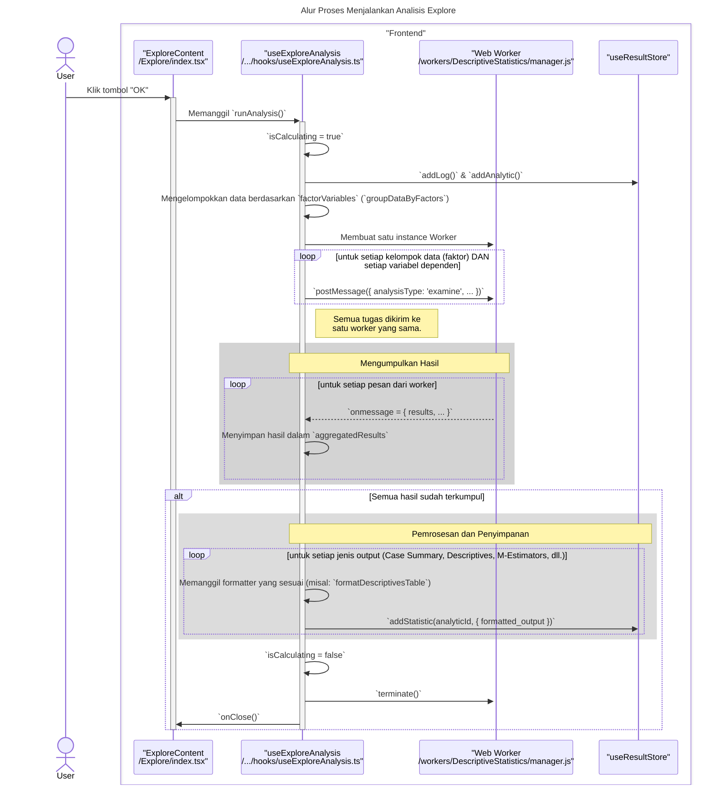

### **Sequence Diagrams: Explore Analysis**

Dokumentasi ini berisi diagram sekuens (sequence diagrams) yang menjelaskan alur kerja utama dan interaksi komponen dalam fitur `Explore`.

---

### 1. Alur Proses Konfigurasi Variabel dan Opsi

Diagram ini menunjukkan bagaimana pengguna memilih variabel dan mengatur opsi pada tab yang berbeda, dengan state dikelola oleh `ExploreContent` melalui berbagai hook.

```mermaid
sequenceDiagram
    title: Alur Proses Konfigurasi Variabel dan Opsi Statistik
    actor User

    box "Frontend Components"
        participant View as "ExploreContent<br>/Explore/index.tsx"
        participant VarTab as "VariablesTab<br>/Explore/VariablesTab.tsx"
        participant StatsTab as "StatisticsTab<br>/Explore/StatisticsTab.tsx"
        participant VarHook as "useVariableManagement"
        participant StatsHook as "useStatisticsSettings"
    end

    User->>+VarTab: Memindahkan variabel ke "Dependent List"
    VarTab->>+View: Memanggil `moveToDependentVariables`
    View->>+VarHook: Memanggil `moveToDependentVariables(variable)`
    VarHook->>VarHook: Memperbarui state `dependentVariables`
    deactivate VarHook
    deactivate VarTab

    User->>View: Pindah ke tab "Statistics"
    User->>+StatsTab: Mencetang checkbox "M-estimators"
    StatsTab->>View: Memanggil prop `setShowMEstimators`
    View->>+StatsHook: Memanggil `setShowMEstimators(true)`
    Note right of StatsHook: State untuk opsi statistik diperbarui.
    deactivate StatsHook

    Note across View, StatsHook: Semua state dari `useVariableManagement` dan `useStatisticsSettings`<br/>diteruskan sebagai parameter ke `useExploreAnalysis` saat analisis dijalankan.
```

---

### 2. Alur Proses Menjalankan Analisis Explore

Diagram berikut menjelaskan proses utama saat pengguna memulai analisis, termasuk pengelompokan data berdasarkan faktor dan pendelegasian ke banyak Web Worker.

