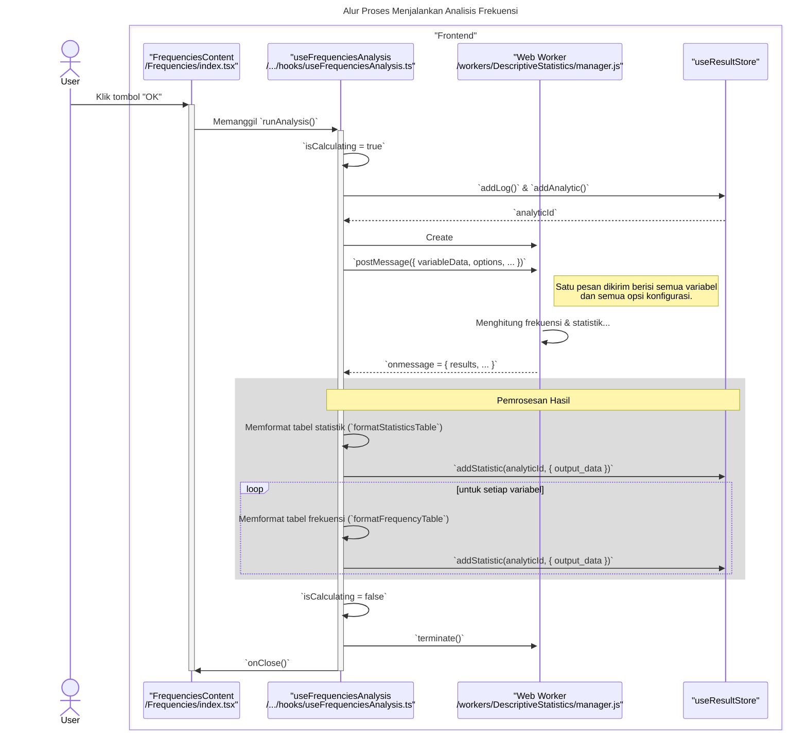

### **Sequence Diagrams: Frequencies Analysis**

Dokumentasi ini berisi diagram sekuens (sequence diagrams) yang menjelaskan alur kerja utama dan interaksi komponen dalam fitur `Frequencies`.

---

### 1. Alur Proses Konfigurasi Statistik dan Grafik

Diagram ini menunjukkan bagaimana pengguna mengonfigurasi opsi pada tab yang berbeda, dengan state dikelola oleh hook-nya masing-masing.

```mermaid
sequenceDiagram
    title: Alur Proses Konfigurasi Statistik dan Grafik
    actor User

    box "Frontend Components"
        participant View as "FrequenciesContent<br>/Frequencies/index.tsx"
        participant StatsTab as "StatisticsTab<br>/Frequencies/StatisticsTab.tsx"
        participant ChartsTab as "ChartsTab<br>/Frequencies/ChartsTab.tsx"
        participant StatsHook as "useStatisticsSettings"
        participant ChartsHook as "useChartsSettings"
    end

    User->>+View: Pindah ke tab "Statistics"
    activate View
    User->>+StatsTab: Mencetang checkbox "Mean"
    StatsTab->>+StatsHook: Memanggil `setMeanChecked(true)`
    Note right of StatsHook: State untuk opsi statistik diperbarui di dalam hook.
    deactivate StatsHook
    deactivate StatsTab

    User->>View: Pindah ke tab "Charts"
    User->>+ChartsTab: Memilih radio button "Bar charts"
    ChartsTab->>+ChartsHook: Memanggil `setChartType('barCharts')`
    Note right of ChartsHook: State untuk opsi grafik diperbarui di dalam hook.
    deactivate ChartsHook
    deactivate ChartsTab
    deactivate View

    Note across View, ChartsHook: Hook analisis utama (`useFrequenciesAnalysis`) akan memanggil<br/>`getCurrentStatisticsOptions()` dan `getCurrentChartOptions()`<br/>dari hook-hook ini saat analisis dijalankan.
```

---

### 2. Alur Proses Menjalankan Analisis Frekuensi

Diagram berikut menjelaskan proses utama dari pengguna yang memulai analisis hingga hasilnya disimpan dan siap ditampilkan. Berbeda dengan analisis lain, Frequencies mengirim semua variabel dalam satu tugas ke worker.

