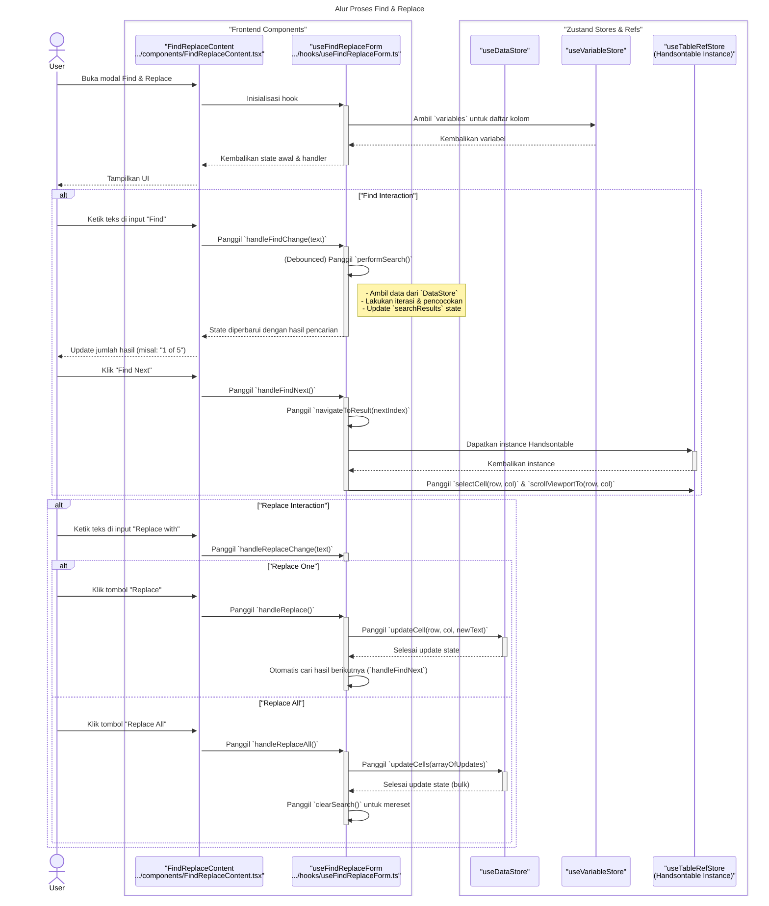

### **Sequence Diagram: Find & Replace**

Dokumentasi ini berisi diagram sekuens yang merinci alur kerja untuk fitur "Find & Replace".

---

### 1. Alur Proses Find & Replace

Diagram ini menunjukkan interaksi antara komponen UI, hook, dan data store saat pengguna melakukan operasi pencarian dan penggantian.

