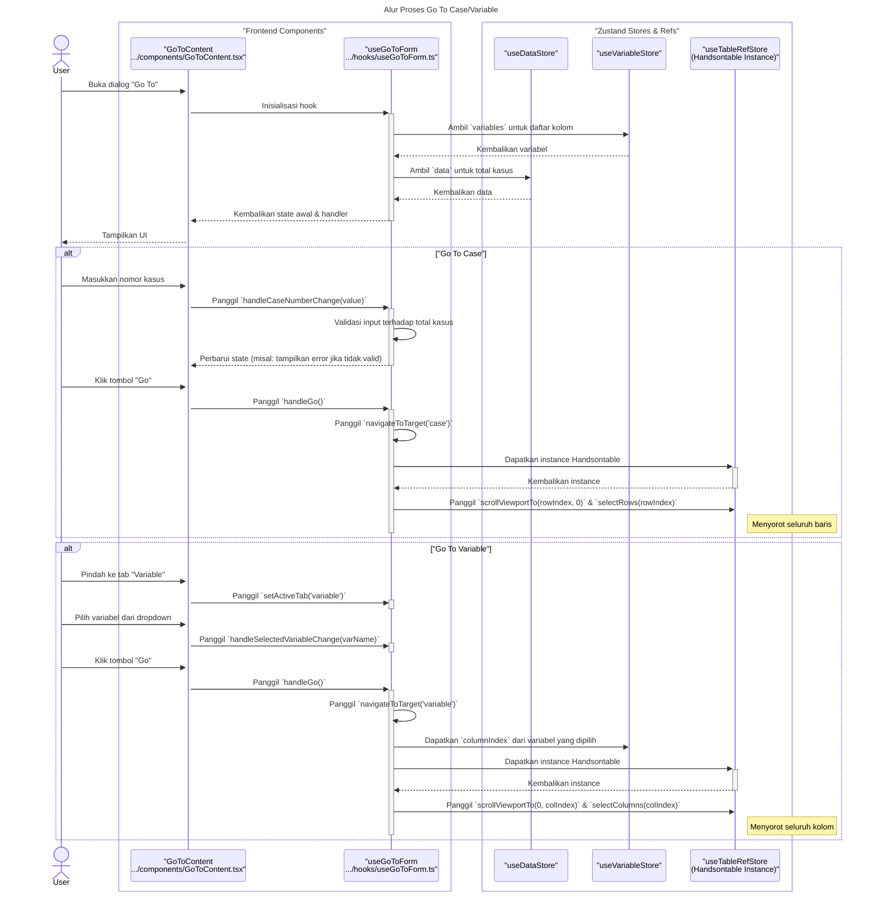

### **Sequence Diagram: Go To Case/Variable**

Dokumentasi ini berisi diagram sekuens yang merinci alur kerja untuk fitur "Go To Case/Variable".

---

### 1. Alur Proses Go To Case/Variable

Diagram ini menunjukkan bagaimana pengguna menavigasi ke baris (Case) atau kolom (Variable) tertentu dalam grid data.



    User->>View: Click "Close"
    View->>-Hook: onClose()
    deactivate View
``` 