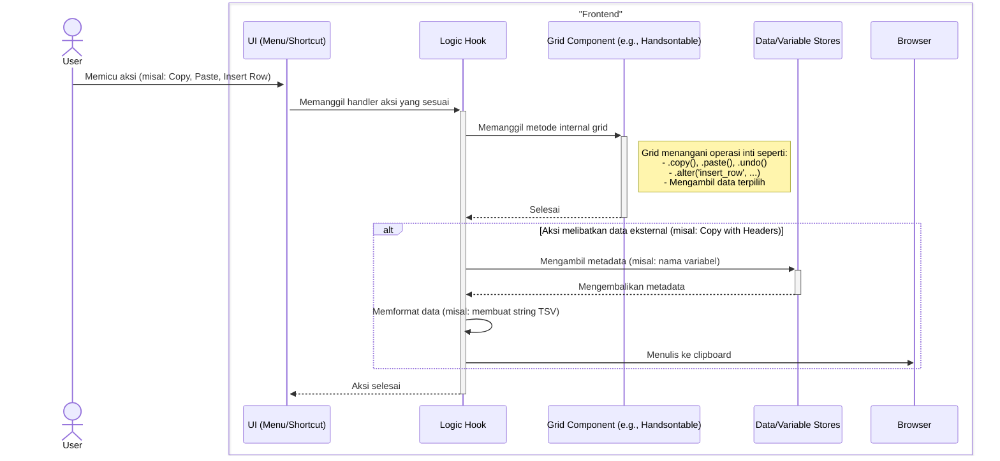
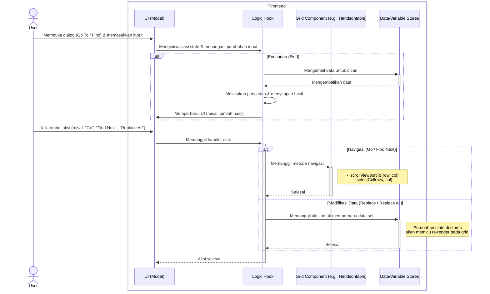

### **Sequence Diagrams: Interaksi Menu Edit**

Dokumentasi ini berisi generalisasi diagram sekuens (sequence diagrams) yang menjelaskan alur kerja utama untuk fitur-fitur di bawah menu "Edit".

---

### 1. Alur Umum Aksi Edit pada Grid

Diagram ini menggeneralisasi berbagai aksi edit yang langsung memanipulasi grid, seperti Undo, Redo, Copy, Paste, atau menyisipkan baris dan kolom.

---

### 2. Alur Umum Navigasi & Pencarian pada Grid

Diagram berikut merangkum alur kerja untuk fitur yang membantu pengguna menavigasi atau mencari data di dalam grid, seperti "Go To Case/Variable" dan "Find & Replace".

