### **Sequence Diagrams: Interaksi Manajemen File**

Dokumentasi ini berisi generalisasi diagram sekuens (sequence diagrams) yang menjelaskan alur kerja utama untuk fitur-fitur manajemen file, seperti impor, ekspor, dan aksi menu lainnya.

---

### 1. Alur Umum Impor Data

Diagram ini menggeneralisasi proses impor data, baik dari file lokal (seperti `.sav`) maupun dari clipboard.

```mermaid
sequenceDiagram
    title: Alur Umum Impor Data (dari File atau Clipboard)
    actor User
    
    box "Frontend"
        participant UI as UI (Modal/Component)
        participant Logic as Logic Hook
        participant Processor as Processor (API/Util)
        participant Stores as Stores (Zustand)
    end

    User->>+UI: Membuka fitur impor & menyediakan input (file/teks)
    UI->>+Logic: Memanggil handler untuk memulai proses
    Logic->>Logic: Mengelola state UI (misal: loading, progress)
    Logic->>+Processor: Meminta pemrosesan data (mengirim file/teks)
    Note right of Processor: Prosesor bisa berupa:<br/>- API call ke backend (untuk .sav)<br/>- Utilitas parsing di frontend (untuk clipboard)
    Processor-->>-Logic: Mengembalikan data terstruktur (JSON)

    Logic->>+Stores: Memperbarui state aplikasi (data, variabel, meta)
    Stores-->>-Logic: Selesai

    Logic-->>-UI: Menutup UI/modal & menampilkan data baru
```

---

### 2. Alur Umum Ekspor Data

Diagram berikut merangkum alur kerja ekspor data ke berbagai format (misalnya CSV, Excel).

---

### 3. Alur Umum Aksi Menu File

Diagram ini mengilustrasikan alur kerja umum untuk aksi-aksi di menu File yang tidak terkait impor/ekspor, seperti "New", "Save", atau "Exit".

